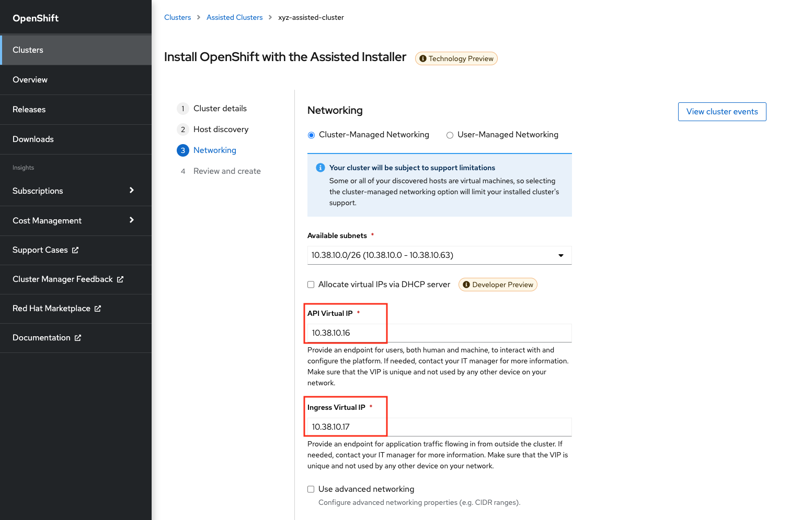
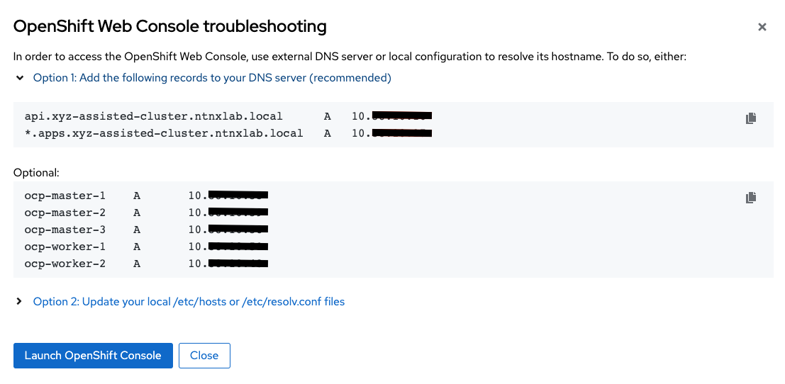

# OCP: Assisted Installation

In this optional lab we will go through Assited Installation feature that Red Hat Console offers.

Assisted Installer is a GUI driven way of deploying OCP clusters.

You would use Assisted Installer clusters for to deploy OCP clusters quickly (e.g. before a POC) and for personal testing purposes.

Single node OCP cluster implementation is also available with Assisted Installer. We will only look at deploying multi-node clusters in this lab.

:::note

Estimated time to complete this lab is 60 minutes.

:::

:::caution 

If you are doing this section of the lab using a Single Node HPOC (SPOC) there will not be enough resources to deploy a second OCP cluster. 

Remove existing OCP clusters that you don't require anymore.

If you were using NCM (Calm) - Please delete the other OCP cluster(s) from **Calm > Actions > Delete** before proceeding with this lab.

:::

## Pre-requisites for Assisted Installation

-   Administrator creates the OCP Master and Worker VMs
-   Adminsitrator provisions compute, networking and storage associated with the OCP Master and Worker VMs
-   Access to Red Hat Console to use Assisted Installer and install a OCP cluster

## High Level Overview of Assisted Installation

Assisted Installer does the following:

-   Provides RHCOS and OCP installation binaries in a CD-ROM ISO file
-   Once the OCP VMs (Master and Worker) nodes are booted with this CD-ROM ISO file, using the public key the VMs connect to Red Hat Console
-   VMs show in Assisted Installer page and the administrator (you) begins the installation
-   Red Hat Console will manage and monitor the installation process from start to end
-   Upon successfull installatino of a OCP cluster the following will be
    provided:
    -   KUBECONFIG file for `oc` access
    -   DNS entries for OCP Cluster Manager access
-   Assisted installer will choose one of the Master VMs to serve the Bootstrap role

:::info

Assisted Installers in GA as of July 2022 [General Availability](https://cloud.redhat.com/blog/openshift-assisted-installer-is-now-generally-available) .

The OCP clusters deployed using Assisted Installers can be used for production, testing and development purposes owing to [pre-requisites](https://cloud.redhat.com/blog/using-the-openshift-assisted-installer-service-to-deploy-an-openshift-cluster-on-metal-and-vsphere#:~:text=Pre%2Drequisites,required%20for%20accessing%20the%20cluster) conformity.

:::

At a very high level, we will accomplish the following to get a OCP cluster deployed using Assisted Installer:

1.  Provision OCP Cluster in Red Hat Console and Generate CD-ROM ISO URL
2.  Provision OCP Infrastructure - Create Master and Worker VMs in your
    AHV HPOC/SPOC cluster using Terraform infrastructure as code
3.  Install OCP Cluster in Red Hat Console

## Provision OCP Cluster in Red Hat Console

1.  Go to [Red Hat Console](https://console.redhat.com/openshift/assisted-installer/clusters)

2.  Click on **Create new assisted cluster**

3.  Fill in the following details:

    -   **Cluster name** - Initials-assisted-cluster (e.g. xyz-assisted-cluster)
    -   **Base domain** - ntnxlab.local

4.  Click on **Next**

5.  Click on **Add Host**

6.  In the **Add Host** pop-up window select **Minimal image file: Provision with virtual media**

7.  In the **SSH public key** text box privide the public key you created in this section 

    Make sure to copy the **public key**

    

8.  Click on **Generate Discovery ISO**

9.  Copy the **Discovery ISO URL** and note it down somewhere. You will
    need this for your next section while creating infrastructure.

    

10. Click on **Close**

## Provision OCP Infrastructure

This section of the lab is done on using Linux Tools VM.

If it is not already present in your HPOC, create Linux Tools VM using instructions in [Linux Tools VM](../toolsvms/linux_tools_vm.mdx)

:::note

You are able to create these VMs and its resources using the Prism Element GUI. But in this section we will use **Terraform** code for repeatability and ease.

:::

We will create the following resources:
  
| OCP Role   |    Operating System    |    vCPU    |  RAM         | Storage   | IOPS |           
| -------------|  ---------------------- |  -------- | ----------- |  --------- |  -------- | 
| Bootstrap    |  RHCOS                 |  4       |  16 GB       | 100 GB    | 300 | 
| Master       |  RHCOS                 |  4        | 16 GB      |  100 GB   |  300 | 
| Worker       |  RHCOS, RHEL 7.9, or RHEL 8.4  |  8  |  16 GB      |  100 GB |    300 | 


1.  Login to the Linux Tools VM using the following credentials

    -   **Username** - root
    -   **Password** - default password

2.  Run the following commands in sequence

    ``` bash
    yum update -y 
    yum install -y yum-utils
    yum-config-manager --add-repo https://rpm.releases.hashicorp.com/RHEL/hashicorp.repo
    yum -y install terraform
    yum -y install git
    ```

3.  Clone the following git repo and initialise Terraform provider

    ```bash
    git clone https://github.com/nutanix-japan/tf-ocp-infra
    cd tf-ocp-infra
    alias "tf=terraform" 
    tf init
    ```

4.  Get your variables file ready with your HPOC/SPOC environment
    information

    ```bash
    cp terraform.tfvars.sample terraform.tfvars
    ```

5.  Modify your variables to suit your HPOC environment using `vi` or `nano` editor

    ``` bash
    vi terraform.tfvars
    ```

    ```bash {1,4,5,6,7,11}
    cluster_name        = "your cluster name" # << Change this
    subnet_name         = "Primary"
    user                = "admin"            
    password            = "XXXXXXX"           # << Change this
    endpoint            = "Prism Element IP"  # << Change this
    vm_worker_prefix    = "xyz-worker"        # << Change xyz to your initials
    vm_master_prefix    = "xyz-master"        # << Change xyz to your initials
    vm_domain           = "ntnxlab.local"
    vm_master_count     = 3
    vm_worker_count     = 2
    image_uri           = "Discover ISO URL you copied earlier" # << Change this
    ```

6.  Validate and run your Terraform code

    ```bash
    tf validate

    # if there are any validate errors fix or request support from your instructor
    ```
    ```bash
    tf apply 

    # Terraform will show you all resources that it will to create
    # Type yes to confirm 
    ```

    ``` bash
    # Sample output for the command above

    Terraform will perform the actions described above.
    Only 'yes' will be accepted to approve.

    Enter a value: yes

    nutanix_image.RHCOS: Creating...
    nutanix_image.RHCOS: Still creating... [10s elapsed]
    nutanix_image.RHCOS: Creation complete after 14s [id=e04cff4e-a6cf-45f9-890d-96097c4b53ed]
    nutanix_virtual_machine.RHCOS-master[0]: Creating...
    nutanix_virtual_machine.RHCOS-master[1]: Creating...
    nutanix_virtual_machine.RHCOS-worker[0]: Creating...
    nutanix_virtual_machine.RHCOS-master[2]: Creating...
    nutanix_virtual_machine.RHCOS-worker[1]: Creating...
    nutanix_virtual_machine.RHCOS-master[0]: Still creating... [10s elapsed]
    nutanix_virtual_machine.RHCOS-master[1]: Still creating... [10s elapsed]
    nutanix_virtual_machine.RHCOS-master[2]: Still creating... [10s elapsed]
    nutanix_virtual_machine.RHCOS-worker[0]: Still creating... [10s elapsed]
    nutanix_virtual_machine.RHCOS-worker[1]: Still creating... [10s elapsed]
    nutanix_virtual_machine.RHCOS-master[0]: Creation complete after 16s [id=3a88a3d7-304e-4284-886d-f7882764d7cc]
    nutanix_virtual_machine.RHCOS-master[2]: Creation complete after 17s [id=5e87599a-5643-465d-9870-5b34751b2158]
    nutanix_virtual_machine.RHCOS-worker[0]: Creation complete after 17s [id=78fb2e69-fee7-4244-ae5c-55ffbc1da21d]
    nutanix_virtual_machine.RHCOS-master[1]: Creation complete after 17s [id=7775b527-fc55-4cac-aabc-a024ea4938c1]
    nutanix_virtual_machine.RHCOS-worker[1]: Creation complete after 17s [id=c9801a82-a7e3-444e-a206-d5e3e3a75bb1]

    Apply complete! Resources: 6 added, 0 changed, 0 destroyed.
    ```

7.  Run the Terraform state list command to verify what resrouces are created

    ``` bash
    tf state list
    ```

    ``` bash
    # Sample output for the command above

    data.nutanix_cluster.cluster            # < This is your existing Prism Element HPOC/SPOC cluster
    data.nutanix_subnet.subnet              # < This is your existing Primary subnet
    nutanix_image.RHCOS                     # < This is OCP Discovery ISO image
    nutanix_virtual_machine.RHCOS-master[0] # < This is master vm 1
    nutanix_virtual_machine.RHCOS-master[1] # < This is master vm 2
    nutanix_virtual_machine.RHCOS-master[2] # < This is master vm 3
    nutanix_virtual_machine.RHCOS-worker[0] # < This is worker vm 1
    nutanix_virtual_machine.RHCOS-worker[1] # < This is worker vm 2
    ```

8.  Login to **Prism Element** > **VM** and verify the VMs and if they are powered on

    

# Install OCP Cluster in Red Hat Console

In this section we will use Red Hat Console\'s Assisted Installer wizard to install the OCP cluster with the VMs we have provisioned.

1.  Return to Red Hat Openshift Console and check if the VMs appear
    (this may take up to 5 minutes)

    

2.  Click **Next** at the bottom of the page

3.  In the Networking section, assign IPs for your **API Virtual IP** and **Ingress Virtual IP** from you HPOC/SPOC **Primary** network pool

    

    :::tip

    Prism Element now shows used IP in the **Networking** setup page for IPAM enabled Network Switches.

    You can use this to determine the IPs for **API Virtual IP** and **Ingress Virtual IP** of your OCP cluster.

    Since AHV IPAM is **not aware of the statically assigned IP address**, the VIPs should be out of the IP Pools in the Primary subnet.

    **Prism Element** > **Menu** > **Network Configuration** > **Primary**

    

    A new pop-up will show the used IPs. Choose two IPs that are not listed here.

    

    :::

4.  In the **Host inventory** section, choose the **Control Plane Node** for Master VMs and **Worker** nodes for Worker VMs from the drop-down menu

    

5.  Click **Next** at the bottom of the page

6.  Review your setup information and click on **Install Cluster**

    

7.  You will be taken to monitoring your installation progress

    

    Now the cluster deploy will proceed

8.  Watch for any messages about user interactions in the progress page

    

9.  This message is wanting the user to unmount the installation Discovery ISO so they VM can boot into the OS drive

10. Go to **Prism Element** > **VM** > **Master/Worker VM** > **update**

11. Under Disks \> Click on Eject

    

12. Click on Save

13. Under **Power Off Actions** choose to Guest Reboot the VM where there are pending user action

14. Repeat ejecting CD-ROM for all VMs and rebooting it as the Wizard prompts for user action (do not do this before the prompting)

15. Once all the user actions are sustained for Master and Worker VMs, OCP cluster will be installed

16. You can access your installed OCP Cluster Manger page using the URL provided

    

    :::note

    This URL can **only** be accessed within your HPOC/SPOC environment

    You can access by creating DNS entry in your AD server or using IP address.

    Click on **Not able to access Web Console?** link in the status page to reveal IP addresses and DNS entry suggestions.

    

    You can download KUBECONFIG file and use `oc` commands.

    

    :::

17. After adding DNS/hosts entries to your environment, use Windows Tools PC you can browse to the IP addresses, or DNS entries you have manually created you are able to login to OC console.

    

You have successfully deployed a OCP cluster using Red Hat Console Assisted Installer.

## Takeaways

-   You can easily deploy multinode/single node OCP cluster using the Red Hat console
-   You can provision resoruces (VM, Storage, etc) on Nutanix using Terraform IaaC (GitOps)
    
    :::info

    The Installer Provisioned Installer (IPI) also uses Terraform to deploy infrastructure assets (VM) on Nutanix and VMware

    :::

-   Assisted Installer provisioned OCP clusters can be used as a learning ground and for testing purposes
