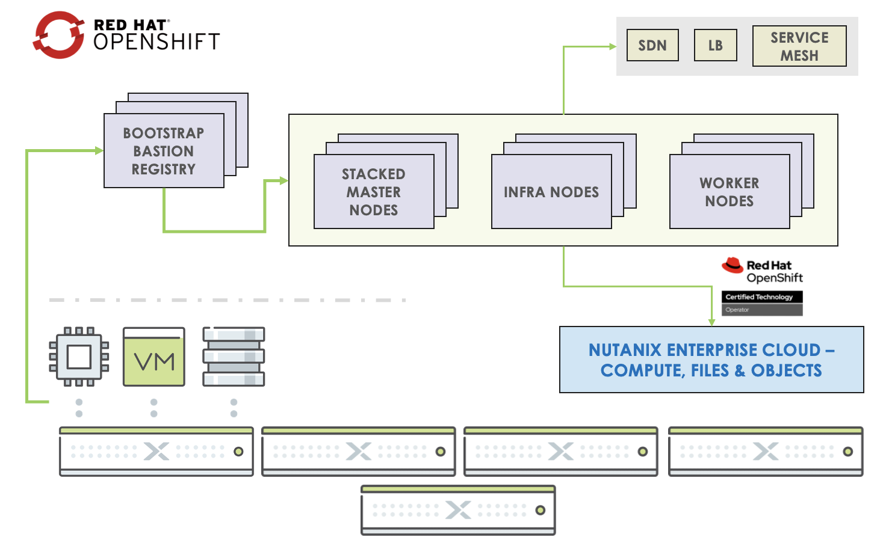

# OCP: Architecture and Initial Setup

In this lab, we will set up OCP infrastructure using Nutanix Calm.

Calm provides an easy way of provisioning and configuring repeatable
infrastructure. Once the blueprint is developed, it can be used
repeatedly and constantly improved.

As OCP infrastructure requirements consist of many moving parts, it is
easy to manage the soltuion in Calm. Since Calm can be used to deploy
the same infrastructure accross multiple clouds, it is a optimal
solution to manage the lifecycle of OCP infrastructure.

At a high-level OCP consists of the following components:

1.  Boostrap VM
2.  Stacked Master Nodes (Kubernetes Master + ETCD)
3.  Worker Nodes (used to run user workloads)
4.  Infra Nodes (used to run infrastructure based workloads)

## Minimum Hardware Requirements for OCP VMs

These are minimum required resrouces and software for the OCP VMs at the
time of writing this bootcamp.

The Calm blueprints in this lab will have these resources pre-configured
for your use.

For latest resource requirements refer to OpenShift portal
[here.](https://docs.openshift.com/container-platform/4.9/installing/installing_platform_agnostic/installing-platform-agnostic.html#installation-minimum-resource-requirements_installing-platform-agnostic)

| OCP Role      | Operating System       | vCPU    | RAM(minimum) | Storage | IOPS |
| ------------- | ---------------------- | --------|  -----------|  --------- | -------- | 
| Bootstrap     | RHCOS                  | 4        | 16 GB       | 120 GB    | 300 | 
| Master        | RHCOS                  | 4        | 16 GB       | 120 GB    | 300 | 
| Worker        | RHCOS, RHEL 7.9, or  RHEL 8.4  | 8        | 16 GB       | 120 GB    | 300 | 

We will use two Calm blueprints to deploy OCP infrastructure.

:::info

These Calm blueprints are developed by Nutanix's very own SA **Wolfgang Huse** and team. For updates and more information about these blueprints check this github page [here.](https://github.com/nutanix/openshift/tree/calm-automation/automation/calm)

This lab uses a modified version of these blueprints to suit HPOC/SPOC environment and to achieve the learning objectives.

:::

1.  Blueprint 1 - provisions a OCP provisioning VM with Calm action to
    deploy OCP
2.  Blueprint 2 - is called by a Calm action in `Blueprint 1` with all the necessary information that `Blueprint 2` needs to run

## Pre-requisites for Infrastructure in HPOC/SPOC Clusters

Since we will be doing the OCP labs in Nutanix HPOC/SPOC clusters, here
is a list of pre-requisites and HPOC/SPOC components that fulfill them.

Some are created with your HPOC/SPOC cluster runbook (see screenshot
below) you chose while booking the cluster in [RX](https://rx.corp.nutanix.com/) .

| OCP Pre-requisite |  HPOC Component                   |  Status | 
| ------------------|  --------------------------------- | ------------------ | 
| IPAM Enabled      |  Primary Network                   | Deployed with HPOC Subnet | 
| Existing AD and   |  AutoAD (Windows based Active      | Deployed with HPOC | 
| DNS Server        |  Directory+DNS server)             |  | 
| Calm Project      |  BootcampInfra                     | Deployed with HPOC | 
| VM Boot images    |  CentOS, RHCOS, etc.               | Deployed with HPOC(downloadable images) | 
| DNS Entries Update Mechanism | Calm Endpoint to contact  AutoAD+DNS server| You will create this  AutoAD+DNS server   |   

Now we can proceed to setup pre-requistes and deploying blueprints.

## Set up Calm Endpoint 

Let's create a Calm endpoint for authentication, authorization and DNS updates for OCP cluster.

1.  In **Prism Central** \> **Services** \> **Calm**

2.  Click on **Endpoint**

3.  Click on **+Create Endpoint**

    

4.  Fill in the following fields:

    -   **Name** - OCP DNS Integration
    -   **Description** - (optional)
    -   **Project** - BootcampInfra
    -   **Type** - Windows
    -   **Target Type** - IP Addresses
    -   **IP Address** - Your AutoAD VM IP (get from list of VMs)
    -   **Connection Protocol** - HTTP (default)
    -   **Port** - 5985 (default)
    -   **Username** - <administrator@ntnxlab.local>
    -   **Secret Type** - Password
    -   **Password** - nutanix/4u

    

5.  Click **Save**

## Upload Blueprints

1.  Download blueprint1 by right-clicking on this link [Provisioning VM](https://raw.githubusercontent.com/nutanix-japan/ocp-hci/main/import_bp/XYZ_OCP_Prov_VM.json) and save as *Initials*_OCP_Prov_VM.json file (e.g XYZ_OCP_Prov_VM.json)

2.  Download blueprint2 by right-clicking on this link [OCP Master Worker](https://raw.githubusercontent.com/nutanix-japan/ocp-hci/main/import_bp/XYZ_OCP_Master_Worker.json) and save as *Initials*_OCP_Master_Worker.json file (e.g XYZ_OCP_Master_Worker.json)

3.  In **Prism Central** \> **Services** \> **Calm**

4.  Click on **Blueprints**

5.  Select your Provisioning VM Initials_OCP_Prov_VM.json blueprint

6.  Fill the following Details

    -   **Blueprint Name** - XYZ_OCP_Prov_VM
    -   **Project** - BootcampInfra

    

7.  Click on **Upload**

8.  Return to **Blueprints** and upload OC Master Worker
    Initials_OCP_Master_Worker.json blueprint

    -   **Blueprint Name** - XYZ_OCP_Master_Worker
    -   **Project** - BootcampInfra

    

9.  Return to **Blueprints** once again and you will see both blueprints
    uploaded to Calm

    

Now that we are setup with all required information. We can proceed to deploying the Provisioning VM and ultimately OCP Cluster in the next sections of the lab.
