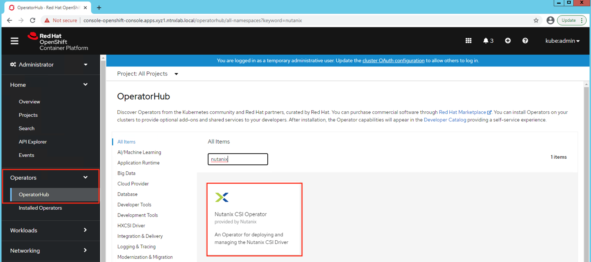
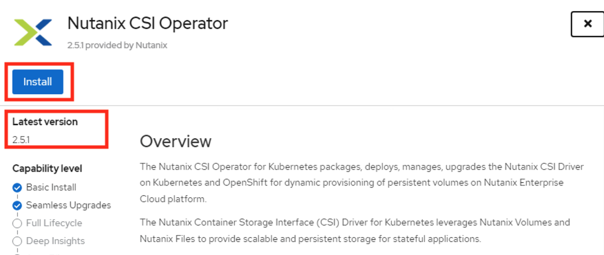
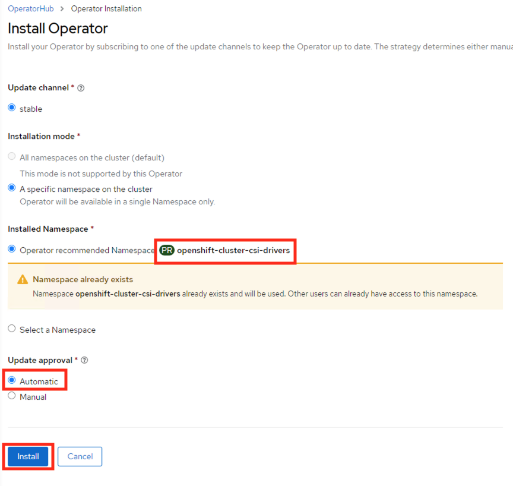

import Tabs from '@theme/Tabs';
import TabItem from '@theme/TabItem';
    

# OCP: Deploy Nutanix CSI for OCP

In this section we will enable your deployed OCP cluster to have access to Nutanix HCI storage in the form of StorageClass, Physical Volumes and Pysical Volume claims.

We will also install kubernetes operator provided by Nutanix to maintain the lifecycle of operator.

See [What are Kubernetes Operators?](https://docs.openshift.com/container-platform/4.7/operators/understanding/olm-what-operators-are.html) for more information.

OpenShift provides a easy way of implementing these third-party operators via OperatorHub from the cluster manager GUI .

As the Nutanix CSI Operator provides the following capabilities as of now, we will install it to manage all our Nutanix StorageClass in this OCP cluster.

-   Basic install
-   Seamless upgrades (Manual or Automatic)

In future Nutanix CSI Operator may provide the following additional features:

-   Full lifecycle
-   Deep insights
-   Autopilot

Nutanix CSI supports Nutanix Volumes and Nutanix Files as backend data storage systems.

| Storage Class Mode   |    ReadWriteOnce     |    ReadOnlyMany |  ReadWriteMany         | 
| -------------|  ---------------------- |  -------- | ----------- | 
| Nutanix Volumes       |  Yes                 |  Yes        | No     | 
| Nutanix Files       |  Yes |  Yes  |  Yes    |  

In this lab, we will deploy both Nutanix Volumes and Files Storage Class and use them throughout the bootcamp.

## Install Nutanix CSI Operator

1.  Login to you Windows Tools VM using the following credentials;

    -   **Username** - <administrator@ntnxlab.local>
    -   **Password** - nutanix/4u

2.  Using Chrome browser browse to Console URL you obtained in the previous section.

    ```url
    https://console-openshift-console.apps.<initials>1.ntnxlab.local
    ```

    ```url
    # example URL
    # https://console-openshift-console.apps.xyz1.ntnxlab.local
    ```

3.  Use your credentials to Login

    -   **Username** - kubeadmin
    -   **Password** - password from previous section

4.  Click on **Log in** (if you are not already logged in)

5.  Click on **Operator** > **Operator Hub**

6.  You will see all third party operators categorised by solution driven use cases (e.g. Big Data, Database, etc)

    

    This is in principle similar to Nutanix Calm Marketplace where you can request and install applications.

7.  In the **Filter by Keyword** text box, type **Nutanix** to find the Nutanix CSI Operator

8.  Click on the **Nutanix CSI Operator**, verify Operator version to be at least `2.5.1` and click on **Install**

    

    Also make sure to check the supported orchestration (RH OCP platforms)

9.  In the Operator install wizard choose the following:

    -   **Update channel** - stable
    -   **Operator recommended Namespace** - ``openshift-cluster-csi-drivers`` (automatically chosen)
    -   **Update approval** - Automatic (admins usually choose Manual option where control over updates is necessary)

    

10. Click on **Install**

11. Once installed you will see the operator in **Operator** > **Installed Operators**

12. Once installed, click on the Details tab of the Operator page and click on **Create Instance**

13. Click on **Create** button

This will create a NutanixCsiStorage resource to deploy your driver.

You have succesfully installed the Nutanix CSI operator to take care of StorageClass installation and upgrades.

:::info

OCP Operators can also be installed using `oc` commandline. For more information refer to OCP documentation [here.](https://docs.openshift.com/container-platform/4.7/operators/admin/olm-adding-operators-to-cluster.html#olm-installing-operator-from-operatorhub-using-cli_olm-adding-operators-to-a-cluster)

Nutanix CSI can be installed using ``helm`` charts as well as you would do in any implementation of kubernetes. See [here](https://github.com/nutanix/csi-plugin) for more details. 
:::

## Install StorageClass with Nutanix Volumes 
    
1.  Depending on the OCP cluster installation you chose, log on to the **UserXX-LinuxToolsVM** or **LB_DNS** VM to be able to access OCP cluster. 

    
    :::caution How did you install OCP?

    If you installed OCP using NCM (Calm), you will be performing commands in **LB_DNS** VM's console.

    We suggest doing the following when modifications to commands are required:

    1.  Edit code from lab instructions using vi/nano/vim

    2.  Modify the required fields (highlighted)

    3.  Paste the commands into the terminal of LB_DNS vm through Calm UI

    Use the following key combinations to paste content into Calm invoked terminal. 

    ```mdx-code-block
    <Tabs groupId="operating-systems">
        <TabItem value="mac" label="macOS">Use <b>Command + v</b> to paste.</TabItem>
        <TabItem value="win" label="Windows">Use <b>Shift + Insert</b> to paste.</TabItem>
    </Tabs>
    ```
    :::

5.  Export the OCP cluster's KUBECONFIG file to environment so we can perform `oc` commands

    ``` bash title="On NCM deployed OCP Clusters - use LB_DNS VM"
    export KUBECONFIG=~/openshift/auth/kubeconfig
    ```
    ``` bash title="On IPI deployed OCP Clusters - use UserXX-LinuxToolsVM"
    export KUBECONFIG=/root/xyz/auth/kubeconfig 
    ```

6.  Create a kubernetes secret that the StorageClass can use to access the Nutanix HCI storage

    Copy the following Secret configuration script, modify required fields (high-lighted)

    **Open a text editor (vi / nano), paste the contents below and change the fields indicated to suit your environment. Example is also provided**

    **Be sure to use your environment's details for the following fields:**

    -   Prism Element IP
    -   Prism Element UserName
    -   Prism Element Password

    ```bash {8}
    cat << EOF > csi_secret.yaml
    apiVersion: v1
    kind: Secret
    metadata:
      name: ntnx-secret
      namespace: openshift-cluster-csi-drivers
    stringData:
      key: <Prism Element IP>:9440:<Prism Element UserName>:<Prism Element Password>    # << change this
      # example: 
      # key: 10.38.2.71:9440:admin:password
    EOF
    ```

    ``` bash
    # Modify the highlighted fields to suit your environment
    vi csi_secret.yaml
    ```

    ``` bash
    # Create the secret 
    oc apply -f csi_secret.yaml
    ```

    ``` bash
    # example output here for the above command
    # secret/ntnx-secret created
    ```

7.  Copy the following StorageClass configuration script, modify ``Storage Container Name`` field and execute it in the command line

    ```zsh {15}
    cat << EOF >  storageclass.yaml
    kind: StorageClass
    apiVersion: storage.k8s.io/v1
    metadata:
      name: nutanix-volumes
    provisioner: csi.nutanix.com
    parameters:
      csi.storage.k8s.io/provisioner-secret-name: ntnx-secret
      csi.storage.k8s.io/provisioner-secret-namespace: openshift-cluster-csi-drivers
      csi.storage.k8s.io/node-publish-secret-name: ntnx-secret
      csi.storage.k8s.io/node-publish-secret-namespace: openshift-cluster-csi-drivers
      csi.storage.k8s.io/controller-expand-secret-name: ntnx-secret
      csi.storage.k8s.io/controller-expand-secret-namespace: openshift-cluster-csi-drivers
      csi.storage.k8s.io/fstype: ext4
      storageContainer: Default           ## << Change this to match your Storage Container
      storageType: NutanixVolumes
      isLVMVolume: "true"
      numLVMDisks: "4"
    allowVolumeExpansion: true
    reclaimPolicy: Delete
    EOF
    ```

    ``` bash
    # Modify the highlighted fields to suit your environment
    vi storageclass.yaml
    ```

    ``` bash
    # Create the storage class 
    oc apply -f storageclass.yaml
    ```

    ```buttonless title="Output"
    storageclass.storage.k8s.io/nutanix-volumes created
    ```

8.  Make this your default StorageClass

    ``` bash
    oc patch storageclass nutanix-volumes -p '{"metadata": {"annotations":{"storageclass.kubernetes.io/is-default-class":"true"}}}'
    #
    oc get sc
    ```
9.  List your StorageClass

    ``` bash
    oc get StorageClass -A
    ```

    ```buttonless title="Output"
    NAME                      PROVISIONER       RECLAIMPOLICY   VOLUMEBINDINGMODE   ALLOWVOLUMEEXPANSION   AGE
    nutanix-volumes(default)   csi.nutanix.com   Delete          Immediate           true                   4m
    ```

10. Create a machine config to make sure iSCSI service starts in worker and master nodes. 

    ```bash title="Start iSCSI service for worker nodes"
    cat << EOF | oc apply -f -
    apiVersion: machineconfiguration.openshift.io/v1
    kind: MachineConfig
    metadata:
      labels:
        machineconfiguration.openshift.io/role: worker
      name: 99-worker-custom-enable-iscsid
    spec:
      config:
        ignition:
          version: 3.1.0
      systemd:
        units:
         - enabled: true
           name: iscsid.service
    EOF
    ```

    ```bash title="Optional - Start iSCSI service for masters nodes"
    cat << EOF | oc apply -f -
    apiVersion: machineconfiguration.openshift.io/v1
    kind: MachineConfig
    metadata:
      labels:
        machineconfiguration.openshift.io/role: master
      name: 99-master-custom-enable-iscsid
    spec:
      config:
        ignition:
          version: 3.1.0
      systemd:
        units:
         - enabled: true
           name: iscsid.service
    EOF
    ```

We have sucessfully installed Nutanix StorageClass so we can provision Physical Volumes (PV) and Physical Volume Claims (PVC) for the applications we will be deploying in this OCP cluster.

## Install StorageClass with Nutanix Files

Nutanix CSI with Nutanix Files as a target provides ReadWriteMany (RWM) capabilities meaning many pods can write to to the target storage at the same time.

In this section we will install StorageClass with Nutanix Files target in ``dynamic`` mode. 

<details>
<summary>Curious about static mode?</summary>

``Static`` mode Files storage class is also available with Nutanix CSI. Use the following manifest to create this. The file share needs to manually created before the storage class can be configured.

```yaml {7-8}
apiVersion: storage.k8s.io/v1
kind: StorageClass
metadata:
  name: nutanix-files
provisioner: csi.nutanix.com
parameters:
  nfsPath: /my_nfs4_share         ##use the file share name - must be NFSv4
  nfsServer: apjsme-fs.apjsme.com ##use the fqdn of your Nutanix Files server
  storageType: NutanixFiles
```
</details>

<!--- commented for later use

### Create a File Share in Nutanix Files

Let's create a new share to provide it as a storage location for our storage class based on Nutanix Files.

1. In Prism Element, go to Menu > Files 

2. Select the **BootcampFS** files server and click on **Launch Files Console** (this will open in a new tab)

3. Click on **Shares > Create a New Share**

4. Create a new ``NFSv4`` share by filling in the following details
   
   - **Name** - Initials_nfs (E.g. xyz_nfs)
   - **Description** - created for Files CSI on OCP 
   - **Share Path** - leave blank
   - **Max Size** - 100 GiB 
   - **Primary Protocol Access** - NFS
   
   :::caution

   Although Nutanix Files supports NFSv3 and NFSv4, only NFSv4 works with Storage Class. 

   Make sure your Files share that you will be using with Storage Class is NFSv4. 

   This issue may be resolved in future via software update to Nutanix CSI. 

   ::: 

4. Click on **Next**

5. Fill in the following details:
   
   - **General**
     - **Enable Compression** - checked
   - **Authentication** - System
   - **Default Access** - Read-Write 
   - **Squash** - None 
   - **Anonymous UID** - leave blank
   - **Anonymous GID** - leave blank

6. Click **Next**

7. Confirm your setting and click on **Create**

-->

### Create File Share as a CSI target

1. Use the following yaml file to create a storage class with Nutanix files as destination

   ```bash 
   cat << EOF 
   kind: StorageClass
   apiVersion: storage.k8s.io/v1
   metadata:
       name: nutanix-dynfiles
   provisioner: csi.nutanix.com
   parameters:
     dynamicProv: ENABLED
     nfsServerName: BootcampFS    ## << Change this to your Files server name (case-sensitive)
     csi.storage.k8s.io/provisioner-secret-name: ntnx-secret
     csi.storage.k8s.io/provisioner-secret-namespace: openshift-cluster-csi-drivers
     csi.storage.k8s.io/node-publish-secret-name: ntnx-secret
     csi.storage.k8s.io/node-publish-secret-namespace: openshift-cluster-csi-drivers
     csi.storage.k8s.io/controller-expand-secret-name: ntnx-secret
     csi.storage.k8s.io/controller-expand-secret-namespace: openshift-cluster-csi-drivers
     storageType: NutanixFiles
     description: "added by OCP dynamic provisioning"
   allowVolumeExpansion: true
   ```
2. Edit the file to make configure your file share and file server 

   ```bash
   vi nutanix-dynfiles.yaml
   ```

3. Create the storage class 

   ```bash
   oc apply -f nutanix-dynfiles.yaml
   ```
   ```buttonless title="Output"
   storageclass.storage.k8s.io/nutanix-dynfiles created
   ```
4. List your storage classes

   ``` bash
   oc get StorageClass -A
   ```

   ```buttonless title="Output"
   NAME                       PROVISIONER       RECLAIMPOLICY   VOLUMEBINDINGMODE   ALLOWVOLUMEEXPANSION   AGE
   nutanix-dynfiles           csi.nutanix.com   Delete          Immediate           true                   67s
   nutanix-volumes (default)  csi.nutanix.com   Delete          Immediate           true                   17m   
   ```

Now that you have deployed two storage classes with backend storage of Nutanix Volumes and Files, we will use them in our subesequent labs.