import Tabs from '@theme/Tabs';
import TabItem from '@theme/TabItem';
    

# Option 1: Nutanix CSI Deployment using NCM Self Service

In this section we will enable your deployed OCP cluster to have access to Nutanix HCI storage in the form of StorageClass, Physical Volumes and Pysical Volume claims.

We will also install kubernetes operator provided by Nutanix to maintain the lifecycle of operator.

See [What are Kubernetes Operators?](https://docs.openshift.com/container-platform/4.9/operators/understanding/olm-what-operators-are.html) for more information.

OpenShift provides a easy way of implementing these third-party operators via OperatorHub from the cluster manager GUI .

As the Nutanix CSI Operator provides the following capabilities as of now, we will install it to manage all our Nutanix StorageClass in this OCP cluster.

-   Basic install
-   Seamless upgrades (Manual or Automatic)

In future Nutanix CSI Operator may provide the following additional features:

-   Full lifecycle
-   Deep insights
-   Autopilot

Nutanix CSI supports Nutanix Volumes and Nutanix Files as backend data storage systems.

| Storage Class Mode   |    ReadWriteOnce     |    ReadOnlyMany |  ReadWriteMany         | 
| -------------|  ---------------------- |  -------- | ----------- | 
| Nutanix Volumes       |  Yes                 |  Yes        | No     | 
| Nutanix Files       |  Yes |  Yes  |  Yes    |  

In this lab, we will deploy both Nutanix Volumes and Files Storage Class and use them throughout the bootcamp.

## Install Nutanix CSI Operator using NCM Self Service

```Note
   The NCM Blueprint: **Deploy CSI** action automated the following:
   - Creation of secret: ntnx-secret in ntnx-system namespace
   - Installation of CSI Operator
   - Installation of Nutanix Volume Storage Class
   - Installation of Nutanix Files Storage Class
``` 

1.  Login to Prism Central. 

2.  Please click on the hamburger menu and navigate to Files

    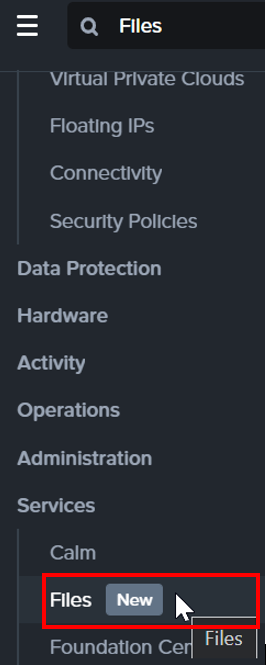

3.  Note down the File Server name

    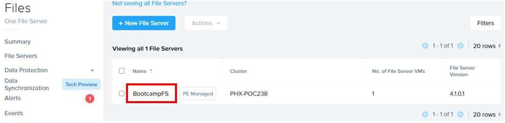

4.  Click on the hamburger menu.  Navigate to Nutanix Calm.

    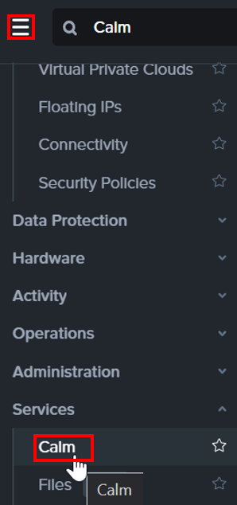

5.  Click on **Application**.  Click on **Application Name**

    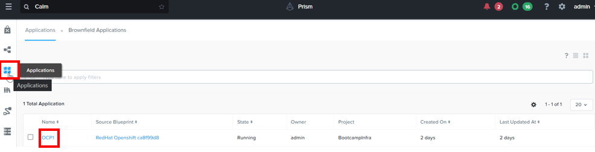

6.  Click on **Deploy CSI**

    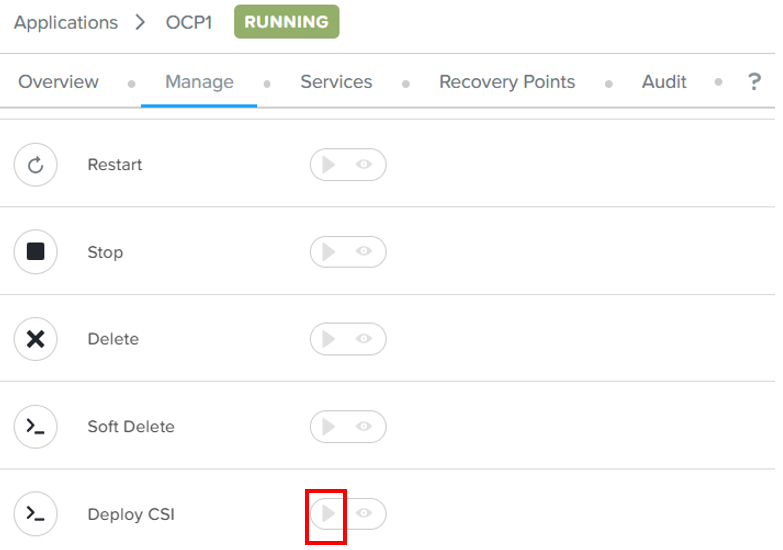

7.  Fill in the Nutanix File Server name.  Click on **Run**

    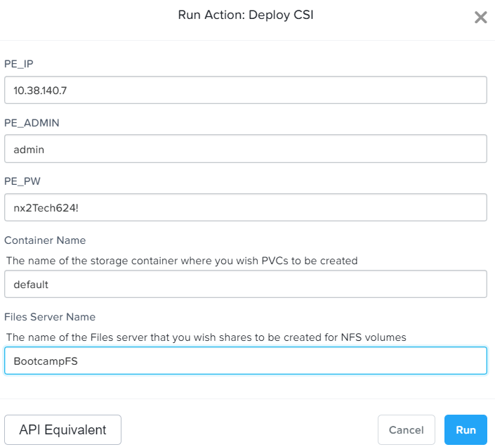

8.  Click on **Audit**.  Observe the deployment of CSI into OpenShift

    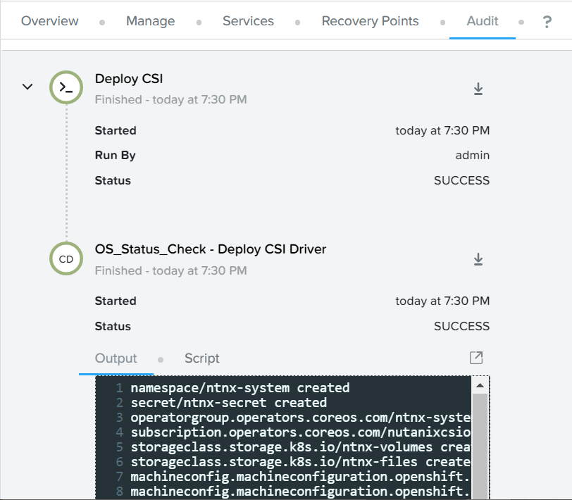

9.  Login into RedHat OpenShift.  

10.  Click on **Project**.  Fill in **ntnx**.  Observe the ntnx-system project was created

    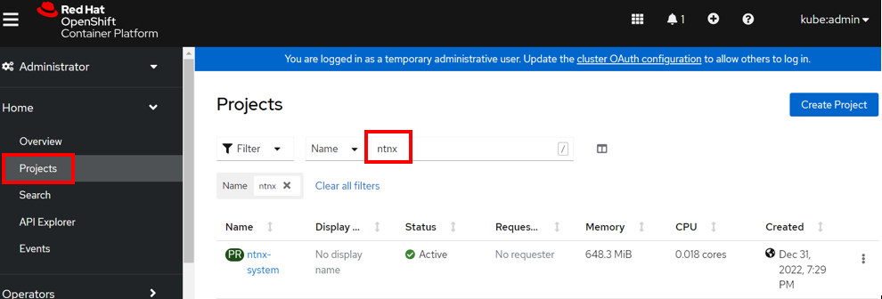

11.  Click on **Operators**.  Click on **Installed Operators**.  Observe the Nutanix CSI was installed.

    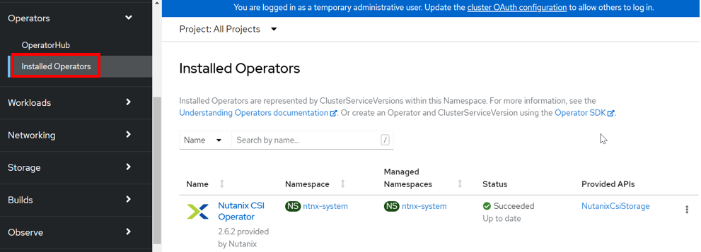

12.  Click on **Projects**.  Observe the **ntnx-system** project had been created

    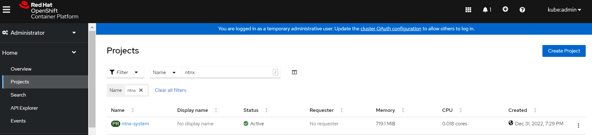

13.  Click on **Storage**.  Click on **Storage Class**.  Observe the **ntnx-volume** and **ntnx-files** had been created

    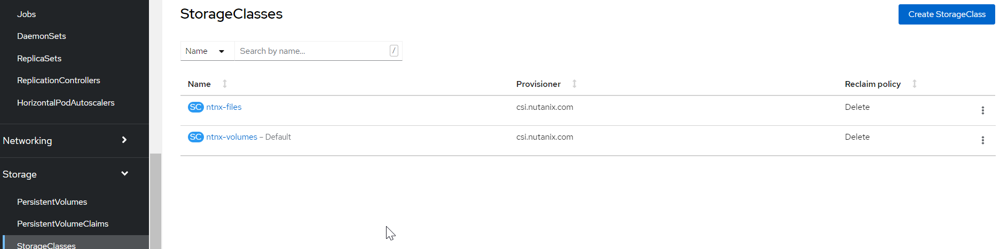


