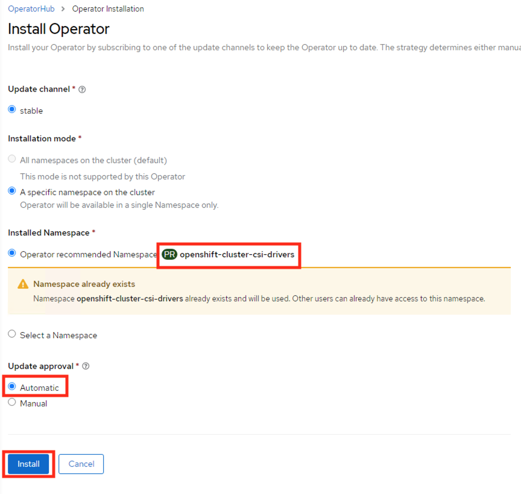

import Tabs from '@theme/Tabs';
import TabItem from '@theme/TabItem';
    

# Option 2: Nutanix CSI deployment for OCP 

In this section we will enable your deployed OCP cluster to have access to Nutanix HCI storage in the form of StorageClass, Physical Volumes and Pysical Volume claims.

We will also install kubernetes operator provided by Nutanix to maintain the lifecycle of operator.

See [What are Kubernetes Operators?](https://docs.openshift.com/container-platform/4.9/operators/understanding/olm-what-operators-are.html) for more information.

OpenShift provides a easy way of implementing these third-party operators via OperatorHub from the cluster manager GUI .

As the Nutanix CSI Operator provides the following capabilities as of now, we will install it to manage all our Nutanix StorageClass in this OCP cluster.

-   Basic install
-   Seamless upgrades (Manual or Automatic)

In future Nutanix CSI Operator may provide the following additional features:

-   Full lifecycle
-   Deep insights
-   Autopilot

Nutanix CSI supports Nutanix Volumes and Nutanix Files as backend data storage systems.

| Storage Class Mode   |    ReadWriteOnce     |    ReadOnlyMany |  ReadWriteMany         | 
| -------------|  ---------------------- |  -------- | ----------- | 
| Nutanix Volumes       |  Yes                 |  Yes        | No     | 
| Nutanix Files       |  Yes |  Yes  |  Yes    |  

In this lab, we will deploy both Nutanix Volumes and Files Storage Class and use them throughout the bootcamp.

## Install Nutanix CSI Operator

1.  Login to you Windows Tools VM using the following credentials;

    -   **Username** - <administrator@ntnxlab.local>
    -   **Password** - nutanix/4u

2.  Using Chrome browser browse to Console URL you obtained in the previous section.

    ```url
    https://console-openshift-console.apps.<initials>1.ntnxlab.local
    ```

    ```url
    # example URL
    # https://console-openshift-console.apps.xyz1.ntnxlab.local
    ```

3.  Use your credentials to Login

    -   **Username** - kubeadmin
    -   **Password** - password from previous section

4.  Click on **Log in** (if you are not already logged in)

5.  Click on **Operator** > **Operator Hub**

6.  You will see all third party operators categorised by solution driven use cases (e.g. Big Data, Database, etc)

    

    This is in principle similar to Nutanix Calm Marketplace where you can request and install applications.

7.  In the **Filter by Keyword** text box, type **Nutanix** to find the Nutanix CSI Operator

8.  Click on the **Nutanix CSI Operator**, verify Operator version to be at least `2.6.2` and click on **Install**

    

    Also make sure to check the supported orchestration (RH OCP platforms)

9.  In the Operator install wizard choose the following:

    -   **Update channel** - stable
    -   **Operator recommended Namespace** - ``openshift-cluster-csi-drivers`` (automatically chosen)
    -   **Update approval** - Automatic (admins usually choose Manual option where control over updates is necessary)

    

10. Click on **Install**.  It will takes a few minutes.

    

11. Click on **View Operator**.  Once installed you will also see the operator in **Operator** > **Installed Operators**

    

12. Click on **Create Instance**

    

13. Click on **Create** button

    

This will create a NutanixCsiStorage resource to deploy your driver.

14.  You have succesfully installed the Nutanix CSI operator to take care of StorageClass installation and upgrades.  

    


:::info

OCP Operators can also be installed using `oc` commandline. For more information refer to OCP documentation [here.](https://docs.openshift.com/container-platform/4.7/operators/admin/olm-adding-operators-to-cluster.html#olm-installing-operator-from-operatorhub-using-cli_olm-adding-operators-to-a-cluster)

Nutanix CSI can also be installed using ``helm`` charts as well as you would do in any implementation of kubernetes. See [here](https://github.com/nutanix/csi-plugin) for more details. 
:::

