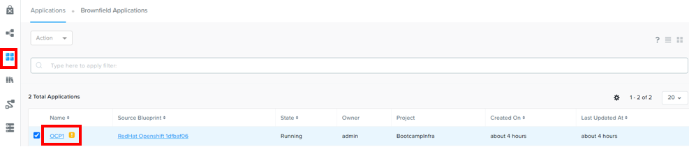
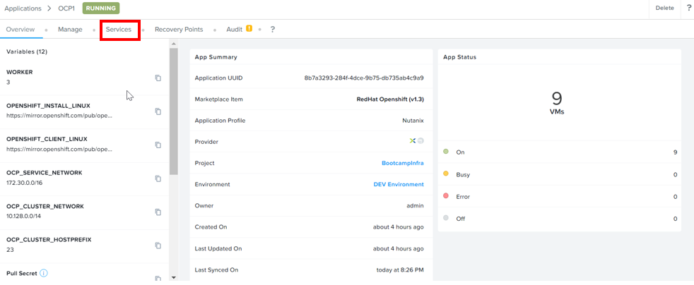
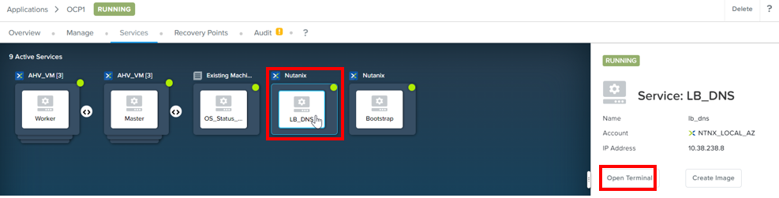
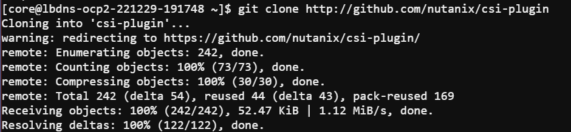
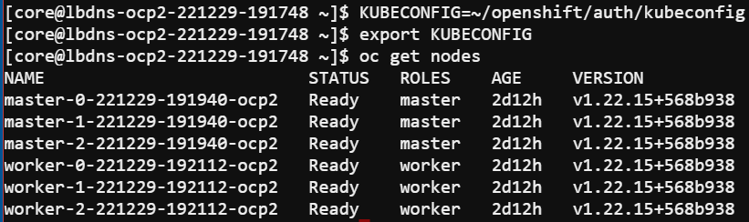
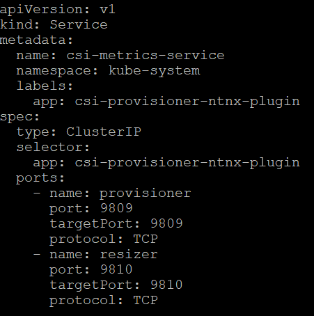
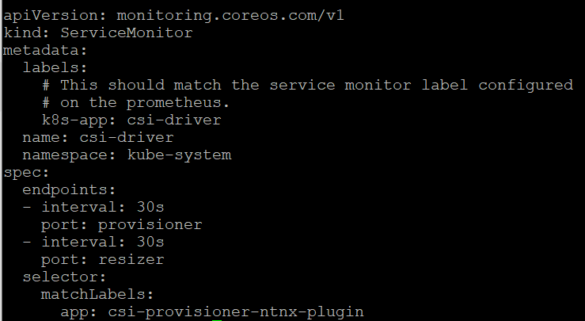
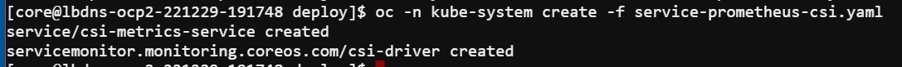

import Tabs from '@theme/Tabs';
import TabItem from '@theme/TabItem';

# CSI Metric Monitor with Prometheus

1.  Login to Prism Central.

2.  Navigate to Nutanix Calm.  Drill into the application.

    

3.  Click on **Service**

    

4.  Click on **LB_DNS**.  Click on **Open Terminal**

    

5.  Run this command to install git

    ```bash
    sudo yum install -y git
    ```

6.  Run this command to download the CSI files.

    ```bash
    git clone http://github.com/nutanix/csi-plugin
    ```

    

7.  Run the following commands to initialize oc.

    ```bash
    KUBECONFIG=~/openshift/auth/kubeconfig
    export KUBECONFIG
    oc get nodes
    ```

    

8.  Navigate to csi-plugin/deploy directory.  Look at the contents of the service-prometheus-csi.yaml.

    ```
    note
        Replace the namespace
        - to ntnx-system when the CSI was installed through NCM Self Service or
        - to openshift-cluster-csi-drivers when the CSI was installed through RedHat OpenShift OperatorHub
    ```

    
    

9.  Run this command

    ```bash
    oc create -f service-prometheus-csi.yaml
    ```

    

## Create Service Monitor in RedHat OpenShift

1.  Run this command to expose the service to the Load Balancer or Master Node.  
    ```note
        Replace the namespace
        - to ntnx-system when the CSI was installed through NCM Self Service or
        - to openshift-cluster-csi-drivers when the CSI was installed through RedHat OpenShift OperatorHub
    ```
    
    ```bash
    cat << EOF > ./ingress-prometheus-csi.yaml
    apiVersion: monitoring.coreos.com/v1
    kind: ServiceMonitor
    metadata:
      labels:
        k8s-app: csi-provisioner-ntnx-plugin
      name: csi-provisioner-ntnx-plugin
      namespace: openshift-cluster-csi-drivers
    spec:
      endpoints:
      - interval: 30s
        port: web
        scheme: https
      selector:
        matchLabels:
          app: csi-provisioner-ntnx-plugin
    EOF

2  Run this command to create the service monitor.  

    ```
    bash
    oc apply -f ingress-prometheus-csi.yaml
    ```