import Tabs from '@theme/Tabs';
import TabItem from '@theme/TabItem';

# Option 1: Nutanix Files StorageClass Deployment using RedHat OpenShift Console

Nutanix CSI with Nutanix Files as a target provides ReadWriteMany (RWM) capabilities meaning many pods can write to to the target storage at the same time.

## Create a File Share in Nutanix Files

Let's create a new share to provide it as a storage location for our storage class based on Nutanix Files.

1. In Prism Central, click on the hamburger menue.  Click on Files

   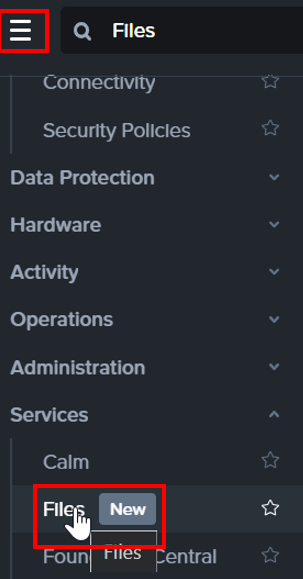

2. Click on the **BootcampFS** files server.  It opens a new tab.

   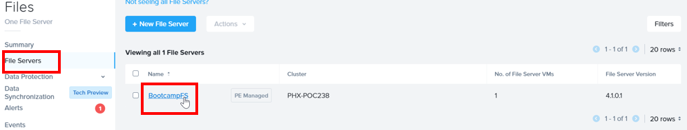

3. Click on **Shares**

   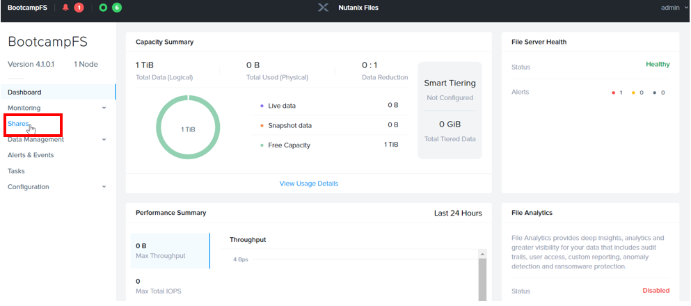

3. Click on **Create a New Share**

   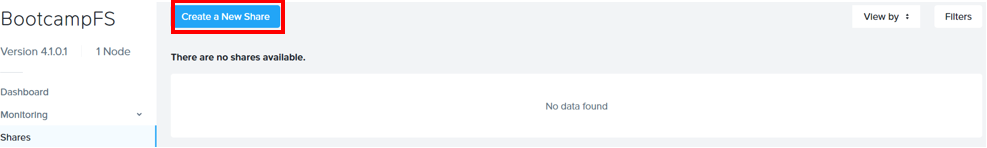

4. Create a new ``NFSv4`` share by filling in the following details
   
   - **Name** - ocp**initial**_nfs (E.g. ocp1_nfs, ocp2_nfs, ocp3_nfs)
   - **Description** - created for Files CSI on OCP 
   - **Share Path** - leave blank
   - **Max Size** - leave blank GiB 
   - **Primary Protocol Access** - NFS
   
    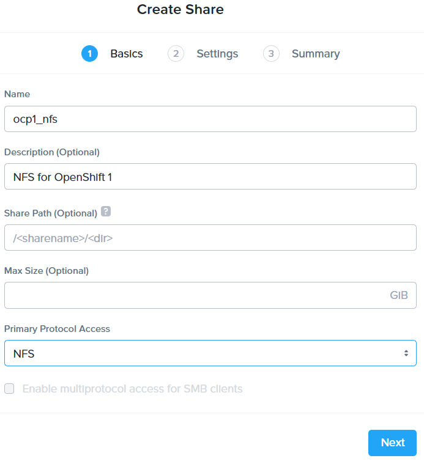

   :::caution

   Although Nutanix Files supports NFSv3 and NFSv4, only NFSv4 works with Storage Class. 

   Make sure your Files share that you will be using with Storage Class is NFSv4. 

   This issue may be resolved in future via software update to Nutanix CSI. 

   ::: 

4. Click on **Next**

5. Fill in the following details:
   
   - **General**
     - **Enable Compression** - checked
   - **Authentication** - System
   - **Default Access** - Read-Write 
   - **Squash** - None 
   - **Anonymous UID** - leave blank
   - **Anonymous GID** - leave blank

   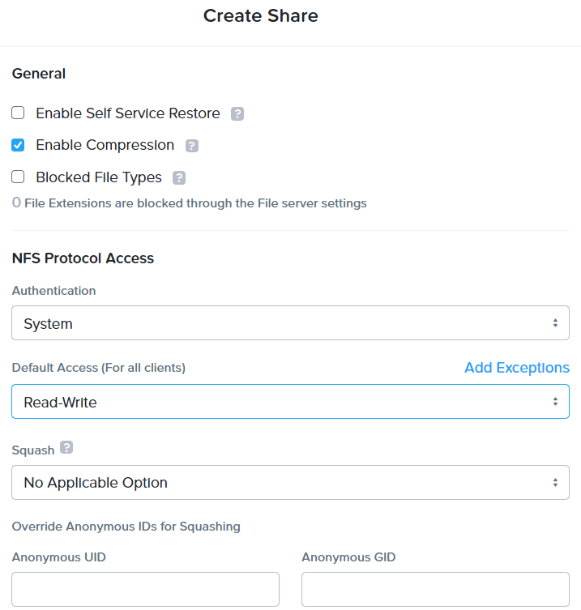

6. Click **Next**

7. Confirm your setting and click on **Create**

   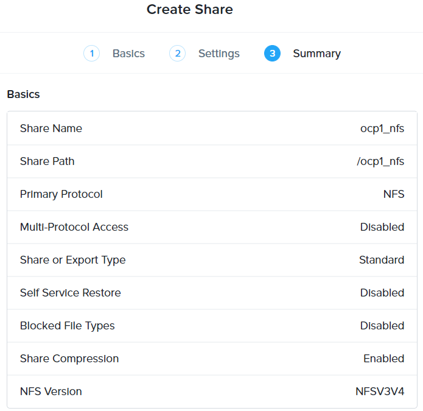
   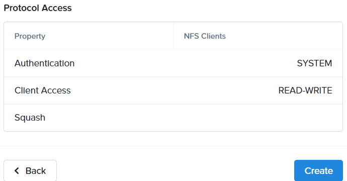

8.  Wait for a few seconds.

   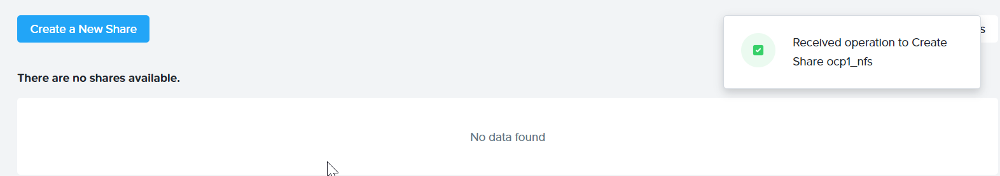

9.  The file share was created successfully

   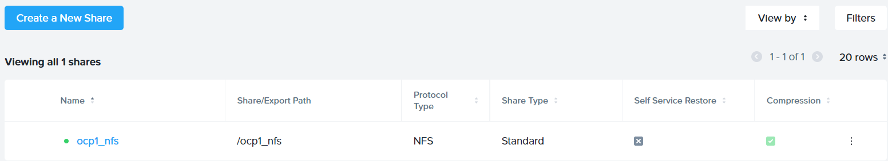

## Create Storage Class for Nutanix Files

1.  Login to RedHat OpenShift console.

2.  Click on **Storage**.  Click on **StorageClasses**.  Click on **Create StorageClass**

   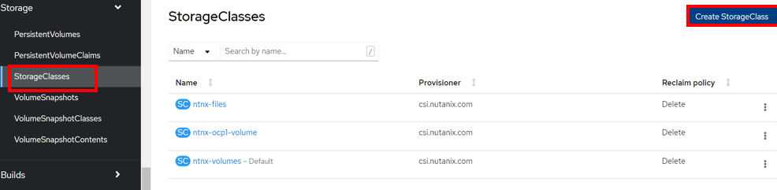

3.  Fill in the following:

   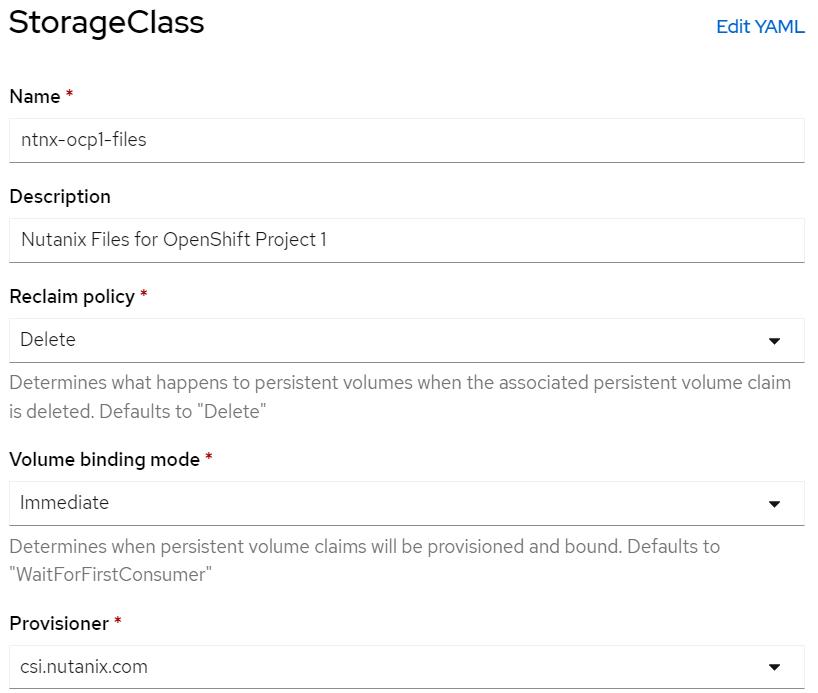

4.  Fill in the following parameters:

    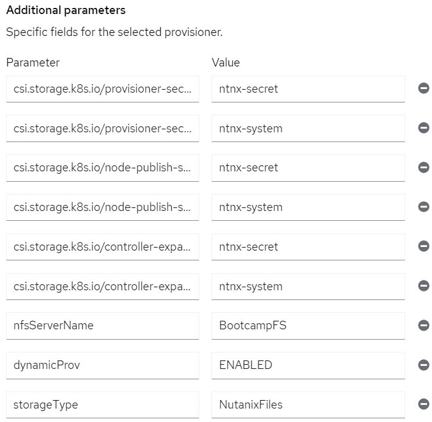

    - Parameters - **Values**     
    - csi.storage.k8s.io/provisioner-secret-name - **ntnx-secret** 
    - csi.storage.k8s.io/provisioner-secret-namespace - **ntnx-system** 
    - csi.storage.k8s.io/node-publish-secret-name  - **ntnx-secret**
    - csi.storage.k8s.io/node-publish-secret-namespace - **ntnx-system**
    - csi.storage.k8s.io/controller-expand-secret-name - **ntnx-secret**
    - csi.storage.k8s.io/controller-expand-secret-namespace - **ntnx-system**
    - nfsServerName - **BootcampFS**
    - dynamicProv -  **ENABLED**
    - storageType - **NutanixFiles**

5.  Click on **Create**.

6.  The storage class for Nutanix Files was created successfully.

   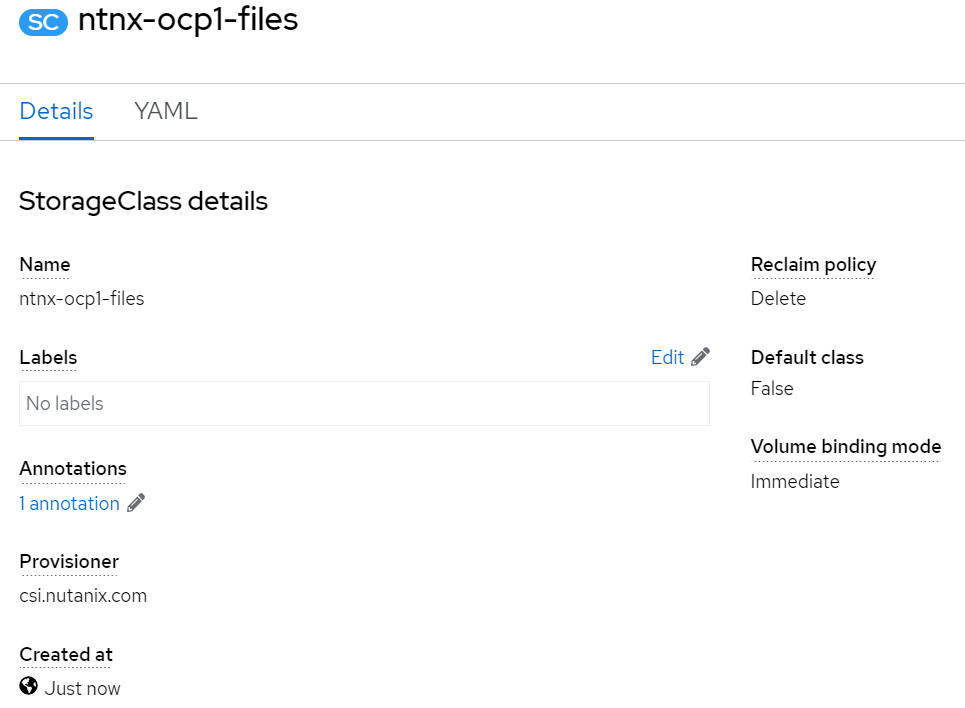
