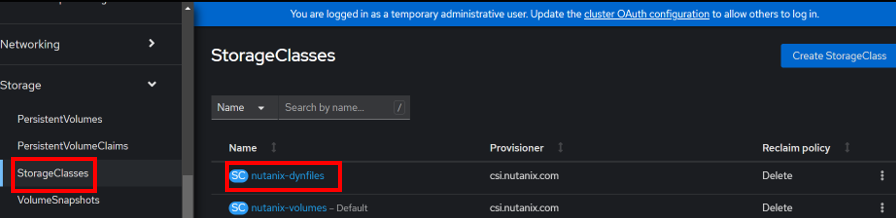

import Tabs from '@theme/Tabs';
import TabItem from '@theme/TabItem';

# Option 2: Nutanix Files StorageClass Deployment using Command Line

Nutanix CSI with Nutanix Files as a target provides ReadWriteMany (RWM) capabilities meaning many pods can write to to the target storage at the same time.

In this section we will install StorageClass with Nutanix Files target in ``dynamic`` mode. 

<details>
<summary>Curious about static mode?</summary>

``Static`` mode Files storage class is also available with Nutanix CSI. Use the following manifest to create this. The file share needs to manually created before the storage class can be configured.

```yaml {7-8}
apiVersion: storage.k8s.io/v1
kind: StorageClass
metadata:
  name: nutanix-files
provisioner: csi.nutanix.com
parameters:
  nfsPath: /my_nfs4_share         ##use the file share name - must be NFSv4
  nfsServer: apjsme-fs.apjsme.com ##use the fqdn of your Nutanix Files server
  storageType: NutanixFiles
```
</details>

<!--- commented for later use

### Create a File Share in Nutanix Files

Let's create a new share to provide it as a storage location for our storage class based on Nutanix Files.

1. In Prism Element, go to Menu > Files 

2. Select the **BootcampFS** files server and click on **Launch Files Console** (this will open in a new tab)

3. Click on **Shares > Create a New Share**

4. Create a new ``NFSv4`` share by filling in the following details
   
   - **Name** - Initials_nfs (E.g. xyz_nfs)
   - **Description** - created for Files CSI on OCP 
   - **Share Path** - leave blank
   - **Max Size** - 100 GiB 
   - **Primary Protocol Access** - NFS
   
   :::caution

   Although Nutanix Files supports NFSv3 and NFSv4, only NFSv4 works with Storage Class. 

   Make sure your Files share that you will be using with Storage Class is NFSv4. 

   This issue may be resolved in future via software update to Nutanix CSI. 

   ::: 

4. Click on **Next**

5. Fill in the following details:
   
   - **General**
     - **Enable Compression** - checked
   - **Authentication** - System
   - **Default Access** - Read-Write 
   - **Squash** - None 
   - **Anonymous UID** - leave blank
   - **Anonymous GID** - leave blank

6. Click **Next**

7. Confirm your setting and click on **Create**

-->

### Create File Share as a CSI target

1. Use the following yaml file to create a storage class with Nutanix files as destination

   ```bash 
   cat << EOF > nutanix-dynfiles.yaml
   kind: StorageClass
   apiVersion: storage.k8s.io/v1
   metadata:
       name: nutanix-dynfiles
   provisioner: csi.nutanix.com
   parameters:
     dynamicProv: ENABLED
     nfsServerName: BootcampFS    
     csi.storage.k8s.io/provisioner-secret-name: ntnx-secret
     csi.storage.k8s.io/provisioner-secret-namespace: openshift-cluster-csi-drivers
     csi.storage.k8s.io/node-publish-secret-name: ntnx-secret
     csi.storage.k8s.io/node-publish-secret-namespace: openshift-cluster-csi-drivers
     csi.storage.k8s.io/controller-expand-secret-name: ntnx-secret
     csi.storage.k8s.io/controller-expand-secret-namespace: openshift-cluster-csi-drivers
     storageType: NutanixFiles
     description: "added by OCP dynamic provisioning"
   allowVolumeExpansion: true
   EOF
   ```
2. Edit the file to make configure your file share and file server 

   ```bash
   vi nutanix-dynfiles.yaml
   ```

3. Create the storage class 

   ```bash
   oc apply -f nutanix-dynfiles.yaml
   ```
   ```buttonless title="Output"
   storageclass.storage.k8s.io/nutanix-dynfiles created
   ```
4. List your storage classes

   ``` bash
   oc get StorageClass -A
   ```

   ```buttonless title="Output"
   NAME                       PROVISIONER       RECLAIMPOLICY   VOLUMEBINDINGMODE   ALLOWVOLUMEEXPANSION   AGE
   nutanix-dynfiles           csi.nutanix.com   Delete          Immediate           true                   67s
   nutanix-volumes (default)  csi.nutanix.com   Delete          Immediate           true                   17m   
   ```

5.  Login to RedHat OpenShift console.  Click on **Storage**.  Click on **StorageClasses" to verify the successful creation.

   

Now that you have deployed two storage classes with backend storage of Nutanix Volumes and Files, we will use them in our subesequent labs.