import Tabs from '@theme/Tabs';
import TabItem from '@theme/TabItem';

# Option 1: Create Nutanix Volume Storage Class using RedHat OpenShift Console
    
1.  You can create the Nutanix Volume Storage Class using one of the approaches below:

    -  **Option 1: Use RedHat OpenShift Console **
    -  **Option 2: Execute command line in Load Balancer or **
    
## Pre-requisites:

1.  You had used NCM Self Service to deploy the Nutanix CSI.

## Modify Secret in RedHat OperatorHub

1.  Click on **Workload->Secrets**.  A secret named **ntnx-secret** was created in the **ntnx-system** namespace 
    when deploying the CSI through NCM Self Service.  Click on **Edit Secret**

    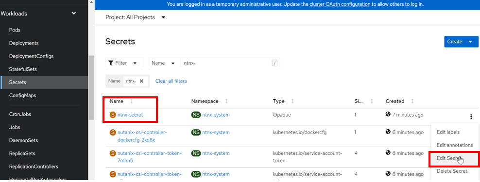

2.  This is the default secret created through NCM Self Service.  The parameter was wrong.  Click on **Cancel**

    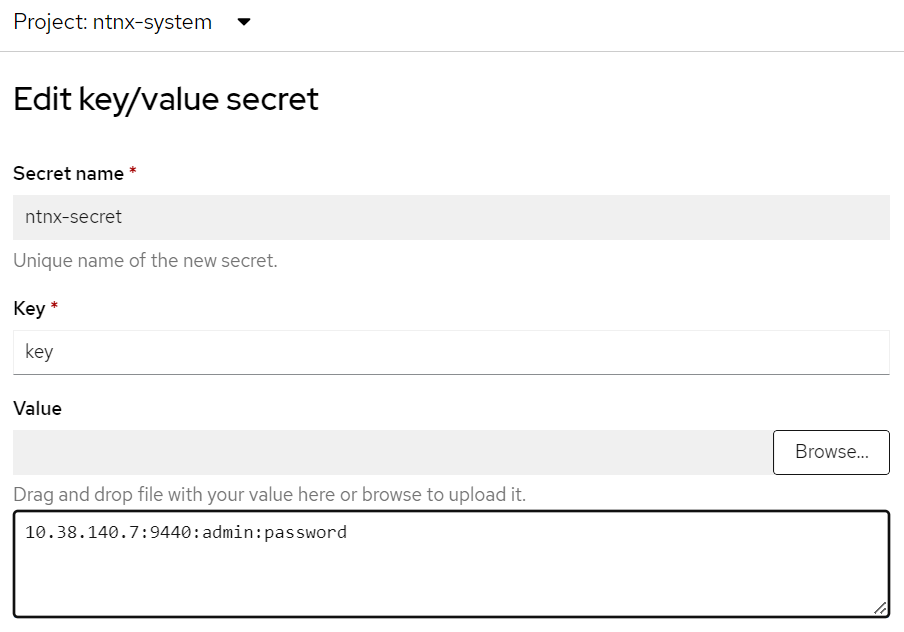

3.  Click on **Delete secret**

    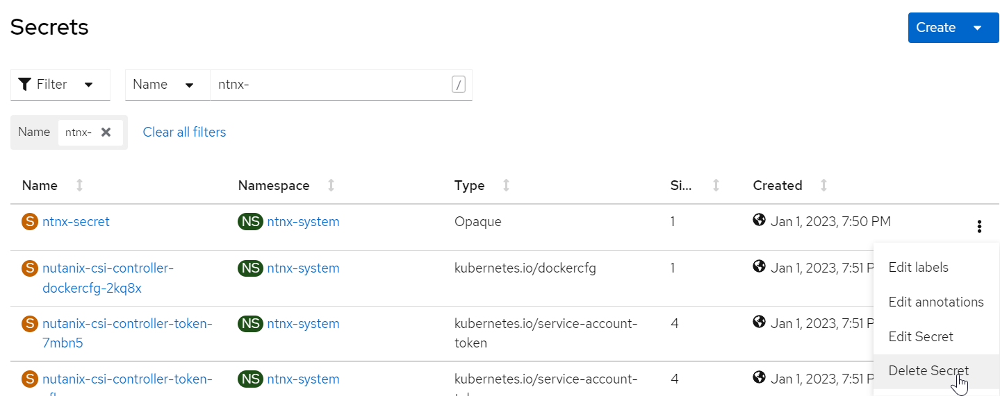

4.  Filter by **OCP Project created earlier**

    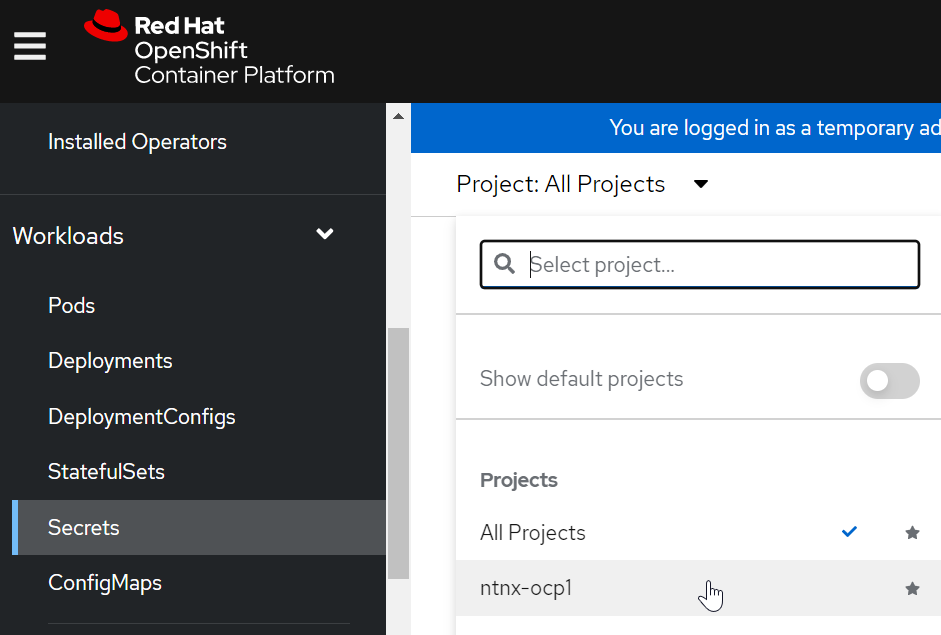

5.  Click on **Key/Value secret**.  

    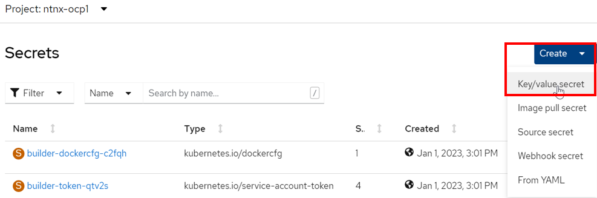

6.  Key in the following.  Click on **Create**

    - Replace the password with the Prism Element password provided by the trainer

    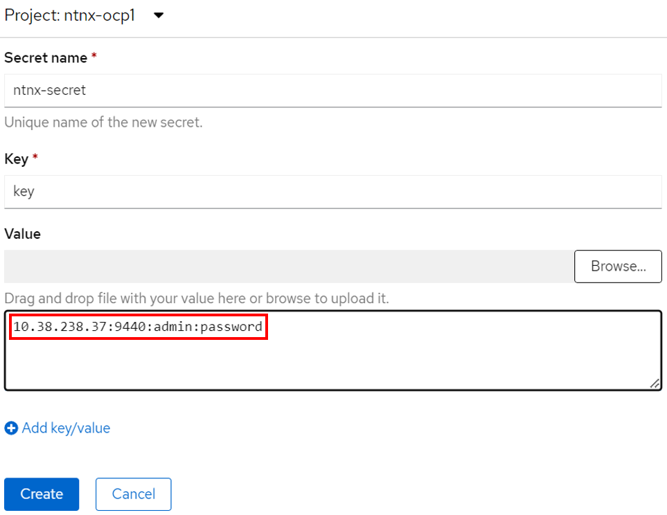

7.  Observe the **ntnx-secret** was created

    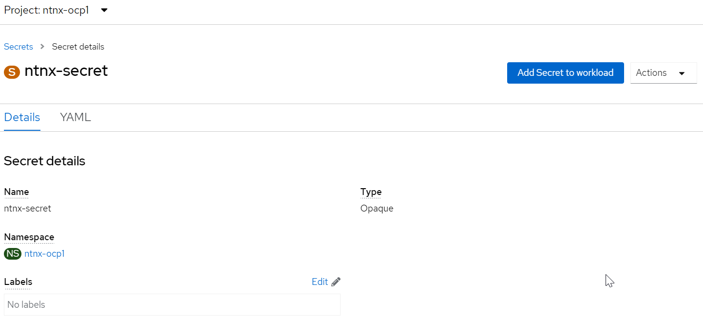

## Create Nutanix Volume Storage Class

1.  Click on **Storage**->**Storage Classes**.  Click on **Create Storage Class**

    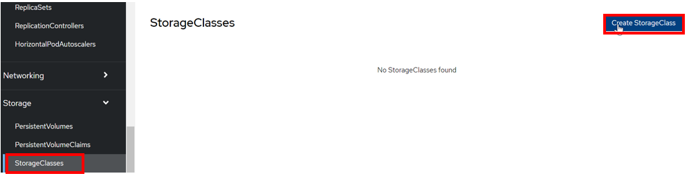

2.  Fill in the following: Click on **Create**

    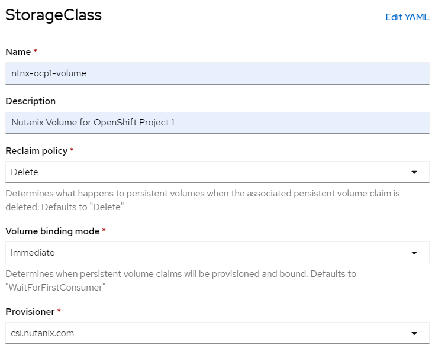

3.  Fill in the following parameters:

    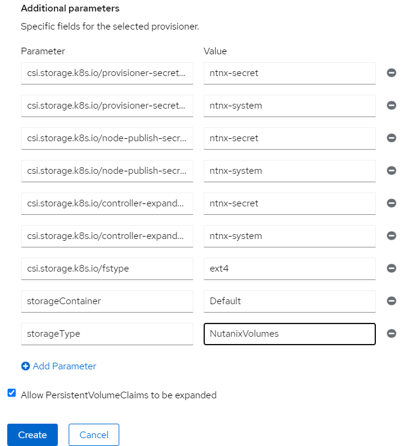
    - Parameters - **Values**     
    - csi.storage.k8s.io/provisioner-secret-name - **ntnx-secret** 
    - csi.storage.k8s.io/provisioner-secret-namespace - **ntnx-system** 
    - csi.storage.k8s.io/node-publish-secret-name  - **ntnx-secret**
    - csi.storage.k8s.io/node-publish-secret-namespace - **ntnx-system**
    - csi.storage.k8s.io/controller-expand-secret-name - **ntnx-secret**
    - csi.storage.k8s.io/controller-expand-secret-namespace - **ntnx-system**
    - csi.storage.k8s.io/fstype - **ext4**
    - storageContainer -  **Default**
    - storageType - **NutanixVolumes**
  

4.  The storage class was created successfully.

    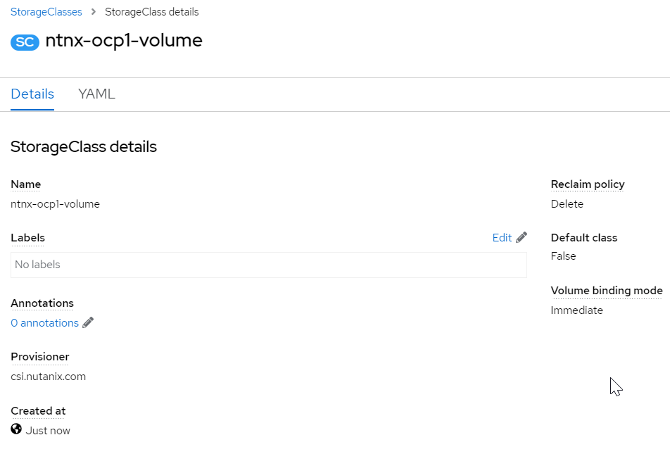

   