# OCP: Day 0 and Day 1 Operations

In this section we will look at Typical Day 1 operations of your OCP cluster in terms of scaling out and scaling in VMs.

For the purposes of the lab, we will achieve scale in/out operations by triggering a Calm Action manually. These Calm Actions can also be triggered using REST calls from an automation script.

:::caution 

This section can only be attempted if the previous sections are completed successfully

:::

## Day 0: Accessing OCP Cluster Manager

In the HPOC environment all the DNS lookups are contained within each HPOC cluster.

For this reason, we will have to access the OCP Cluster Manager using the Windows Tools VM.

If you don't have a Windows Tools VM in your HPOC. Use these instructions [here](../toolsvms/windows_tools_vm.mdx) to create one.

:::info

DNS lookup will not work from anywhere else except the Windows Tools VM within your HPOC/SPOC cluster as it is connected to the AutoAD server which also is a DNS server.

Only use this Windows Tools VM to access the ocp cluster manager web UI.

:::

1.  Login to you Windows Tools VM using the following credentials;

    -  **Username** - <administrator@ntnxlab.local>
    -  **Password** - nutanix/4u

2.  Using Chrome browser browse to Console URL you obtained in the previous section. Note that this URL will be different for each cluster that you deploy.

    ``` url
    https://console-openshift-console.apps.<initials>1.ntnxlab.local
    # example URL
    # https://console-openshift-console.apps.xyz1.ntnxlab.local
    ```

3.  Use your credentials to Login

    -   **Username** - kubeadmin
    -   **Password** - password from previous [section](#Day-0:-Getting-OCP-Cluster-Login-Details)

4.  Click on **Log in**

    You will see the cluster manager\'s web interface.

    This is in principle similar to Nutanix Karbon's individual kubernetes cluster management page. Note that you can only manage the resources of just this local cluster.

    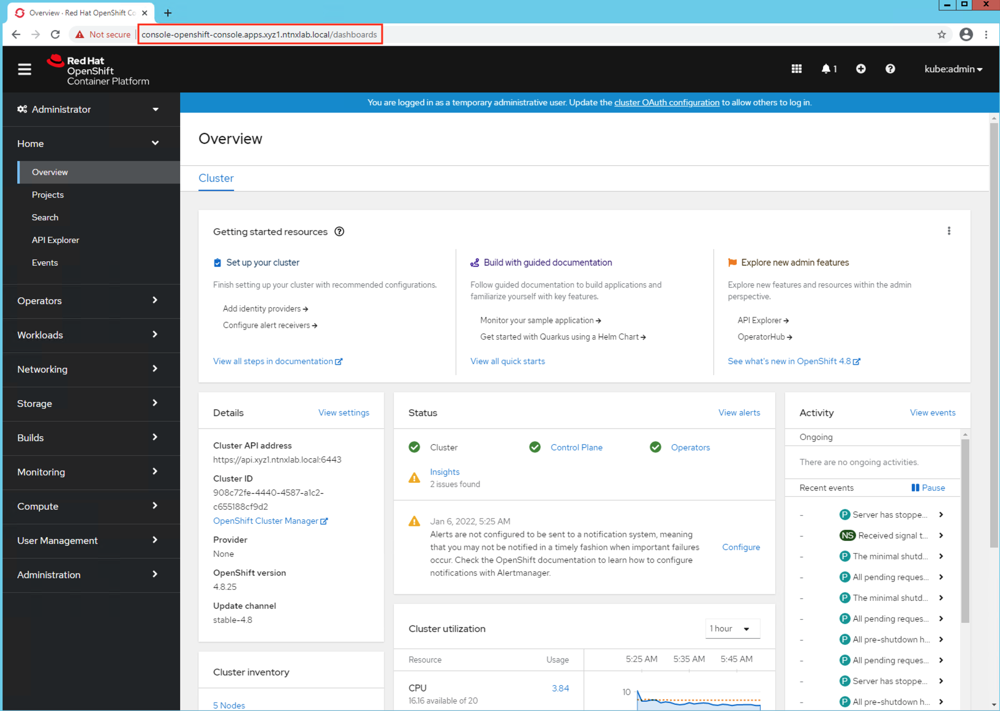

    :::info
   
    To be able to manage other clusters or a group of clusters, you will need to register this cluster to  web interface

    :::

You can see how managing all parts of the OCP cluster are in a single place. In a open source kubernetes cluster you would have to install many management packages and go many places them.This is one of the strong selling points of a OCP kubernetes cluster.

## Day 1: Scale Out Worker Nodes

As any environment would require more kubernetes nodes from time to time to host more workloads. In this sectoin we will look at how a extra worker node is added to this OCP cluster.

We will do this using Calm Actions.

1.  In **Calm** > **Applications**

2.  Click on the **Openshift xyz1** application and go to **Manage** tab

3.  In the **Scale Out** action, click on play button

    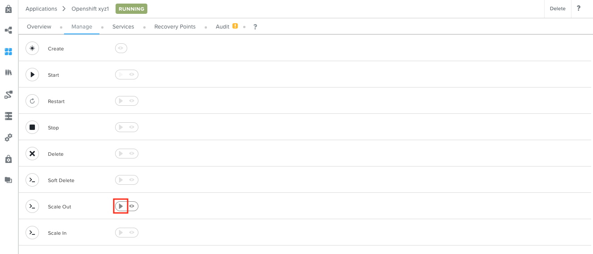

4.  Enter `2` as the **Scale out number of Workers** and click on **Run**

    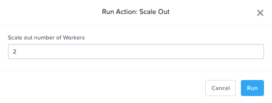

5.  In the **Scale Out** action, click on the eye button to see the action's progression status

    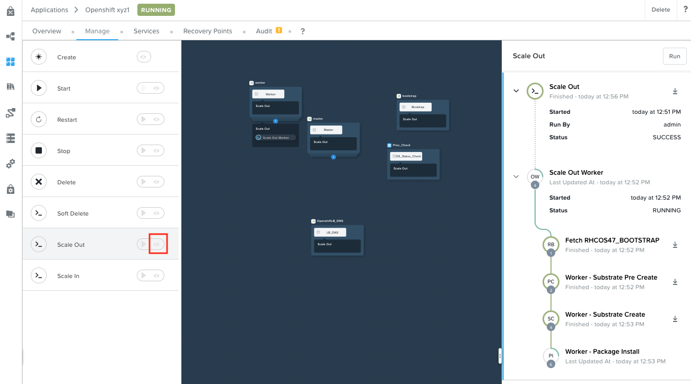

6.  Monitor the events in Prism Central to see what is being create on the HCI infrastructure

7.  Note down the number of resources created (e.g VM, Disk, etc)

8.  This will take about 5-10 minutes

9.  Once the Scale Out action is successfully completed, go to the **Service** tab of the VM and check if two more nodes are added

    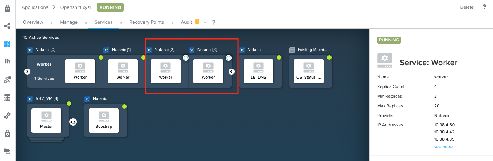

10. In your OCP Console, go to Compute > Nodes and make sure OCP has picked up the two extra worker nodes

    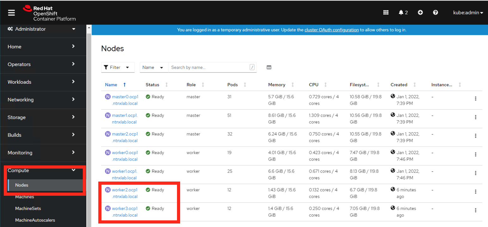

Calm makes it really simple to scale out your OCP cluster Day 1 operations.

## Day 1: Scale In Worker Nodes

As any environment would require more kubernetes nodes from time to time to host more workloads. In this section we will look at how a worker node is removed from this OCP cluster as the resource requirements for workloads decreases.

We will do this using Calm Actions.

1.  In **Calm** > **Applications**

2.  Click on the **Openshift xyz1** application and go to **Manage** tab

3.  In the **Scale In** action, click on play button

    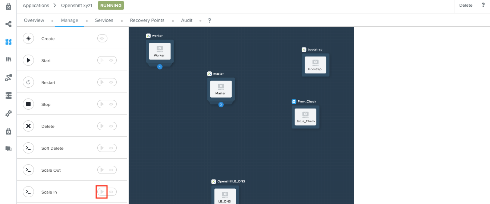

4.  Enter `1` as the **SCALEIN_WORKER** input and click on **Run**

    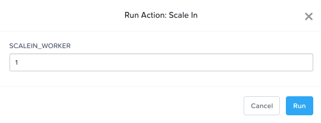

5.  In the **Scale In** action, click on the eye button to see the action's progression status

    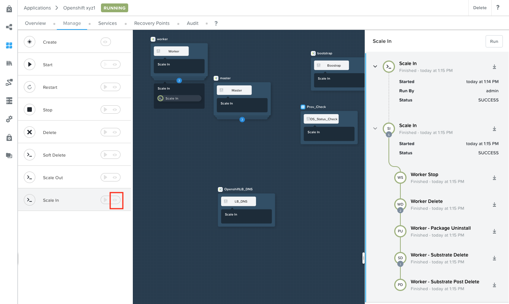

6.  Monitor the events in Prism Central to see what is being create on the HCI infrastructure

7.  Note down the number of resources deleted (e.g VM, Disk, etc)

8.  This will take about 5 minutes

9.  Once the Scale In action is successfully completed, go to the **Service** tab of the VM and check if one worker nodes is deleted

    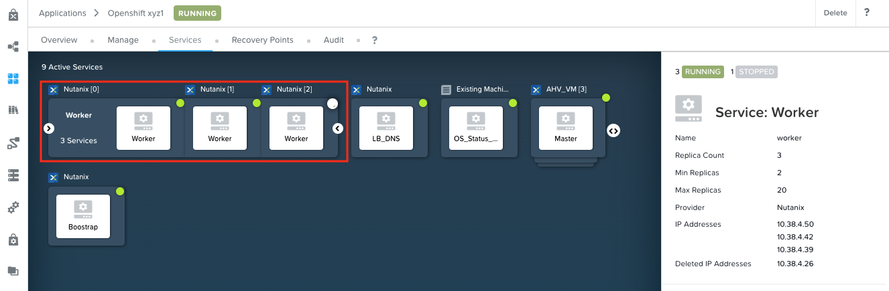

10. In your OCP Console, go to Compute \> Nodes and make sure OCP has deleted 1 worker node (there will be three left)

    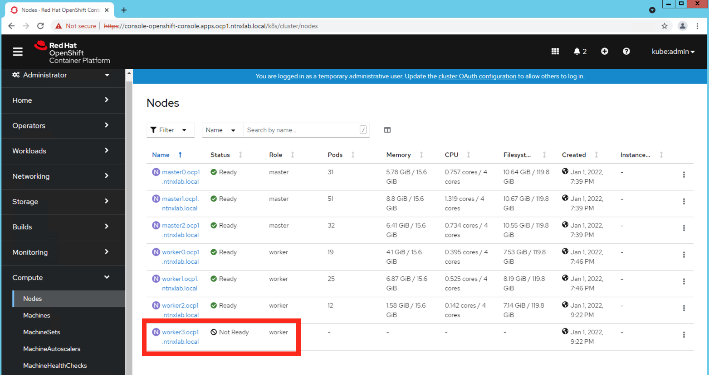

    :::caution

    OCP keeps the node entry as **Not Ready** (unless manually deleted) to prevent any data corruption to workloads running on the node and to register a new node that comes in as a result of another scale
    out operation

    Only delete a node that you have confirmed is completely stopped and cannot be restored.

    :::
    
    :::tip

    As an optional task run the **Scale Out** action once again with `1` node and check if the OCP node becomes **Ready**.
    
    :::

Calm makes it simple to scale in your OCP cluster Day 1 operations as the resource requirements reduces.

We have now successfully completed this section of the lab doing Day 1 operations.

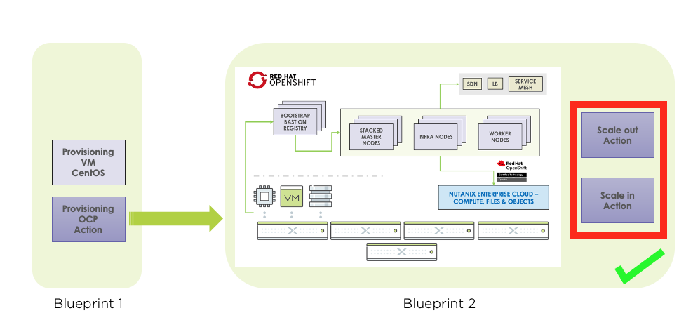

## Takeaways

-   Calm makes Day 0 and Day 1 operations easy to manage in a complex environment
-   As maintaining a OCP environment is difficult in terms of administration, Calm helps facilitate this in a repeatable and reliable manner

We will proceed to deploying Nutanix CSI drivers section of the lab.
