# OCP: Deploy OCP Infrastructure

In this section we will deploy a OCP cluster using Nutanix Calm.

As discussed in the previous section about the Calm blueprints,

1.  Blueprint 1 (XYZ_OCP_Prov_VM) - provisions a OCP provisioning VM with Calm action to deploy OCP
2.  Blueprint 2 (XYZ_OCP_Master_Worker) - is called by a Calm action in `Blueprint 1` with all the necessary information that `Blueprint 2` needs to run

Since we sucessfully setup OCP provisioning VM, we have to do the following to proceed:

1.  Configure OCP VM Blueprint for environment information
2.  Call the `Deploy OCP` action in Blueprint 1 to deploy OCP cluster

## Configuring OCP VM Blueprint

In this section we will configure the environemnt for the OCP VM blueprint to run. This will include the following:

-   Credentials (SSH Private Key) for the services
-   Confirming OCP DNS endpoint for the services
-   NICs are auto selected during execution

:::caution Are Calm endpoints setup?

Calm automatically assigns endpoint to Calm Actions as endpoint is created in your previous labs Calm endpoint section. It is important to confirm end points for actions in the lab.

:::

1.  In **Prism Central** > **Services** > **Calm**

2.  Click on **Blueprints**

    We need to configure network and credentials for the blueprint so it can be deployed in your HPOC/SPOC.

1.  Select your Provisioning VM `XYZ_OCP_Master_Worker` blueprint

2.  Click on **Credentials** (next to Save)

 3.  Copy the same **Private Key** that you generated from the previous section and paste the generated primary key in the bluprints credential called **CRED**

    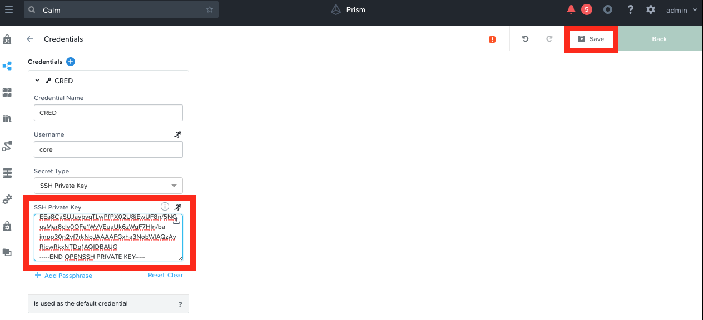

4.  Click on **Save**

5.  Click on **Back** to return to the blueprints main window

6.  You will notice a few warnings for KUBEADMIN and KUBECONFIG
    variables. These can be ignored as they will be auto-generated.

Now we will check if OCP DNS endpoints are configured for the services.

1.  In the blueprint's main window, expand the application and services pane

2.  Click on the **Worker** service and select the **Create DNS Entry**
    action

    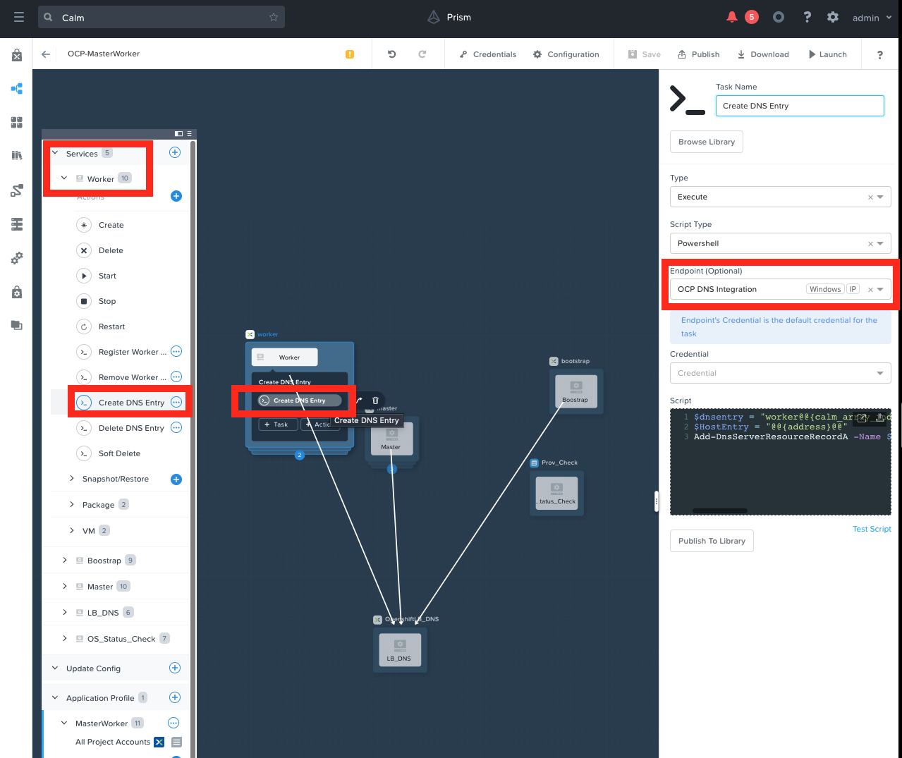

3.  Confirm that the endpoint is the **OCP DNS Integration** that you
    previously configured in `endpoint`{.interpreted-text role="ref"}
    section

4.  Confirm the **OCP DNS Integration** for **Delete DNS Entry** task

5.  Confirm the **OCP DNS Integration** endpoints for **Create DNS Entry** and **Delete DNS Entry** for the following services:

    -   Bootstrap
    -   Master

6.  If the endpoint is not assigned properly, correct the condition

7.  Save the blueprint and confirm there are no validation errors
    (warnings about KUBECONFIG (runtime variable) can be ignored)

    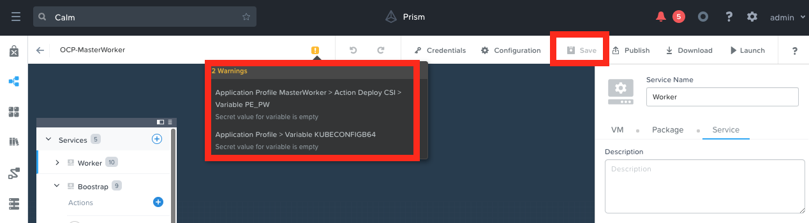

## Deploying OCP Cluster

1.  In **Prism Central** > **Services** > **Calm**

2.  Click on **Applications**

3.  Select your Provisioning VM *Initials*_PROV_VM application

    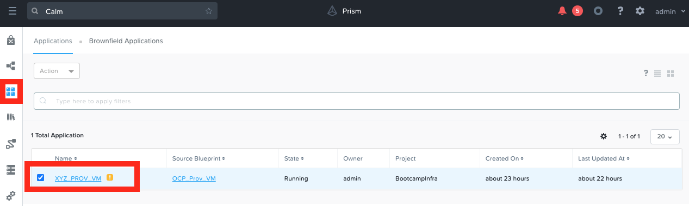

4.  Click on **Manage** tab

5.  Click on the **play** button next to **Deploy OCP** action

    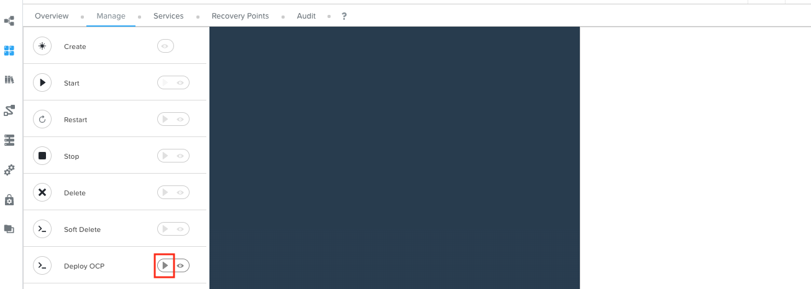

6.  This will open up **Run Action: Deploy OCP** window for user inputs

7.  Fill only the following details:

    -   **Number of Workers** - 2
    -   **OCP_PULL_SECRET** - download/copy pull secret this from your Red Hat Portal [Login](https://console.redhat.com/openshift/install/pull-secret) (you will need Red Hat Portal Access)
    -   **OCP_SUBDOMAIN** - Initials1 (e.g. **xyz1**)
    -   **OCP_MACHINE_NETWORK** - provide your Primary network address for your HPOC/SPOC (e.g. 10.38.2.64/26 ) - check in your cluster reservation email/webpage
    -   **OCP_BP** - name of the OCP_Master_Worker `blueprint2` that you
        uploaded (e.g. XYZ_OCP_Master_Worker)

    :::caution Check your subdomain/ocp cluster name?
   
    Make sure that the **OCP_SUBDOMAIN** name is be unique for each OCP cluster you deploy with this blueprint. A DNS zone is created based on this subdomain name.

    You can observe this in DNS in your AutoAD VM for other deployed clusters.

    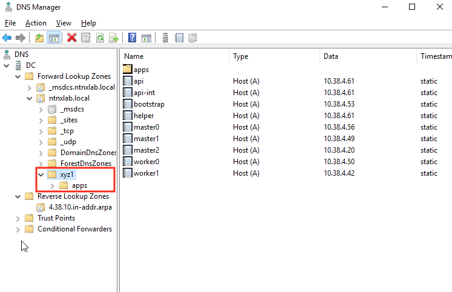

    :::

    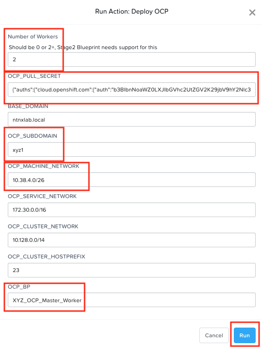

8.  Click on **Run**

9.  Go to the **Audit** tab to check the stautus of the launched **Deploy OCP** action

    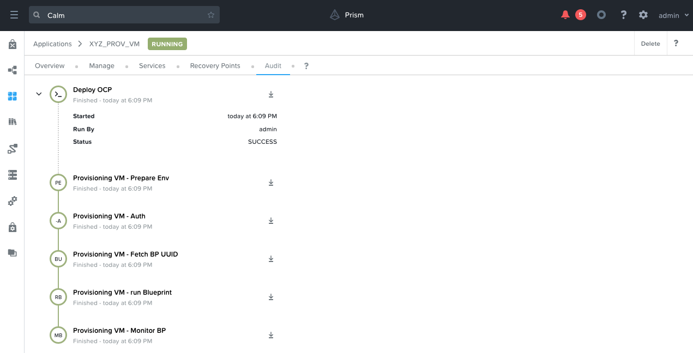

10. If this action launch is succesful, you will see another application
    **Openshift xyz1** in the **Calm** > **Applications** in a **Provisioning** state (this might take up to 5 minutes to show up in the Web UI)

    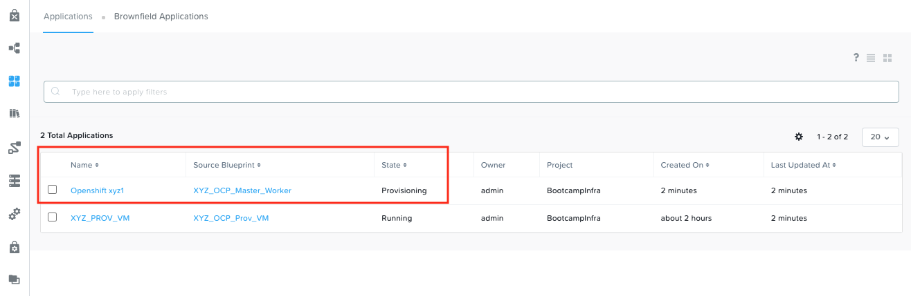

11. Click on the **Openshift xyz1** application and go to **Audit** tab

12. Observe the VM create, package install and other Calm actions

13. This should take about 30-35 minutes

14. Meanwhile you can notice that Prism Central\'s event will be getting
    quite busy. This is a result of VMs, storage, etc,. getting
    provisioned by Calm using REST calls to Prism Cental

15. Once deployed the Calm application **Openshift ocp1 XYZ** will be in
    a running state

    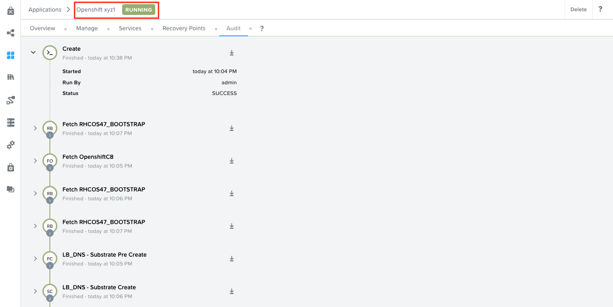

Now that your OCP cluster has been deployed, in the **Services** tab, lets explore the VMs (Services in Calm) and their corresponding functions.

Click on each VM (Service) will display IP addresses and **Open Terminal** options. We will be using the private key to ssh into these VMs (if required)

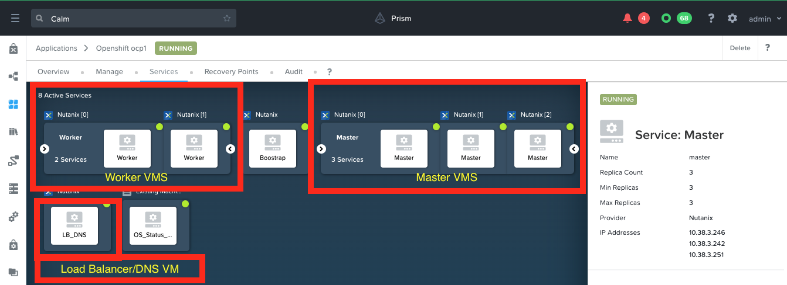

We have completed this section of the lab where our OCP cluster is sucessfully deployed.

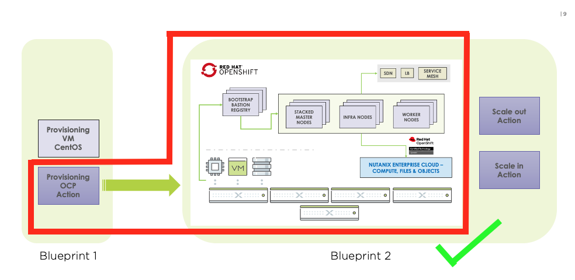

## Day 0: Getting OCP Cluster Login Details

1.  In **Calm** > **Applications**

2.  Click on the **Openshift xyz1** application and go to **Audit** tab

3.  Go to the end of the audit trail and look for **OS_Status_Check
    Start** task and expand

4.  Click on **OS_Status_Check - Show Login Information** sub task and
    click to maximize the output window

    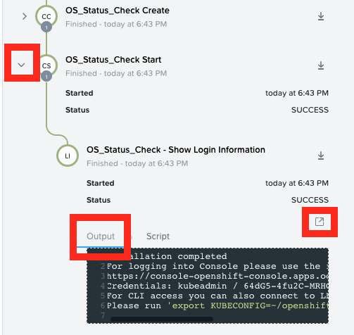

5.  Make a note of the following:

    -   Console URL
    -   Credentials: Username / password

    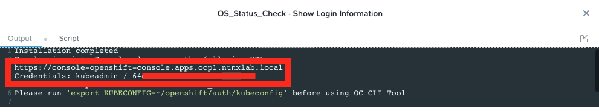

    :::caution

    The password and URL will be different for your OCP cluster.

    :::

6.  Note this down as you will need these credentials to logon to the OCP cluster managment console

We will proceed to test Day 1 operations (Scale out and Scale in) in the next section of the lab.
