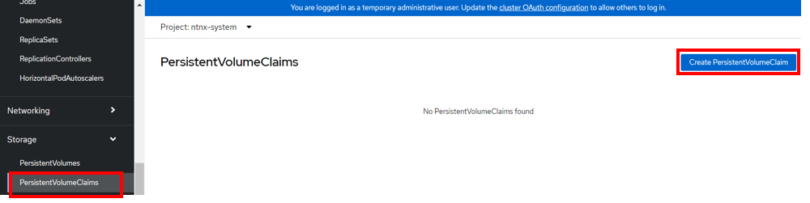
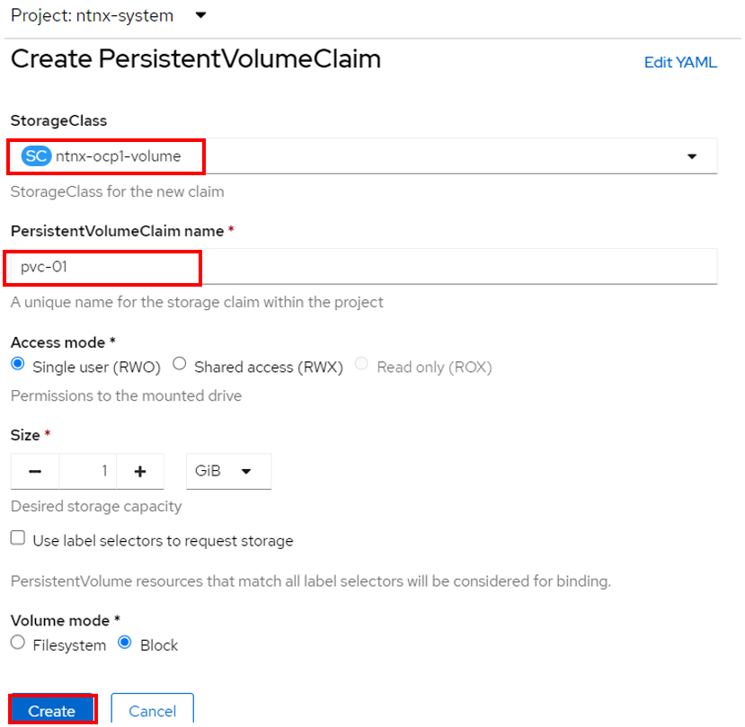
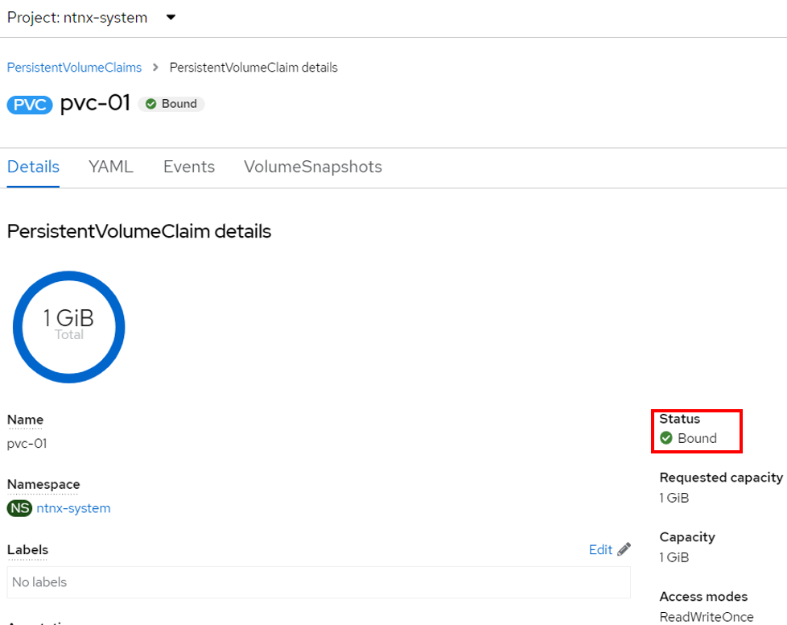

import Tabs from '@theme/Tabs';
import TabItem from '@theme/TabItem';

# Create Persisnt Volume Claim (PVC)for Nutanix Volume

Managing storage is a distinct problem from managing compute resources. OpenShift Container Platform uses the Kubernetes persistent volume (PV) framework to allow cluster administrators to provision persistent storage for a cluster. Developers can use persistent volume claims (PVCs) to request PV resources without having specific knowledge of the underlying storage infrastructure.

## Create Persistent Volume Claim

1.  Click on **Storage**->**Persistent Volume Claim**.  Click on **Create Persistent Volume Claim**

    

2.  Fill in the following.

    - PersistentVolumeClaim name: Eg pvc-01, pvc-02 in accordance to assigned user by the instructor

    

3.  The Persistent Volume Claim was created successfully.  Please observe the status must be in **Bound** state.  
    
    

4.  If the status was in **Pending** state, verify the following:

    -  Edit the secret **ntnx-secret**.  Verify it is configured to the right Prism Element IP and credential
    -  Delete & Re-create the storage class.
    -  Delete & Re-create the persistent volume claim.