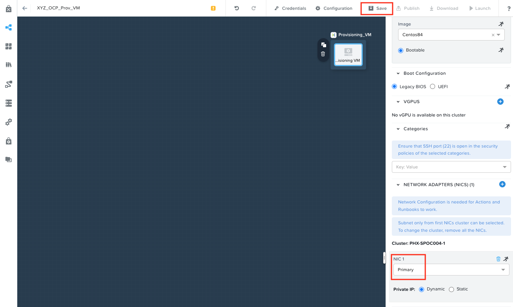
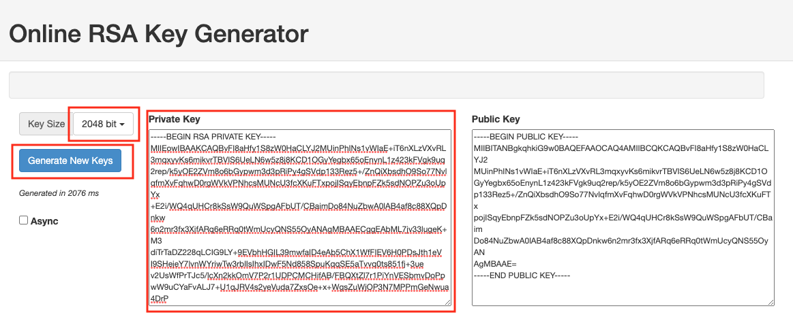
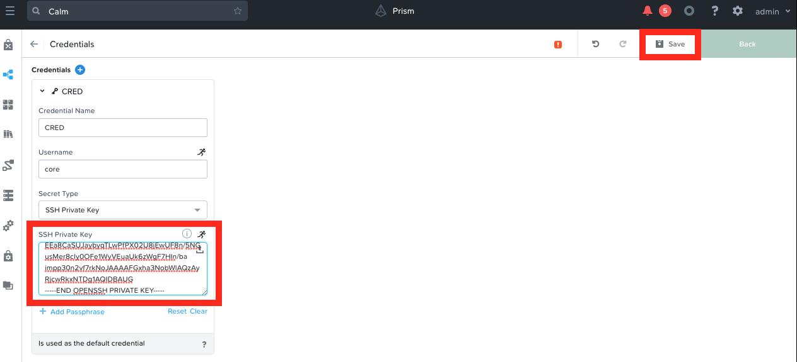
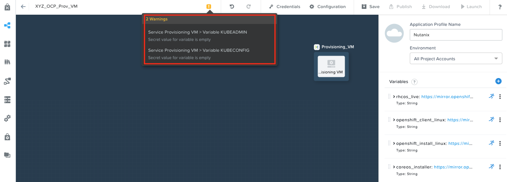
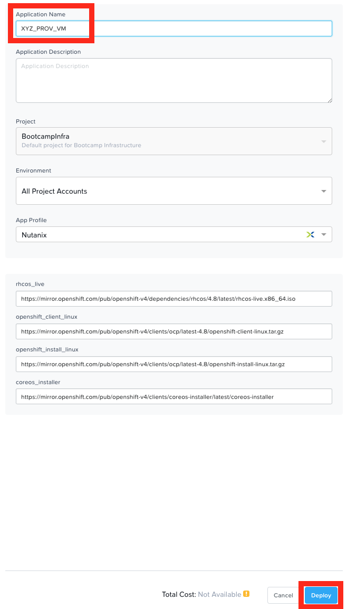
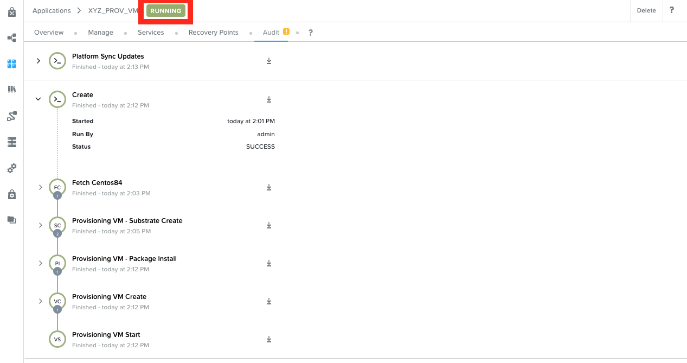
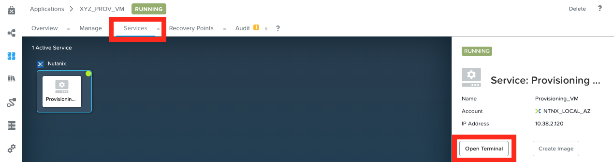
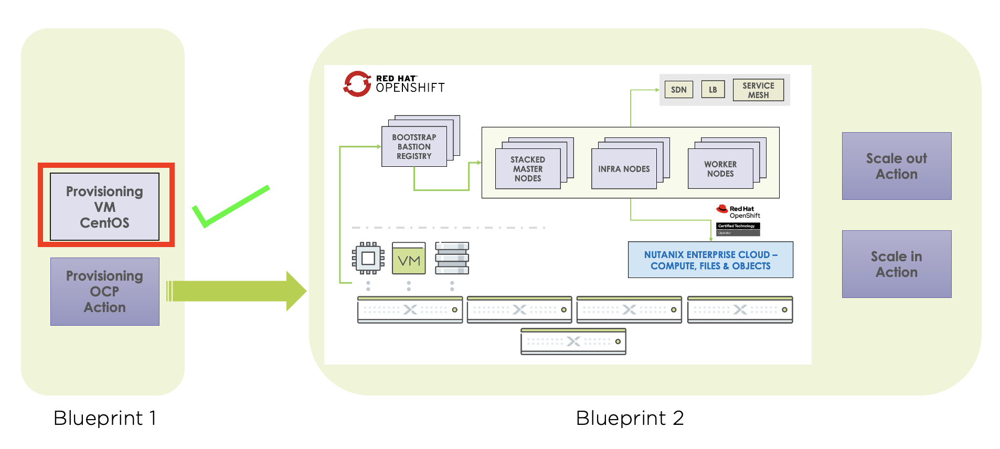

## Configure Provisioning VM Blueprint

Now lets configure and deploy Provisioning VM

1.  In **Prism Central** \> **Services** \> **Calm**

2.  Click on **Blueprints**

    :::warning
  
    Make sure that you only edit the blueprints you uploaded with your intials. There could be other users using the same HPOC cluster and working on similar blueprints.

    :::

3.  Select your Provisioning VM `XYZ_OCP_Prov_VM` blueprint

We need to configure network and credentials for the blueprint so it can be deployed in your HPOC/SPOC.

1.  Select the Provisioning_VM service

2.  In the Provisioning_VM service\'s VM properties, Choose **Primary**
    as the NIC 1

    

3.  Click on **Save**

4.  Click on **Credentials** (next to **Save**)

5.  Go to this [URL](https://travistidwell.com/jsencrypt/demo/) to create a RSA private key

6.  Choose **2048 bit** as the key size and click on **Generate New Keys**

    :::caution

    **Copy the private key and public key to somewhere safe (notepad/notes) on your PC/Mac**

    :::

    

    :::tip
  
    You can use any online key generator if you using Windows.

    Execute the following commands in you are in a Linux / Mac environment to generate a private key.

    ``` bash
    ssh-keygen -t rsa -b 2048 -C "Created for OCP Workshop"

    # follow prompts 
    # do not specify passphrase
    # once completed run the following command

    cat id_rsa

    # copy the contents of the id_rsa file to your Calm blueprint
    ```
    :::

7.  Copy the **Private Key** and paste the generated primary key in the
    bluprint\'s credential called **CRED**

    

9.  Click on **Save**

10. Click on **Back** to return to the blueprints main window

11. You will notice a few warnings for KUBEADMIN and KUBECONFIG
    variables. These can be ignored as they will be auto-generated.

    

## Launch Provisioning VM Blueprint

Now it is time to launch the provisioning VM blueprint.

1.  Click on **Launch** button

2.  Give the application a name *Initials*\_Prov_VM

    

3.  Click on **Deploy**

4.  Go to Audit and monitor the deployment tasks. There will be detailed
    logging for all tasks

5.  This should take about 10-15 minutes

6.  Once deployed the Calm application will be in a running state

    

7.  **Optional step** - You are also able to ssh into the provisioning
    VM using the application\'s (if you are curious to see the
    downloaded files for OCP setup) \> **Services** \> **Open Terminal**

    

    ```zsh
    [core@Openshift-provisioning-0-211225-210356 ~]$ ls -lRh openshift/
    openshift/:
    total 1.6G
    -rw-rw-r--. 1 core   core   7.3M Dec 26 05:11 coreos-installer
    -rwxr-xr-x. 2 core   core   118M Nov  4 19:41 kubectl
    -rwxr-xr-x. 2 core   core   118M Nov  4 19:41 oc
    -rwxr-xr-x. 1 core   core   369M Nov 22 17:12 openshift-install
    -rw-r--r--. 1 core   core    954 Nov  4 19:41 README.md
    -rw-rw-r--. 1 core   core   988M Dec 26 05:12 rhcos-live.x86_64.iso ## << this is RHCOS ISO
    drwxrwxr-x. 2 apache apache  105 Dec 26 05:12 web

    openshift/web:
    total 144M
    -rw-rw-r--. 1 apache apache 7.3M Dec 26 05:12 coreos-installer 
    -rw-rw-r--. 1 apache apache  48M Dec 26 05:11 openshift-client-linux.tar.gz ## << this is OCP Client
    -rw-rw-r--. 1 apache apache  89M Dec 26 05:11 openshift-install-linux.tar.gz ## << this is OCP Server
    ```

Now we have the provisioning VM up and running. This section of the lab is done.



We will proceed to deploy a OCP cluster in the next section of the lab.
