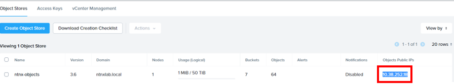
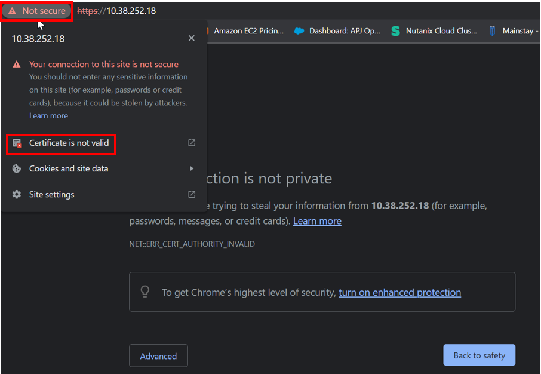
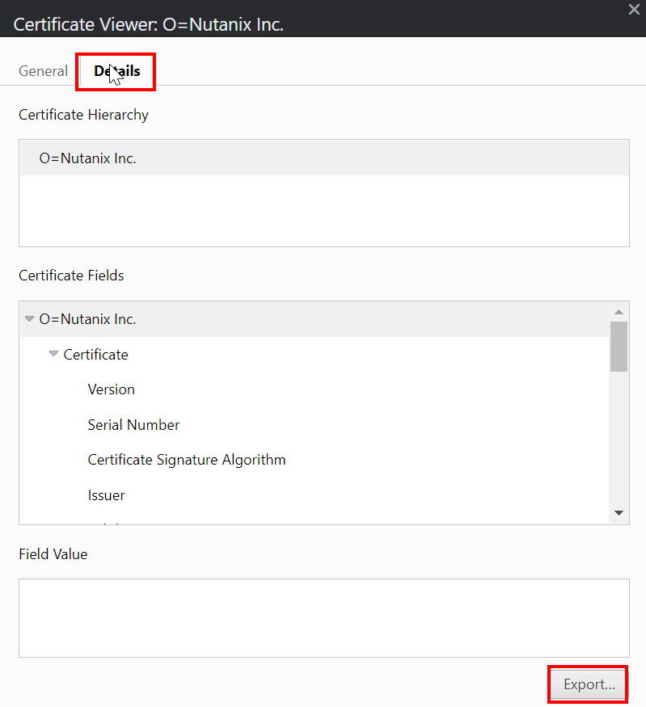
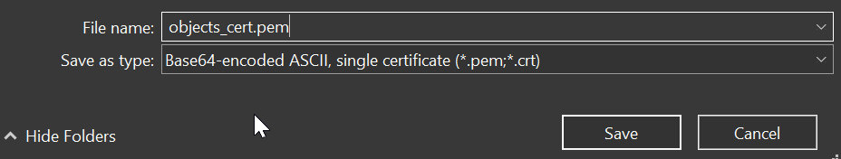

import Tabs from '@theme/Tabs';
import TabItem from '@theme/TabItem';

# Backup and Restore Application

## Retrieve the Objects root CA certificate

1.  In Prism Central, select the hamburger menu.  Click on **Services**.  Click on **Objects**.  Note down the **Object IP** address.

    

2.  Open a Chrome browser.  Put in the Objects IP address

    ```bash
    https://object ip address
    ```

3.  Click on **Not Secure** in the browser address bar.  Click on "Certificate is not valid"

    

4.  Click on **Detail** tab.  Click on **Export**

    

5.  Please give a filename and saved it as pem file.

    

## Create Application

1.  Login to LinuxToolVM.  

2.  Create the manifest to create the application.  Change the following:
    - CA certificate of the Nutanix Object.
    - Object Bucket

    ```bash
    cat << EOF > object-application.yaml
    apiVersion: oadp.openshift.io/v1alpha1
    kind: DataProtectionApplication
    metadata:
      name: oadp-ntnx
      namespace: openshift-adp
    spec:
      configuration:
        velero:
          defaultPlugins:
            - openshift
            - aws
            - csi
        featureFlags:
        - EnableCSI
        restic:
          enable: false
      backupLocations:
        - name: default
          velero:
            provider: aws
            default: true
            objectStorage:
              bucket: replace bucket name
              prefix: velero
              caCert: base64 encoded Object root CA
            config:
              insecureSkipTLSVerify: "true"
              region: us-east-1
              s3ForcePathStyle: "true"
              s3Url: https://ntnx-object.ntnxlab.local
          credential:
            key: credentials-velero
            name: cloud-credentials
    EOF
    ```

