import Tabs from '@theme/Tabs';
import TabItem from '@theme/TabItem';

# Create Object Bucket and Access Keys in Nutanix

## Pre-requisites:

- Nutanix Objects 3.6.0
- RedHat OpenShift 4.11

## Configure Nutanix Objects to access Active Directory.

1.  **This section needs to be configured once.  Check with the trainer on the assignment**

2.  Login to Prism Central.

3.  Click on hamburger menu and scroll down to **Objects**.  Click on **Access Keys**.

    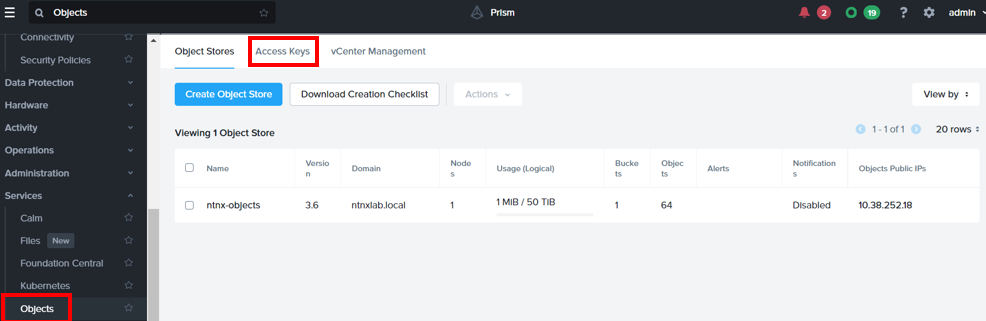

4.  Click on **Configure Directory**

    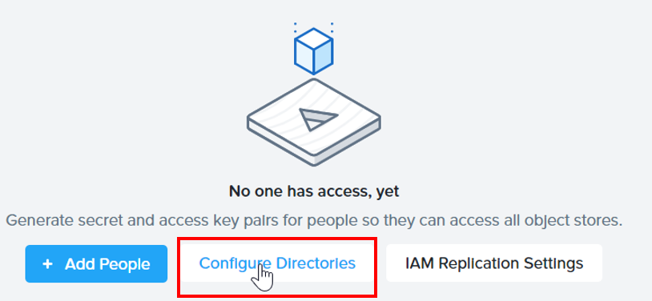

5.  Click on **+ Add Directory**

    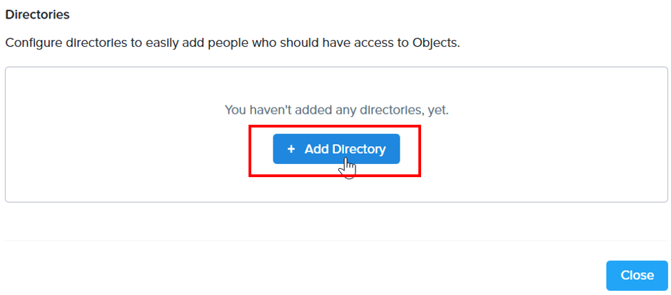

6.  Fill in the following: Please check with the trainer on the Active Directory IP & Credential

    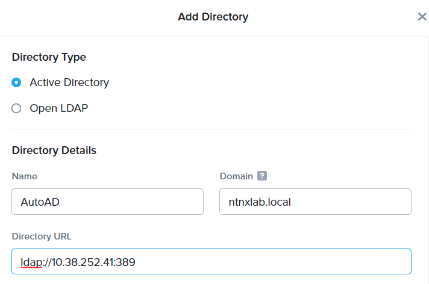
    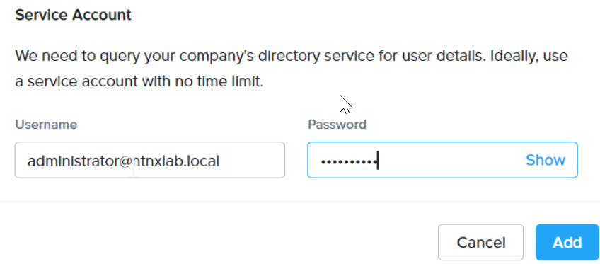

7.  The Active Directory was configured.  Click on **Close**

    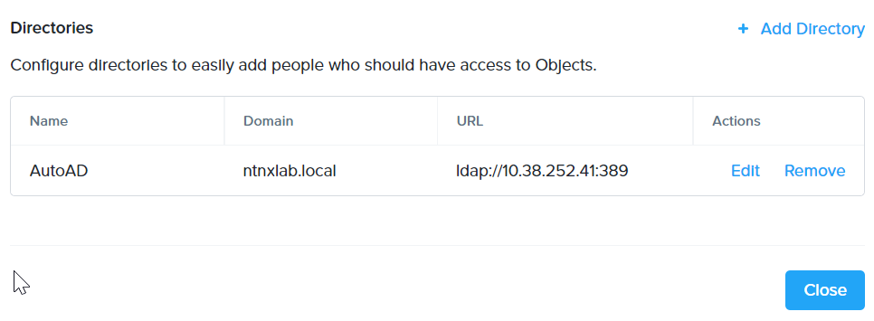

## Create Access Key in Nutanix Objects

1.  Click on hamburger menu and scroll down to **Objects**.  Click on **Access Keys**.  Click on **+ Add People**

    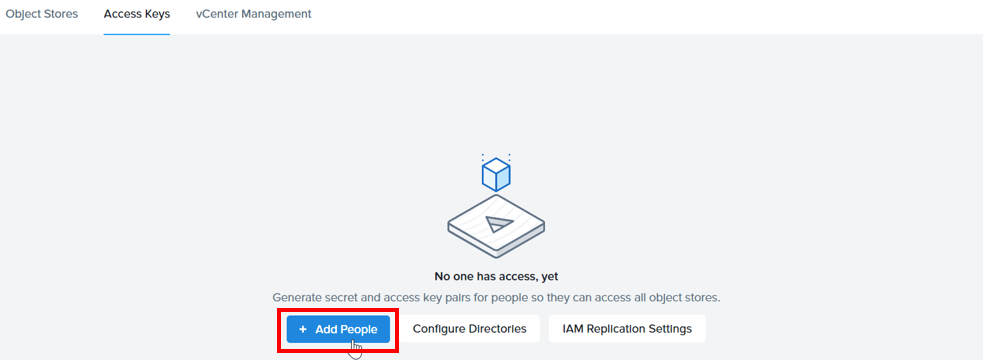

2.  Search for **adminuser**.  Choose **adminuser02, adminuser03, adminuser04 etc.**.  Click on **Next**

    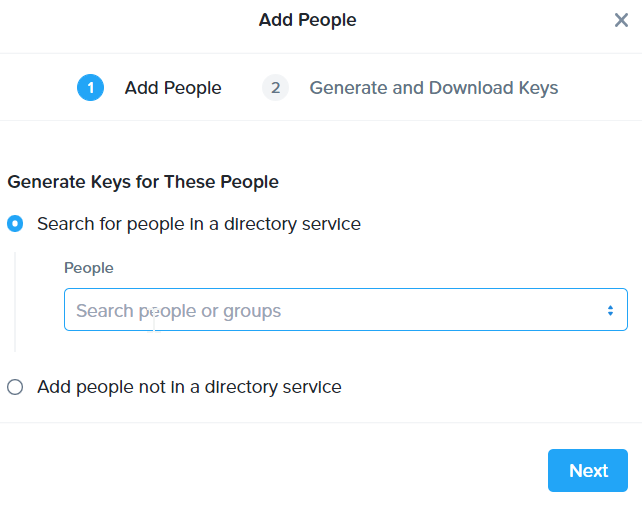

3.  Click on **Generate Keys**

    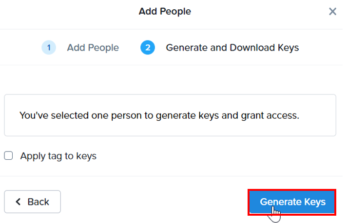

4.  Click on **Download Key**.  **Please keep a copy of the object key**

    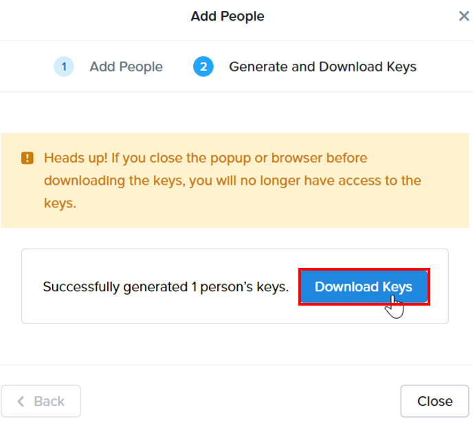

5.  Objects Access Key created successfully

    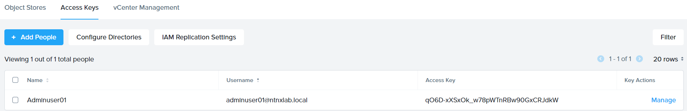

## Create a Bucket in Nutanix Objects

1.  Click on **Objects**.  Drill into the **Object Store**.  It opens a new browser tab.

    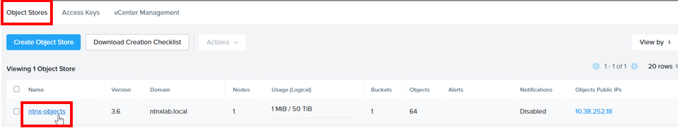

2.  Click on **Create Bucket**

    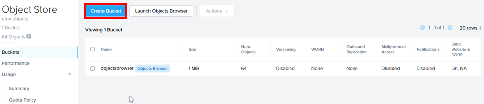

3.  Fill in the following: Click on **Create**
    - Object Name: **Eg ocp2ipi_bucket, ocp3ipi_bucket etc**

    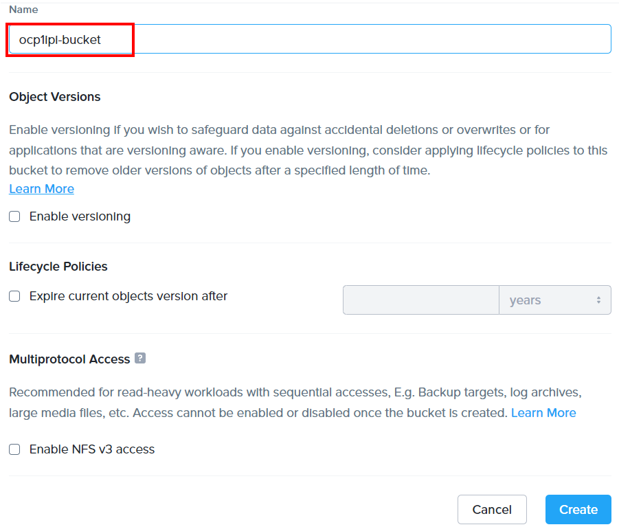

4.  The object bucket was created

    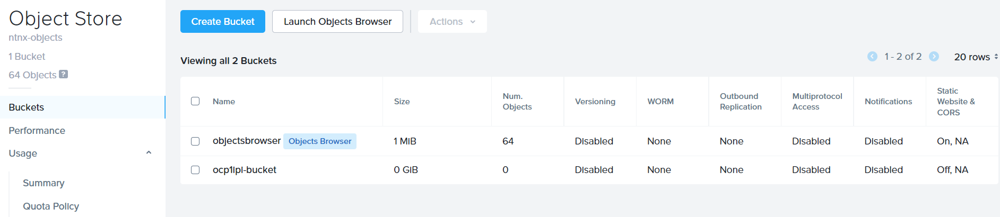

## Assign user to the bucket

1. Drill into the created object bucket

    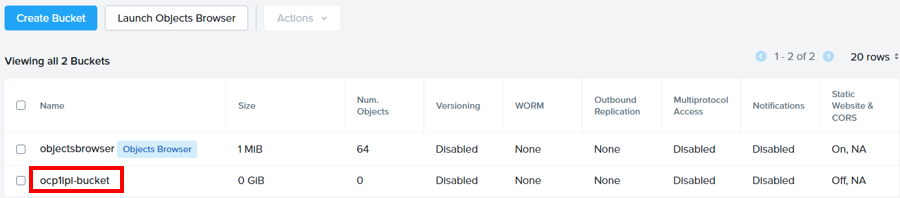

2.  Click on **User Access**.  Click on **Edit User Access**

    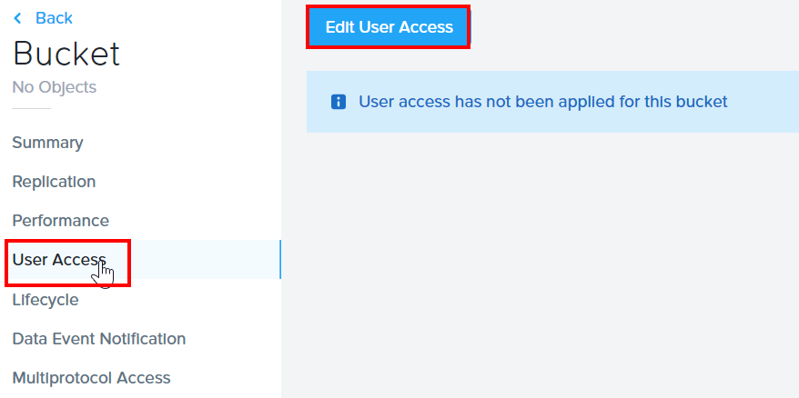

3.  Select the **adminuser** assigned earlier. **Eg adminuser02, adminuser03 etc**.  Select the **READ, WRITE** permission

    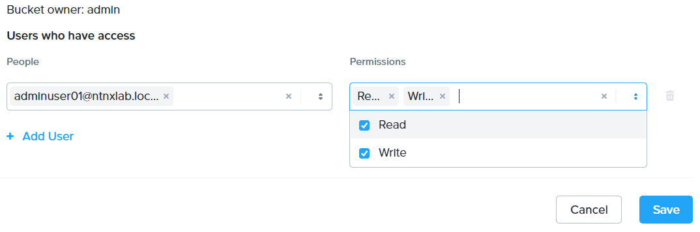

