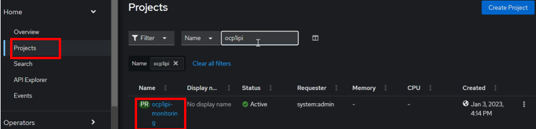
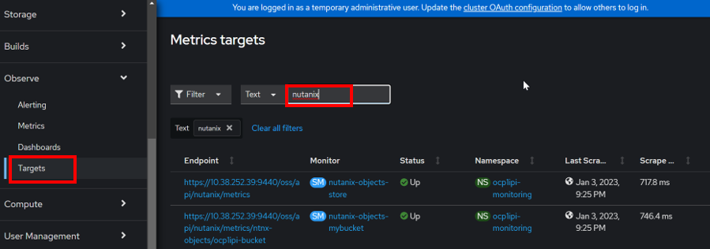
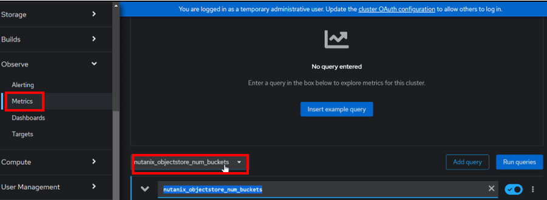
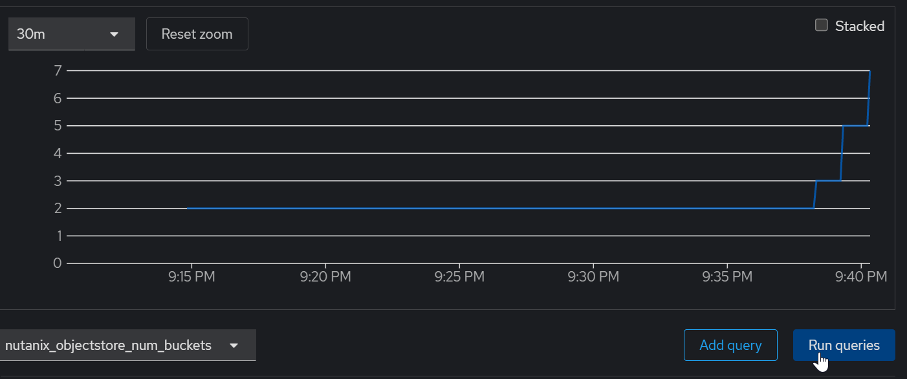

import Tabs from '@theme/Tabs';
import TabItem from '@theme/TabItem';

# Nutanix Objects Metric Monitor with Prometheus

1.  Create this yaml file to enable User Workload monitoring.  Run this command

    ```bash
    cat << EOF > ./cluster-monitoring.yaml
    apiVersion: v1
    kind: ConfigMap
    metadata:
      name: cluster-monitoring-config
      namespace: openshift-monitoring
    data:
      config.yaml: |
        enableUserWorkload: true
    EOF
    ```

2.  Run this command to apply the change

    ```bash
    oc apply -f cluster-monitoring.yaml
    ```
3.  Create new Project in RedHat OpenShift.  Please use assign OpenShift SubDomain appended with monitoring as the new project

    ```bash
    oc new-project ocp1ipi-monitoring
    ```

4.  Login to RedHat OpenShift Console.  Verify the project was created successfully

    

5.  Create Secret for Prism Central.  

    - Replace the namespace with the project created earlier.
    - Replace the password with the assigned HPOC Prism Central.

    ```bash
    oc create secret -n ocp1ipi-monitoring generic pc-creds \
    --from-literal=user=admin \
    --from-literal=password='passwordtobereplaced'
    ```

6.  Create the manifest to connect to Nutanix Objects.

    ```bash
    vi object_monitoring.yaml
    ```

7.  Paste the contents

    - Replace the namespace with the project created earlier.
    - Replace the ip with the Prism Central IP address.   

    ```bash
    kind: "Endpoints"
    apiVersion: "v1"
    metadata:
      name: "external-nutanix-objects"
      namespace: ocp1ipi-monitoring
    subsets: 
      - addresses:
          - ip: "x.x.x.x" 
        ports:
          - port: 9440 
            name: "objects-metrics"
    ```

8.  Run this command to apply the change.

    ```bash
    oc create -f object_monitoring.yaml
    ```

9.  Create Service

    - Replace the namespace with the project created earlier.

    ```bash
    cat << EOF > object_monitoring_service.yaml
    kind: "Service"
    apiVersion: "v1"
    metadata:
      labels:
        external-infra-monitor: "true"
      name: "external-nutanix-objects"
      namespace: ocp1ipi-monitoring
    spec:
      ports:
      - name: "objects-metrics"
        protocol: "TCP"
        port: 9440
        targetPort: 9440 
        nodePort: 0
    selector: {}
    EOF

10.  Run this command to create the service

    ```bash
    oc create -f object_monitoring_service.yaml
    ```

11.  Create ServiceMonitor for Statistics and Performance on Objects-Store Level.
    **Replace the namespace with the project created earlier.**
   
    ```bash
    cat <<EOF > object_service_monitor.yaml
    apiVersion: monitoring.coreos.com/v1
    kind: ServiceMonitor
    metadata:
      name: nutanix-objects-store
      namespace: ocp1ipi-monitoring
    spec:
      endpoints:
        - interval: 30s
          basicAuth:
            password:
              name: pc-creds
              key: password
            username:
              name: pc-creds
              key: user
          path: /oss/api/nutanix/metrics
          port: objects-metrics
          scheme: https
          tlsConfig:
            insecureSkipVerify: true
      selector:
        matchLabels:
          external-infra-monitor: "true"
    EOF

12.  Run this command to create the service monitor.

    ```bash
    oc create -f object_service_monitor.yaml
    ```

13.  Create Service Monitor Manifest for Object Bucket.  **Replace the following:**
    
    ```note
    a.  Replace namespace with project created earlier.
    b.  Replace object store name and object store bucket 
        /oss/api/nutanix/metrics/object store name/object store bucket
    with
        /oss/api/nutanix/metrics/ntnx-objects/ocp1ipi-bucket
    ```

14.  This is the contents for the object_bucket_service_monitor.yaml

    ```bash
    cat <<EOF > object_bucket_service_monitor.yaml
    apiVersion: monitoring.coreos.com/v1
    kind: ServiceMonitor
    metadata:
      name: nutanix-objects-mybucket
      namespace: ocp1ipi-monitoring
    spec:
      endpoints:
      - interval: 30s
        basicAuth:
          password:
            name: pc-creds
            key: password
          username:
            name: pc-creds
            key: user
        path: /oss/api/nutanix/metrics/ntnx-objects/ocp1ipi-bucket 
        port: objects-metrics
        scheme: https
        tlsConfig:
          insecureSkipVerify: true
      selector:
        matchLabels:
          external-infra-monitor: "true"
  EOF

15.  Create the Object Bucket Service Monitor

    ```bash
    oc create -f object_bucket_service_monitor.yaml
    ```

16.  In the RedHat OpenShift console, navigate to **Metrics**.  Navigate to **Targets**.  Filter by **Nutanix**.
Verify the Object endpoints are available

    

17.  Click on **Metrics**.  Filter by **nutanix_objectstore_num_buckets**.  Click on **Run Queries**

    

18.  The object bucket creation metric was deployed

    
