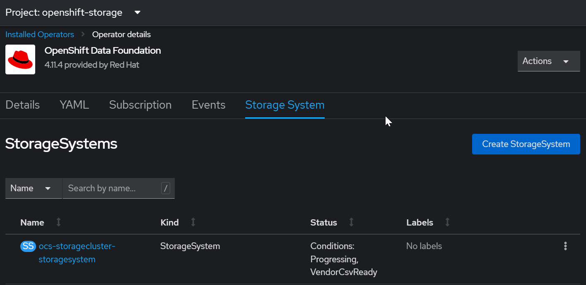
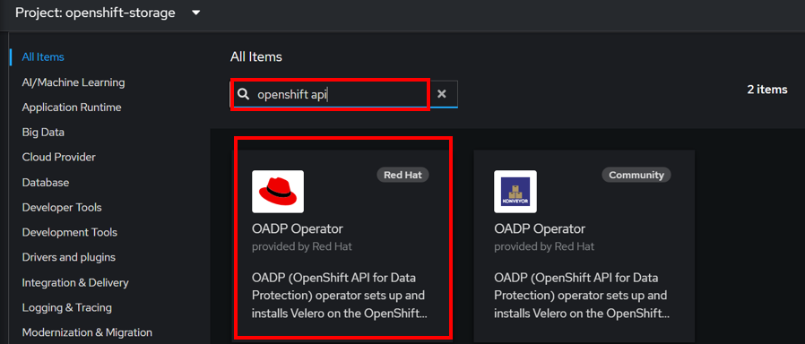
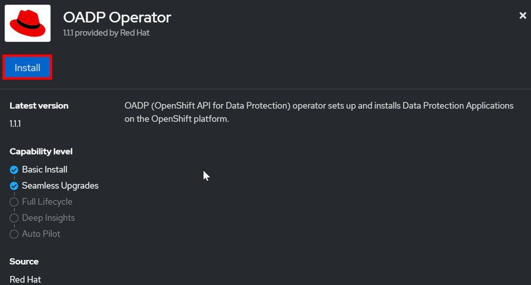
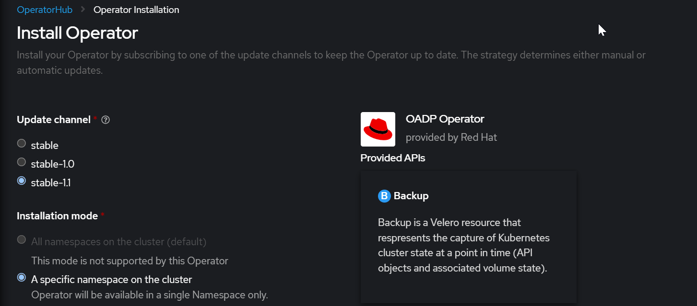
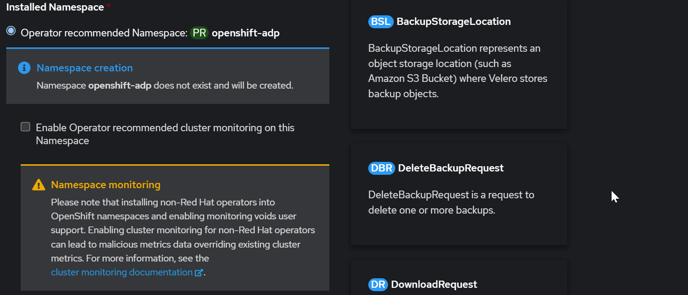
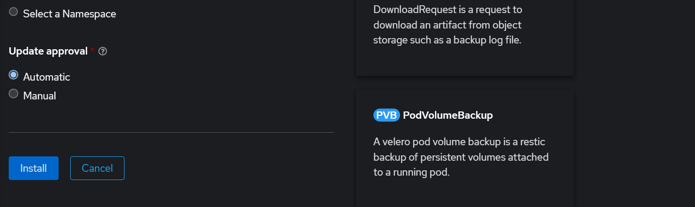
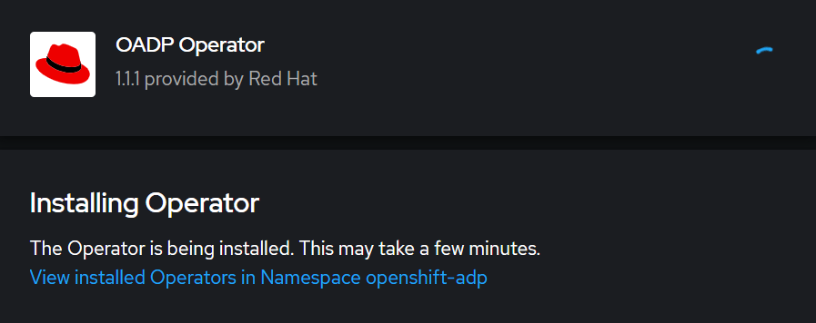
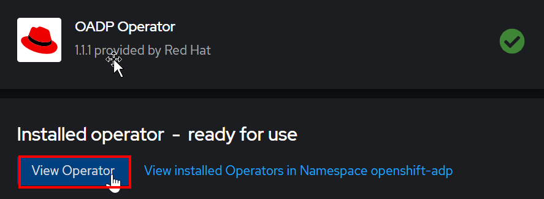
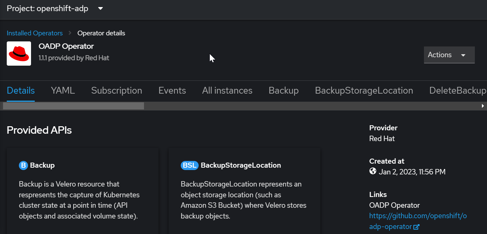
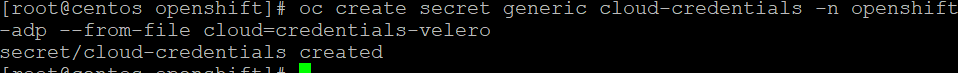

import Tabs from '@theme/Tabs';
import TabItem from '@theme/TabItem';

# OpenShift API for Data Protection (OADP) & OpenShift Data Protection (ODF)

OADP enables backup, restore, and disaster recovery of applications on an OpenShift cluster. Data that can be protected with OADP include Kubernetes resource objects, persistent volumes, and internal images. The OpenShift API for Data Protection (OADP) is designed to protect Application Workloads on a single OpenShift cluster.

Red Hat OpenShift® Data Foundation is software-defined storage for containers. Engineered as the data and storage services platform for Red Hat OpenShift, Red Hat OpenShift Data Foundation helps teams develop and deploy applications quickly and efficiently across clouds

OADP backs up and restores Kubernetes resources and internal images at the granularity of a namespace by using Velero. Nutanix CSI offers snapshot
capabilities, which can be leveraged by OADP to back up and restore persistent volumes (PVs).

## Pre-requisites/Requirements
1.  The RedHat OpenShift 4.11 cluster was created either using NCM Self Service or IPI 

2.  **Nutanix CSI must be installed**

3.  **Nutanix Volume deployment** must be installed.  Refer to **Nutanix Volume Deployment** on the left 
hand side of this guide.

    -  Option 1 is specific for UPI installation & CSI installation through NCM Self Service
        - Create Nutanix Volume Storage Class using RedHat OpenShift Console.

    -  Option 2 is specific for IPI deployment 
        - Create Volume Storage Class using Command Line.

2.  Terminal environment must have the following commands:
    - oc (Available in both UPI & IPI installation)
    - git 
    - velero

3.  Set alias to use command from cluster (preferred)
    - alias velero='oc -n openshift-adp exec deployment/velero -c velero -it -- ./velero'

4.  Download velero from Github Release

5.  Your cluster meets the minimum requirement for ODF in Internal Mode deployment
    - 3 worker nodes, each with at least:
        - 8 logical CPU
        - 24 GiB memory
        - 1+ storage devices

## Installing OpenShift Data Foundation (ODF) Operator

1.  Open the RedHat OpenShift console in the browser.  Put in the following:

    https://console-openshift-console.**ocp subdomain**.**base domain>**.

    **Eg https://console-openshift-console.ocp1ipi.ntnxlab.local**

2.  Navigate to **Operators**.  Navigate to **OperatorHub**

3.  Filter by **openshift data**.  Click on **OpenShift Data Foundation**

     

4. Click on **Install**

     

5.  Click on **Install** at the bottom of the screen.

     
     

6.  Wait for a few minutes

     

7.  Click on **Create Storage System**

    

8.  Fill in the following default values.  Click on **Create**

    
    

9.  Storage System created successfully

    

### Verify ODF installation

1.  In the LinuxToolVM (Eg LinuxToolVM1, LinuxToolVM2 etc), run the following commands:

    ```bash
    KUBECONFIG=~/openshift/auth/kubeconfig
    export KUBECONFIG
    oc get storagecluster -n openshift-storage ocs-storagecluster -o jsonpath='{.status.phase}{"\n"}'
    ```

## Install OpenShift API for Data Protection (OADP) Operator

1.  Login to RedHat OpenShift Console.

2.  Select **Operators**.  Select **OperatorHub**

3.  Filter by **openshift-api**.  Select **OADP Operator by RedHat**

    

4.  Click on **Install**

    

5.  Fill in the following.  Click on **Install**

    
    
    

6.  Wait for a few minutes.

    

7.  Click on **View Operator**

    

8.  OADP Operator installed successfully

    

## Create Credentials Secret For OADP Operator To Use

1.  Putty into the LinuxToolVM (Eg LinuxToolVM1, LinuxToolVM2 etc)

2.  Modify the credentials-velero & replace the following:

    - aws_access_key_id with Nutanix Objects Access Key
    - aws_secret_access_key with Nutanix Objects Secret Access Key

    ```bash
    cat << EOF > ./credentials-velero
    [default]
    aws_access_key_id=my_access_key
    aws_secret_access_key=my_secret_key
    EOF
    ```

3.  Run this command to create the secret

    ```bash
    oc create secret generic cloud-credentials -n openshift-adp --from-file cloud=credentials-velero
    ```

    

## Create Nutanix CSI Snapshot Class

1.  Putty into the LinuxToolVM (Eg LinuxToolVM1, LinuxToolVM2 etc)

2.  Run this command to create the yaml file

    ```bash
    cat << EOF > ./csi-snapshot-class.yaml
    apiVersion: snapshot.storage.k8s.io/v1beta1
    kind: VolumeSnapshotClass
    metadata:
    name: nutanix-snapshot-class
    labels:
    velero.io/csi-volumesnapshot-class: "true"
    driver: csi.nutanix.com
    parameters:
    storageType: NutanixVolumes
    csi.storage.k8s.io/snapshotter-secret-name: ntnx-secret
    csi.storage.k8s.io/snapshotter-secret-namespace: ntnx-system
    deletionPolicy: Delete
    ```