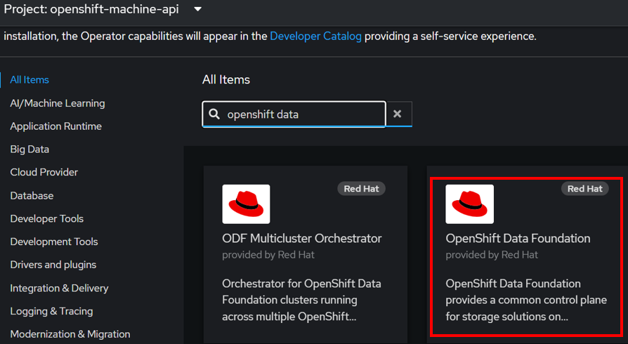
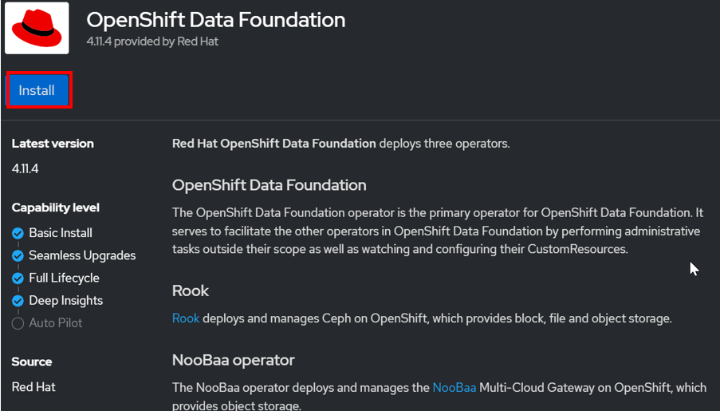
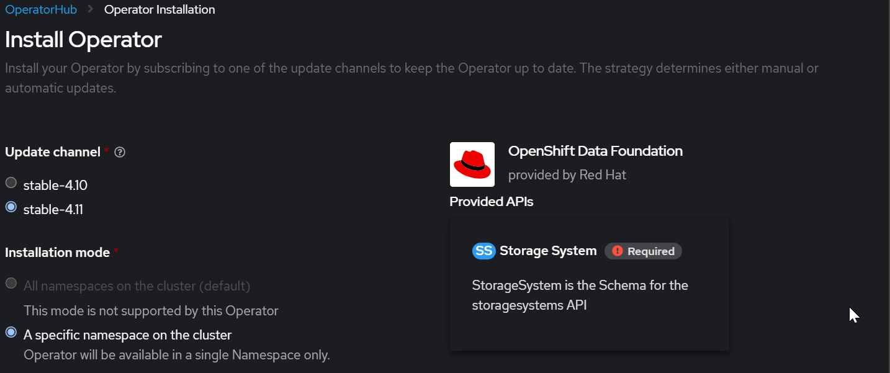
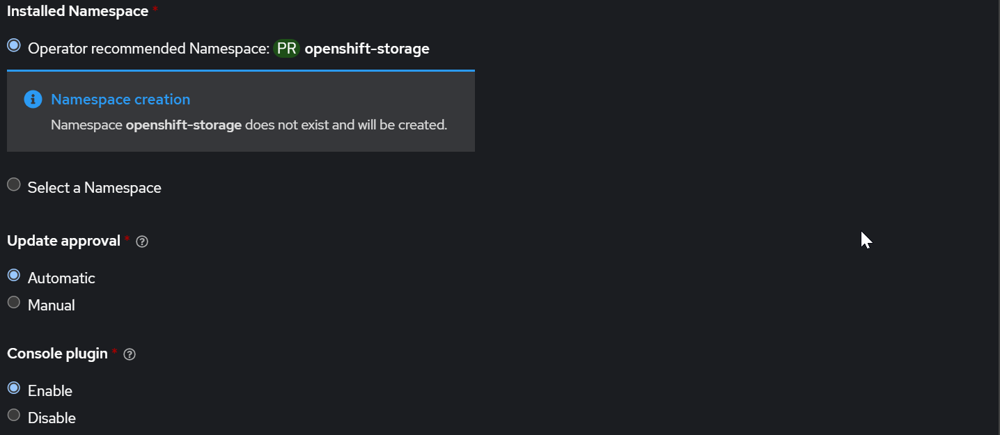
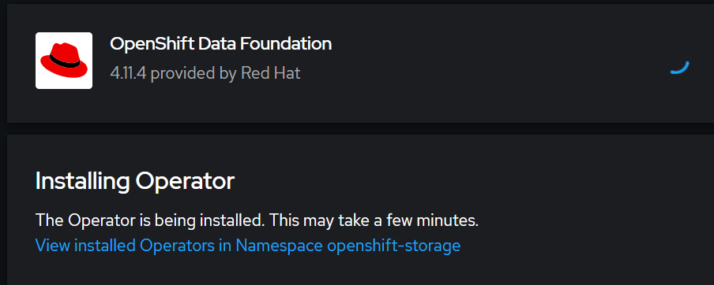
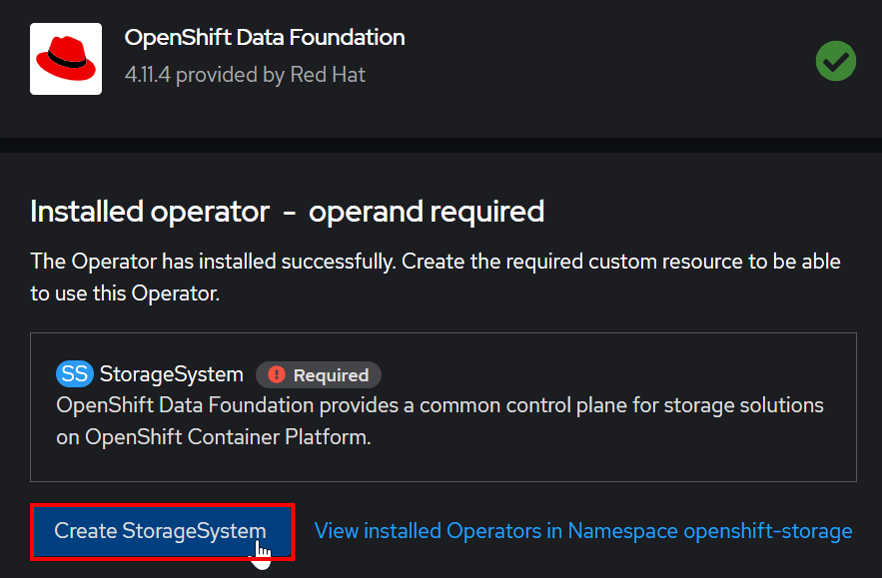
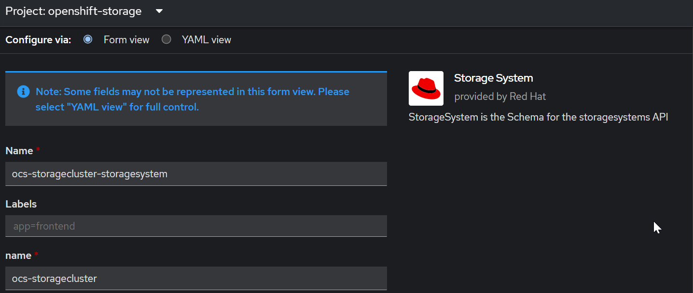
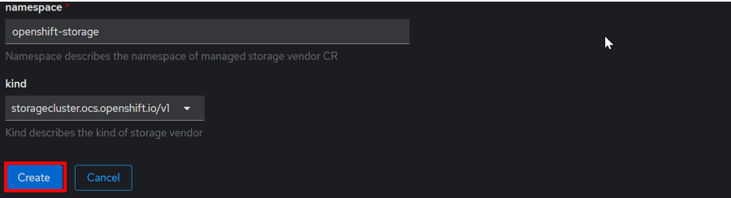

import Tabs from '@theme/Tabs';
import TabItem from '@theme/TabItem';

# OpenShift API for Data Protection (OADP) & OpenShift Data Protection (ODF)

OADP enables backup, restore, and disaster recovery of applications on an OpenShift cluster. Data that can be protected with OADP include Kubernetes resource objects, persistent volumes, and internal images. The OpenShift API for Data Protection (OADP) is designed to protect Application Workloads on a single OpenShift cluster.

Red Hat OpenShift® Data Foundation is software-defined storage for containers. Engineered as the data and storage services platform for Red Hat OpenShift, Red Hat OpenShift Data Foundation helps teams develop and deploy applications quickly and efficiently across clouds

OADP backs up and restores Kubernetes resources and internal images at the granularity of a namespace by using Velero. Nutanix CSI offers snapshot
capabilities, which can be leveraged by OADP to back up and restore persistent volumes (PVs).

## Pre-requisites/Requirements
1.  The RedHat OpenShift 4.11 cluster was created using IPI

2.  Terminal environment must have the following commands:
    - oc (Available in both UPI & IPI installation)
    - git 
    - velero

3.  Set alias to use command from cluster (preferred)
    - alias velero='oc -n openshift-adp exec deployment/velero -c velero -it -- ./velero'

4.  Download velero from Github Release
Alternatively enter prepared environment in your terminal with docker run -it ghcr.io/kaovilai/oadp-cli:v1.0.1 bash
source can be found at https://github.com/kaovilai/oadp-cli
Authenticate as Cluster Admin inside your environment of an OpenShift 4.9 Cluster.

5.  Your cluster meets the minimum requirement for ODF in Internal Mode deployment
    - 3 worker nodes, each with at least:
        - 8 logical CPU
        - 24 GiB memory
        - 1+ storage devices

## Installing OpenShift Data Foundation Operator

1.  Open the RedHat OpenShift console in the browser.  Put in the following:

    https://console-openshift-console.**ocp subdomain**.**base domain>**.

    **Eg https://console-openshift-console.ocp1ipi.ntnxlab.local**

2.  Navigate to **Operators**.  Navigate to **OperatorHub**

3.  Filter by **openshift data**.  Click on **OpenShift Data Foundation**

     

4. Click on **Install**

     

5.  Click on **Install** at the bottom of the screen.

     
     

6.  Wait for a few minutes

     

7.  Click on **Create Storage System**

    

8.  Fill in the following default values.  Click on **Create**

    
    
