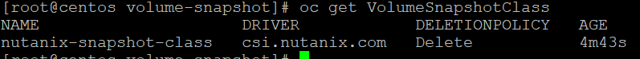
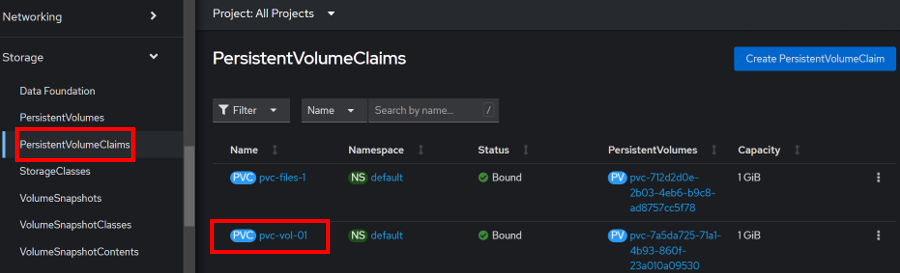
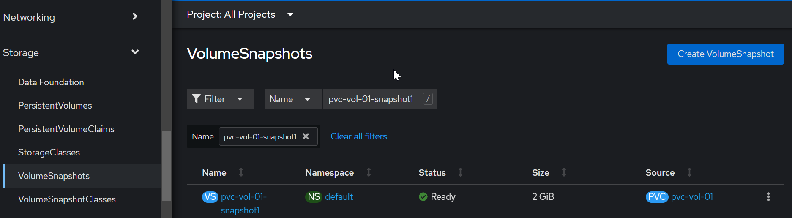

import Tabs from '@theme/Tabs';
import TabItem from '@theme/TabItem';

# Volume Snapshot in Nutanix

Use snapshots of persistent volume claims (PVCs) to create new PVCs and persistent volumes
(PVs) with Nutanix Volumes only. CSI driver supports taking volume snapshots and restoring
the volume. CSI driver creates a storage efficient snapshot in a second using the volumes
snapshot capability. You can also create a backup of your application in Nutanix Objects, AWS
S3, or any S3 compatible storage.
Taking a snapshot of a PVC lets you reuse the data in that snapshot to create a new PVC and
PV in the future. The snapshot only stores data from the time you take the snapshot. The newly
created snapshot appears as a VolumeSnapshot in the same Kubernetes cluster as the original
PVC.

## Create a Volume Snapshot Class

1.  Login to LinxToolVM (Eg LinuxToolVM1, LinuxToolVM2 etc)

2.  **This command assumes the CSI Driver was installed using RedHat OpenShift Console 
    OperatorHub.**  
    
    If you had installed the CSI Driver through NCM Self Service, please replace the 

    - snapshotter-secret-namespace to ntnx-system.

    ```bash
    cat << EOF > ./volume-snapshot-class.yaml
    apiVersion: snapshot.storage.k8s.io/v1
    kind: VolumeSnapshotClass
    metadata:
      name: nutanix-snapshot-class
      labels:
        velero.io/csi-volumesnapshot-class: "true"
    driver: csi.nutanix.com
    parameters:
      storageType: NutanixVolumes
      csi.storage.k8s.io/snapshotter-secret-name: ntnx-secret
      csi.storage.k8s.io/snapshotter-secret-namespace: openshift-cluster-csi-drivers
    deletionPolicy: Delete
    EOF
    ```

2.  Run this command to create the Volume Snapshot Class

    ```bash
    oc apply -f volume-snapshot-class.yaml
    ```

3.  Run this command to verify the creation of the Volume Snapshot Class

  ```bash
  oc get VolumeSnapshotClass
  ```

  

  ## Create the Snapshot of a Persistent Volume Claim (PVC)

1. In the RedHat OpenShift console, navigate to **Storage**.  Click on **Persistent Volume Claim**

  

2. In the LinuxToolVM, run the following command to create the manifest to create the snapshot of a PVC

  - Replace the PVC-name with the volume PVC created earlier.

    ```bash
    cat << EOF > volume-snapshot.yaml
    apiVersion: snapshot.storage.k8s.io/v1
    kind: VolumeSnapshot
    metadata:
      name: pvc-vol-01-snapshot1
      namespace: default
    spec:
      volumeSnapshotClassName: nutanix-snapshot-class
      source:
        persistentVolumeClaimName: PVC-name
    EOF
    ```

2.  Run this command to create the snapshot of the PVC.

  ```bash
  oc create -f volume-snapshot.yaml
  ```

3.  Verify the VolumeSnapshot in the RedHat OpenShift console

  