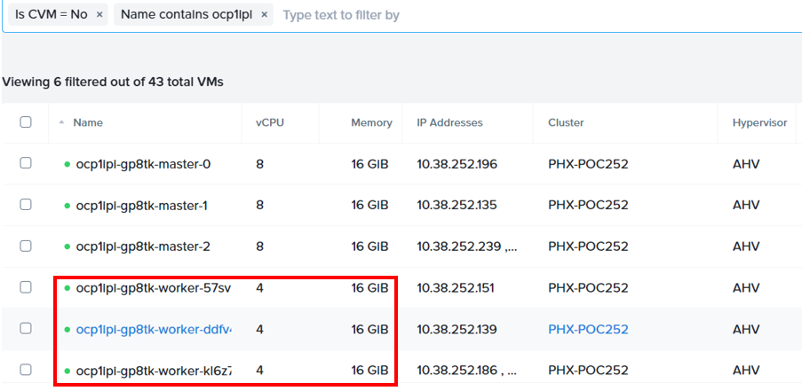
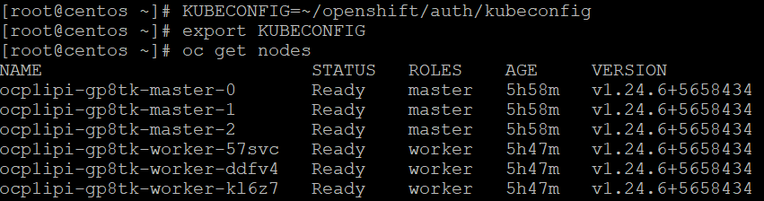
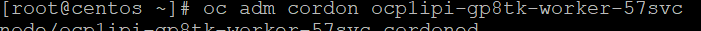
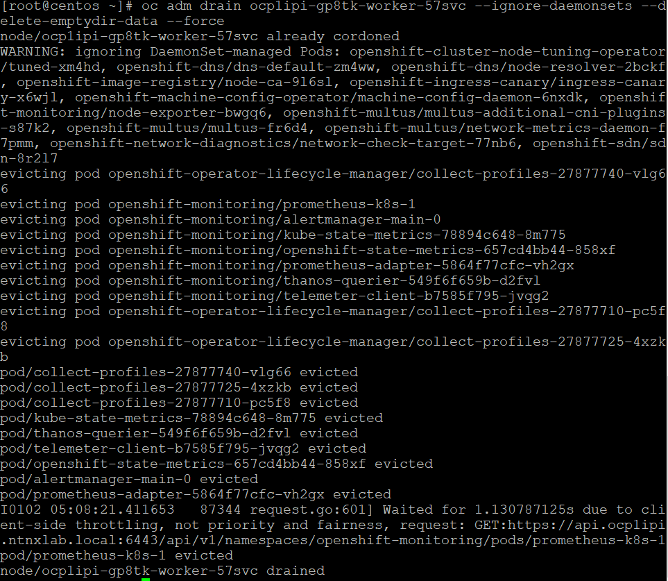
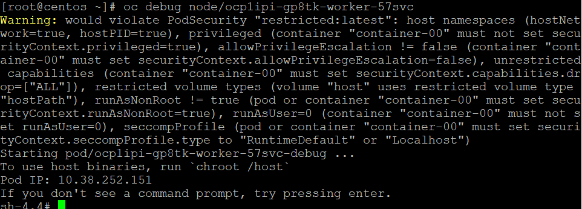
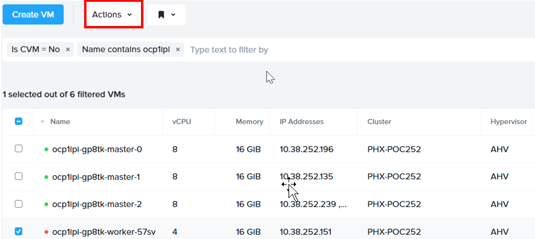
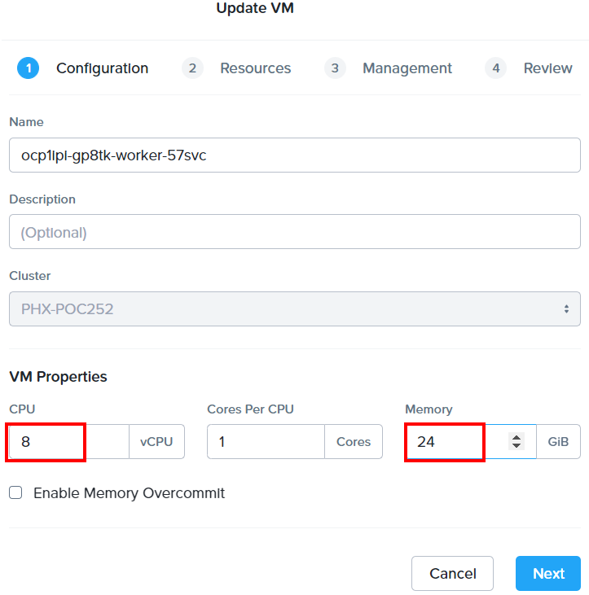
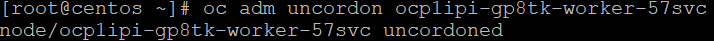
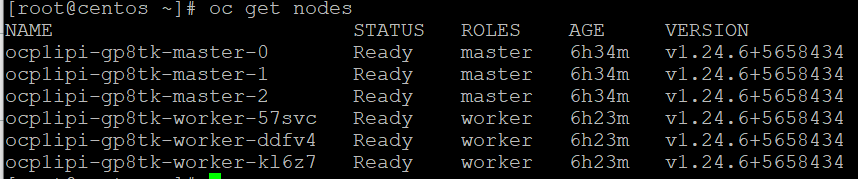
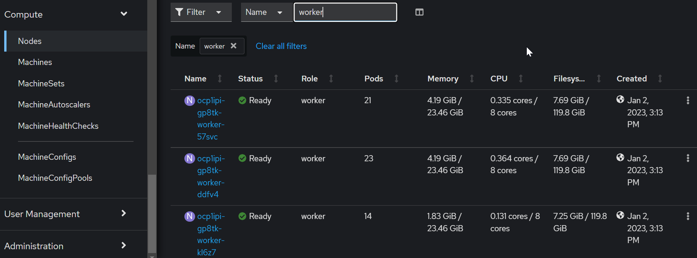

import Tabs from '@theme/Tabs';
import TabItem from '@theme/TabItem';

# Modify the VM sizing of the Worker nodes

```note
Reference: https://docs.openshift.com/container-platform/4.11/nodes/nodes/nodes-nodes-rebooting.html
```

1.  Login to Prism Central. 

2.  The IPI installer had created the following worker nodes which did not meet the minimum requirements for ODF.

     

3.  Putty into the **LinuxToolVM (Eg LinuxToolVM2, LinuxToolVM3 etc)**.  Retrieve the credential from the trainer.

4.  Run this command to get the KUBECONFIG to connect to the RedHat OpenShift cluster

    - KUBECONFIG=~/openshift/auth/kubeconfig
    - export KUBECONFIG
    - oc get nodes

     

5.  Run this command to mark the node as unschedulable.

    oc adm cordon **node name**

     

6.  Run this command to drain the node of the running pods.

    oc adm drain **node name** --ignore-daemonsets --delete-emptydir-data --force

     

7.  Access the node in debug mode

    oc debug node/**node name**

    

8.  Change the root directory to host

    chroot /host

9.  Run the command

    shutdown now

10.  In Prism Central, click on **Action**.  Click on **Update**

    

11.  Change it to
    ```note
    vCPU: **8**
    memory: **24** GIB
    ```
    

12.  Click on **Next**.  Click on **Next**.  Click on **Next**.  Click on **Save**

13.  In Prism Central, click on **Action**.  Click on **Power On**

14.  Run this command to mark the node as schedulable.

    oc adm uncordon **node name**

     

15.  Verify the nodes are schedulable.

     

16.  Repeat for the next 2 nodes

17.  Login to RedHat OpenShift console.  

18.  Click on **Compute**.  Click on **Node**.  Filter by **worker**.  Verify the nodes were changed to the new hardware sizing.

     