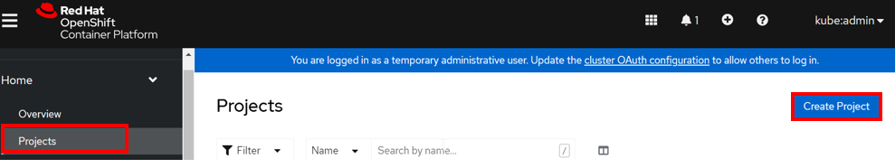
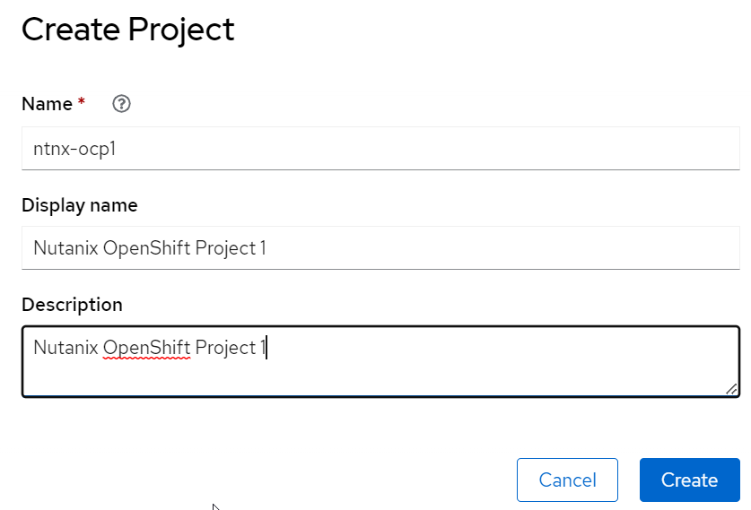
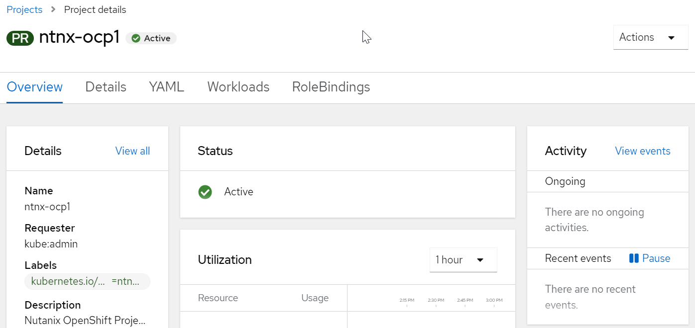

import Tabs from '@theme/Tabs';
import TabItem from '@theme/TabItem';

# Create Project in OpenShift

1.  Click on **Project**.  Click on **Create Project**

    

2.  Fill in the following:

    - Name: Eg ntnx-ocp1, ntnx-ocp2, ntnx-ocp3 (Based on your assigned user no)

    

3.  The project was successfully created

    
