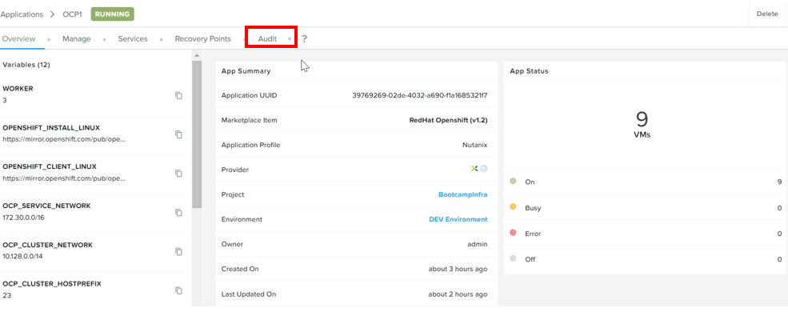
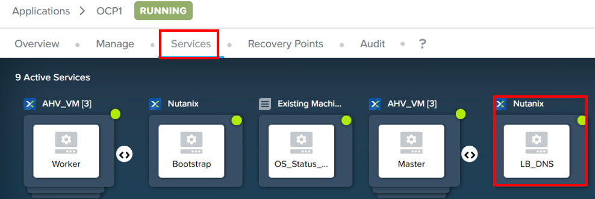

import Tabs from '@theme/Tabs';
import TabItem from '@theme/TabItem';

# OpenShift (OCP) User Provision Installation (UPI)

One of the approaches to install OpenShift is using (UPI).  The System Administrator would prepare 
the bare-metal or virtual machines.  Subsequently, the system administrator would run the bootstrap installer 
to start the installation process.  This is an example of UPI.

 

# OpenShift Architecture

The OCP Architecture comprise of the following components:
1.  1x Bootstrap Node to jumpstart the installation process
2.  1x Load Balancer to allow client to access the Master Node in the OpenShift network
3.  3x Control Plane Master Nodes
4.  1 or more Worker Nodes

 

:::info

Estimated time to complete this whole lab is **60 minutes**

 # Nutanix Cloud Manager (NCM) Self Service with OpenShift using UPI

 ## Objective

 The purpose of this lab was to allow the user to use NCM Self Service Marketplace to provision 
 RedHat OpenShift cluster using UPI.  NCM Self Service would provision the virtual machines (VMs) 
 and automate the setup of RedHat OpenShift cluster using UPI.

## Pre-requisites: (Lab Setup)

1.  Prism Central on pc2022.6.01
2.  NCM Self Service 3.6.0
3.  RedHat OpenShift blueprint published in NCM Self Service Marketplace
4.  Configuration of the NCM Self Service environment to allow self service of RedHat OpenShift

## Launch NCM Self Service Marketplace

1.  Retrieve the IP address of Prism Central from the trainer

2.  Login to Prism Central.

3.  Click on to access NCM Self Service

    

4.  Click on **Marketplace**.  Navigate to **RedHat OpenShift**.  Click on **Get**

    

5.  Click on **Launch**

    

6.  Fill in the **Application Name** Eg OCP-2, OCP-3 or OCP-4

    

7.  Scroll down.  Select the **OpenShift Subdomain** as shared by the instructor.  **Eg ocp2, ocp3 or ocp4**

    

8.  Key in the **Bastion IP** as shared by the instructor.  Click on **Deploy**

    

9.  It is in **Provisioning** state.  Wait for 10 to 15 minutes.  The speed depends on the load in the cluster.

    

## Verification

1.  Click on **Audit**.

    

2.  Open the OS_Status_Check.  

    

3.  Copy the url and credential

    

4.  Click on **Services**.  Click on **LB_DNS**

    

5.  Note down the IP address of the Load Balancer

    

6.  Run the notepad as the administrator.  

7.  Add in the following lines into the C:\Windows\System32\drivers\etc\hosts

    **Load Balancer IP** console-openshift-console.apps.ocp1.ntnxlab.local oauth-openshift.apps.ocp1.ntnxlab.local

8.  Open a new browser.  Put in https://console-openshift-console.apps.ocp1.ntnxlab.local 

9.  Key in the credential for kubeadmin user stored earlier.

    

10.  Logged in successfully into OpenShift Management console

    
 

