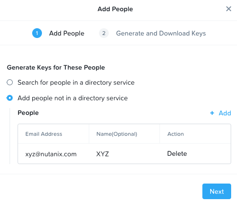
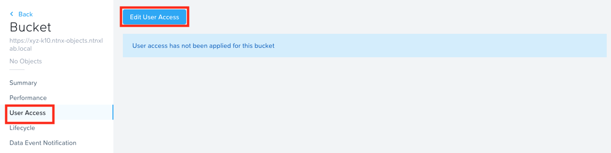
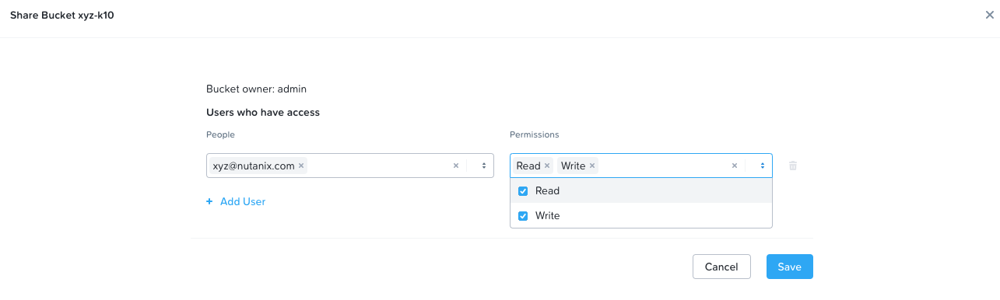
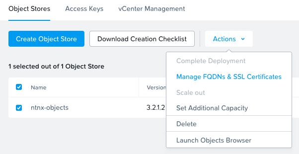
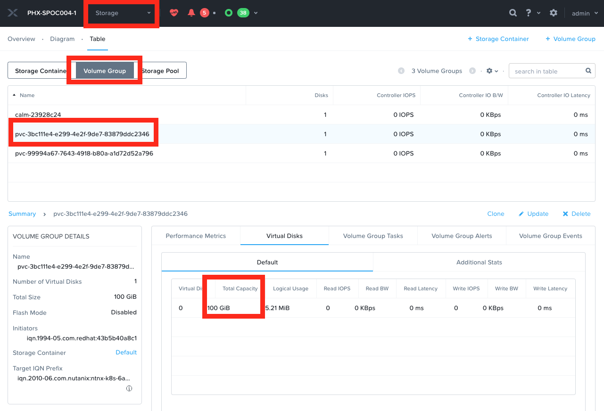

import Tabs from '@theme/Tabs';
import TabItem from '@theme/TabItem';

OCP comes with a in-built container image registry. The advantages of these container image registry are the following:

> From [Red Hat](https://docs.openshift.com/container-platform/4.11/registry/index.html) - The registry is typically used as a publication target for images built on the cluster, as well as being a source of images for workloads running on the cluster. When a new image is pushed to the registry, the cluster is notified of the new image and other components can react to and consume the updated image.

-   Integrates with OCP clusters authentication and authorization system
-   Provides a image source local to the cluster for all running workloads
-   Integrates with OCP clusters CICD workflows - for example when a new container images is uploaded to this registry, the cluster can update
    the image of all the running running contianers
-   Registry can be easily scaled up or down
-   Image data is stored in a cloud storage

:::caution OCP Image Registry Scope 

Internal image registry should not be used as enterprise-wide image registry. For this use-case Quay is part of OpenShift OPP subscription. 
For disconnected scenarios there is a limited Quay-Version available: “mirror-registry”

Single OCP cluster is the typical scope of the OCP inbuilt registry.
:::

There are two ways of provisioning Nutanix HCI based storage to OpenShift Image Registry:

- Using S3 compliant storage (recommended by Nutanix and RedHat)
- Presenting a CSI Volumes PVC (RWO) 

We will look at both in this section. Nutanix CSI Volumes PVC is optional. Use one or the other for OCP Image registry. 

## Image Registry Storage using Nutanix S3 Bucket

In this section we will provision Nutanix Objects based S3 storage to serve as a storage for all OpenShift image registry containers. 

### Generating Access Keys for S3 Bucket

1.  Go to **Prism Central** > **Objects**

2.  Note down the **ntnx-objects** object store's public IP

    

3.  On the top menu, click on **Access Keys**

4.  Click on **+ Add people**

5.  Select **Add people not in a directory service**

6.  Enter your email and name

    

7.  Click on **Next**

8.  Click on **Generate Keys**

9.  Once generated, click on **Download Keys**

10. Once downloaded, click on **Close**

11. Open the downloaded file to verify contents

    

12. Store the access key and secret key in a safe place for later access

### Create Buckets Storage for OCP Image Registry

We will create a bucket for backup destination

1.  On the top menu, click on **Object Stores**

2.  Click on **ntnx-objects**, this will open objects store management page in a separate browser tab

3.  Click on **Create Bucket**

4.  Enter *Initials*-ocp-registry as the bucket name

5.  Click on **Create**

6.  In the list of buckets, click on the *Initials*-ocp-registry bucket

7.  Click on **User Access** menu and **Edit User Access**

    

8.  In the **Share Bucket xyz-k10** window, type in your email that you configured in User Access section

9.  Give **Read** and **Write** permissions

    

10. Click on **Save**

### Create a DNS Entry for Nutanix Objects Store

In this section we will add nutanix objects store's DNS records for lookup by OCP Image registry. 

1. Logon to the AutoAD windows VM 

   - Username: administrator
   - Password: default

2. We will add the following entries to DNS server using the two consecutive IPs you found in the previous section
   
   :::danger Use your HPOC cluster's IP Addresses

   The IP addresses in the following commands are used as an example. You should use IP address details that belong to your HPOC cluster. For information on locating your cluster IP see Getting Started [Networking](../intro.md#networking) section. 
   
   :::
   
   ```buttonless
   10.38.18.221  ntnx-objects.ntnxlab.local
   ```

3. Open PowerShell as Administrator and create the two A records

   ```PowerShell title="Add the API A record - use your own subdomain"
   Add-DnsServerResourceRecordA -Name ntnx-objects.ntnxlab.local -IPv4Address 10.38.18.221 -ZoneName ntnxlab.local -ZoneScope ntnxlab.local
   ```

3. Test name resolution for added entries

   ```PowerShell {6} 
   nslookup ntnx-objects.ntnxlab.local
   Server: dc.ntnxlab.local
   Address: 10.38.18.203

   Name: ntnx-objects.ntnxlab.local
   Address: 10.38.18.221 
   ```

### Download Object Store's Public Certificate

1. Logon to Prism Central Web GUI on the WindowsToolsVM

   ```url
   https://pc.ntnxlab.local/
   ```

2. Browse to **Services > Objects** (this will open in a new browser tab)

3. Select the **ntnx-objects**  objects store 

4. Click on Actions and select **Manage FQDNs and SSL Certificates**

   

5. Click on **Download CA Certificate**

6. Copy the contents of the downloaded pem (public certificate) to your clipboard

7. Go to your UserXX-LinuxToolsVM 

8. Go to you working directory 

   ```bash
   cd /root/xyz/
   ```

9. Create a new file and paste the contents of the above pem file 
    
   ```bash
   vi ntnx-objects.pem
   ```
   Save and close the file.

10. Create a connection to your OCP cluster (if not already done so)

   ```bash
   export KUBECONFIG=/root/xyz/auth/kubeconfig
   ```
   List the nodes in the cluster to make sure the connection is working

   ```bash
   oc get nodes
   ```
   ```buttonless title="Output"
   # oc get nodes
   NAME                     STATUS   ROLES    AGE    VERSION
   xyz-7q676-master-0       Ready    master   115m   v1.24.0+b62823b
   xyz-7q676-master-1       Ready    master   116m   v1.24.0+b62823b
   xyz-7q676-master-2       Ready    master   115m   v1.24.0+b62823b
   xyz-7q676-worker-4lxjt   Ready    worker   104m   v1.24.0+b62823b
   xyz-7q676-worker-fg7b5   Ready    worker   104m   v1.24.0+b62823b
   xyz-7q676-worker-kbsfw   Ready    worker   104m   v1.24.0+b62823b
   ```

11. Create a config map 

  ```bash
  oc create configmap object-ca --from-file=ca-bundle.crt=ntnx-objects.pem -n openshift-config 
  ```
  ```buttonless title="Output"
  configmap/object-ca created
  ```

12. Make the nutanix objects ssl certificate available to OCP's global proxy settings
  
  ```bash
  oc patch proxy/cluster --type=merge --patch='{"spec":{"trustedCA":{"name":"object-ca"}}}'
  ```
  ```buttonless title="Output"
  proxy.config.openshift.io/cluster patched
  ```

13. Create a secret with the bucket access and secret key you generated in the previous section 
  
  ```bash
  oc create secret generic image-registry-private-configuration-user \
    --from-literal=REGISTRY_STORAGE_S3_ACCESSKEY=ofYqh4g2ImLNuXm5JjqDrRtiDLKU8YAr \
    --from-literal=REGISTRY_STORAGE_S3_SECRETKEY=jluOBDuENC7jeci7JiSH4tsB4uCHX0ST \
    --namespace openshift-image-registry
  ```
  ```buttonless title="Output"
  secret/image-registry-private-configuration-user created
  ```
14. Update the image registry configuration to use the newly create nutanix objects S3 bucket 

  ```bash
  oc patch configs.imageregistry.operator.openshift.io/cluster \
    --type='json' \
    --patch='[
  {"op": "remove", "path": "/spec/storage" },
  {"op": "add", "path": "/spec/storage", "value":
  {"s3":
  {"bucket": "xyz-ocp-registry", 
  "regionEndpoint": "https://ntnx-objects.ntnxlab.local",
  "encrypt": false, 
  "region": "us-east-1"}}}]'
  ```
  ```buttonless title="Output"
  config.imageregistry.operator.openshift.io/cluster patched
  ```

15. Enable the image registry (by default image registry is disabled)
   
 ```bash
 oc patch configs.imageregistry.operator.openshift.io cluster --type merge --patch '{"spec":{"managementState":"Managed"}}'
 ```
 ```buttonless title="Output"
 config.imageregistry.operator.openshift.io/cluster patched
 ```

16. You can use the config description to check if the image registry sucessfully connected to Nutanix Objects store ``xyz-ocp-registry``

  ```bash
  oc get  config.imageregistry.operator.openshift.io/cluster -oyaml
  ```
  ```yaml {8,10} title="Output"
  kind: Config
  
  spec:
    httpSecret: xxxxxxxxxx
    logLevel: Normal
    ## Snipped for brevity
      s3:
        bucket: xyz-ocp-registry                            ## << your Nutanix bucket for storing container images
        region: us-east-1
        regionEndpoint: https://ntnx-objects.ntnxlab.local  ## << your Nutanix Object's URL
        trustedCA:
          name: ""
        virtualHostedStyle: false
    unsupportedConfigOverrides: null
  ## Snipped for brevity
  status:
    - lastTransitionTime: "2022-10-04T01:56:40Z"
      reason: S3 Bucket Exists                             
      status: "True"
      type: StorageExists                       ## << your Nutanix bucket connection is successful
  ```
## Verify Image Contents in S3 Bucket 

We will install a simple application to verify if the local OCP image registry is able to store container images in the S3 bucket.

1. Create a new project (namespace) in OCP cluster

   ```bash
   oc new-project my-shared-storage
   ```
2. Create an app called new-app inside this project/namespace
   
   ```bash
   oc new-app openshift/php https://github.com/christianh814/openshift-php-upload-demo --name=file-uploader
   ```
   :::info have you got (g)it? 
   If the command complains about ``git`` binary not being present, install it using the following command:

   ```bash
   yum install git -y
   ```
   Retry the operation once again
   :::

3. Wait for a few seconds to check the logs of the application

   ```bash
   sleep 10s
   oc logs -f file-uploader-1-build
   ```
  ```buttonless {18-19}  title="Output"
  ## Output snipped for brevity
  STEP 9/9: CMD /usr/libexec/s2i/run
  COMMIT temp.builder.openshift.io/my-shared-storage/file-uploader-1:00fde781
  Getting image source signatures
  Copying blob sha256:b38cb92596778e2c18c2bde15f229772fe794af39345dd456c3bf6702cc11eef
  Copying config sha256:9ef2b09224b2a0b312cc0c5a1b5c96afadb9e7f1c36f990ad1c47c50ac3ea82a
  Writing manifest to image destination
  Storing signatures
  --> 9ef2b09224b
  Successfully tagged temp.builder.openshift.io/my-shared-storage/file-uploader-1:00fde781
  9ef2b09224b2a0b312cc0c5a1b5c96afadb9e7f1c36f990ad1c47c50ac3ea82a
  Pushing image image-registry.openshift-image-registry.svc:5000/my-shared-storage/file-uploader:latest ...
  Getting image source signatures
  Copying blob sha256:b9cf13b728c6800670647c11df5701edf60214352ff4c3d721bf0277cf20350d
  Copying config sha256:9ef2b09224b2a0b312cc0c5a1b5c96afadb9e7f1c36f990ad1c47c50ac3ea82a
  Writing manifest to image destination
  Storing signatures
  Successfully pushed image-registry.openshift-image-registry.svc:5000/my-shared-storage/file-uploader@sha256:6a073686b1538fe6d2cc657f0116060d93721caef05c3bbee267e67b29b9fa79
  Push successful
  ```

  To verify the pods are running
  
  ```bash
  oc get pods
  ```
  ```buttonless {4} title="Output"
  # oc get po
  NAME                                READY   STATUS      RESTARTS   AGE
  file-uploader-1-build               0/1     Completed   0          32m
  file-uploader-5d56584787-bzkbs      1/1     Running     0          31m
  ```
    

4. To verify if the images are present in the S3 bucket, Logon to your Prism Central and check the contents using Object's browser.
   
5. From **Prism Central > Services > Objects** 

6. Click on ``ntnx-object`` object store (this will open in a new tab)

7. Select the ``xyz-ocp-registry`` 

4. Click on **Launch Objects Browser** (this will open in a new tab)

5. Here you will be able to see the contents of the uploaded container image (you will have to drill down the directory structure to see this as shown below)

   

## Image Registry Storage using Volumes PVC (Optional)

In this section we will create a persistent volume claim (PVC) and present it as storage to the running image registry on this OCP cluster. This
will be our first use case for Nutanix provided HCI storage.

The PVC will be 100 GB.
1.  Depending on the OCP cluster installation you chose, log on to the **UserXX-LinuxToolsVM** or **LB_DNS** VM to be able to access OCP cluster. 

2.  Export the OCP cluster's KUBECONFIG file to environment so we can perform `oc` commands

    ``` bash title="On NCM deployed OCP Clusters - use LB_DNS VM"
    export KUBECONFIG=~/openshift/auth/kubeconfig
    ```
    ``` bash title="On IPI deployed OCP Clusters - use UserXX-LinuxToolsVM"
    export KUBECONFIG=/root/xyz/auth/kubeconfig 
    ```

6.  Copy the following StorageClass configuration script and paste it in the command line window

    ```bash
    cat << EOF | oc apply -f -
    kind: PersistentVolumeClaim
    apiVersion: v1
    metadata:
      name: image-registry-claim
      namespace: openshift-image-registry
    spec:
      accessModes:
      - ReadWriteOnce
      resources:
        requests:
          storage: 100Gi
      storageClassName: nutanix-volume
    EOF
    ```

    ```bash
    # example output here for the above command
    # persistentvolumeclaim/image-registry-claim created
    ```

7.  Confirm the creation of pvc using the following command

    ```bash
    oc get pvc -n openshift-image-registry
    ```

    ```bash
    # example output here for the above command
    # NAME                   STATUS   VOLUME                                     CAPACITY   ACCESS MODES   STORAGECLASS     AGE
    # image-registry-claim   Bound    pvc-e31a2dc7-fcb0-498b-bb88-ffdf61aeaa81   100Gi      RWO            nutanix-volume   2m14s
    ```

### Presenting the PVC to OCP Image Registry

1.  Copy the following patch configuration script and paste it in the command line window

    ``` bash
    oc patch configs.imageregistry.operator.openshift.io cluster --type merge --patch '{"spec":{"managementState":"Managed","storage":{"pvc":{"claim":"image-registry-claim"}},"rolloutStrategy": "Recreate"}}'
    ```

    ``` bash
    # example output here for the above command
    # config.imageregistry.operator.openshift.io/cluster patched
    ```

    This will patch the image registry with the created storage (PVC) by re-creating imageregistry operator.

2.  To see the changes at the operator level execute the following command:

    ``` bash
    oc describe configs.imageregistry.operator.openshift.io
    ```

    ``` bash
    # example output here for the above command
    Spec:
       Operator Log Level:  Normal
       Proxy:
       Replicas:  1
       Requests:
           Read:
           Max Wait In Queue:  0s
           Write:
           Max Wait In Queue:  0s
       Rollout Strategy:       Recreate
       Storage:
           Management State:  Unmanaged
           Pvc:
             Claim: image-registry-claim   ## << Here is the claim
       Unsupported Config Overrides:  <nil>
    ```

To check the existence this PV in Prism Element, check the volume detail in Storage container.

1.  Go to your **Prism Element** > **Storage** > **Volume Group**

2.  You should see a 100 GB disk provisioned as shown below

    

You have successfully created a storage PVC in Nutanix HCI and presented it to a resource in OCP cluster. We will create other resources and
present Nutanix HCI storage to them in the subsequent sections of the lab.
