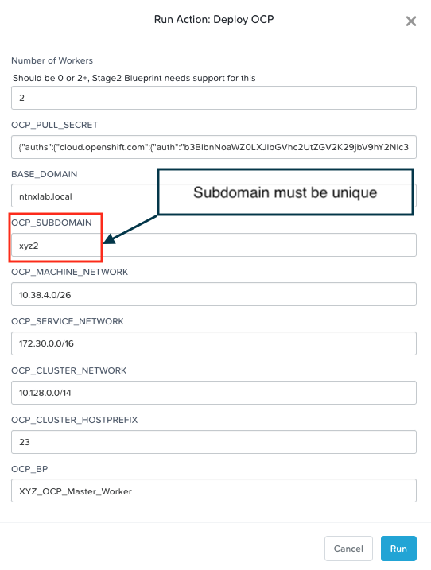
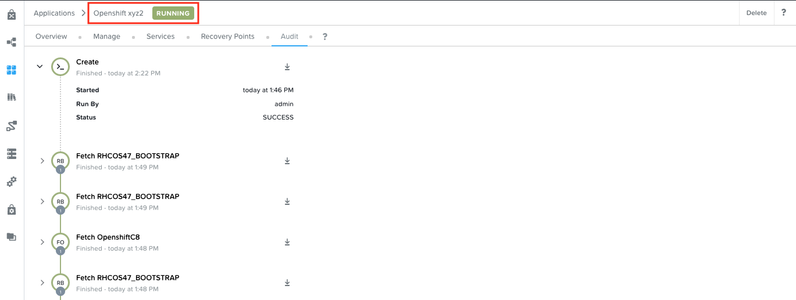

# Creating Additional OCP Clusters using Calm

:::caution

If you are doing this section of the lab using a Single Node HPOC (SPOC) there will not be enough resources to deploy a second OCP cluster. Please delete the first OCP cluster from Calm > Actions > Delete before proceeding with this lab.

:::

There will instances where you will want to deploy a second OCP cluster in the same/different environment using the blueprints you have worked with so far.

We are able to achieve this by executing the **Deploy OCP** action once again from the Provisioning VM.

## Deploy OCP Cluster

1.  In **Prism Central** > **Services** > **Calm**

2.  Click on **Applications**

3.  Select your Provisioning VM `Initials_PROV_VM` application

    

4.  Click on **Manage** tab

5.  Click on the play button next to **Deploy OCP** action

    

6.  Fill only the following details:

    -   **Number of Workers** - 2
    -   **OCP_PULL_SECRET** - download/copy pull secret this from your
        Red Hat Portal
        [Login](https://console.redhat.com/openshift/install/pull-secret)
        (you will need Red Hat Portal Access)
    -   **OCP_SUBDOMAIN** - Initials2 (e.g. **xyz2**)
    -   **OCP_MACHINE_NETWORK** - provide your Primary network address
        for your HPOC/SPOC (e.g. 10.38.2.64/26 ) - check in your cluster
        reservation email/webpage
    -   **OCP_BP** - XYZ_OCP_Master_Worker

    :::caution
  
    Make sure that the **OCP_SUBDOMAIN** name is be unique for each OCP cluster you deploy with this blueprint. A DNS zone is created based on this subdomain name.

    You can observe this in DNS in your AutoAD VM for other deployed clusters.

    
    
    :::

    

7.  Click on **Run**

8.  Go to the **Audit** of your tab to check the stautus of the launched
    **Deploy OCP** action

    

9.  If this action launch is succesful, you will see another application
    **Openshift xyz2** in the **Calm** \> **Applications** in a
    **Provisioning** state

    

10. Click on the **Openshift xyz2** application and go to **Audit** tab

    

11. Observe the VM create, package and other Calm actions

12. This should take about 20-25 minutes

13. Once deployed the Calm application **Openshift xyz2** will be in a
    running state

    

14. Go to DNS in your AutoAD VM to check for the **xyz2** subdomain for your **Openshift xyz2**

    

    :::info

    If other users are using your cluster you will see other subdomains in your DNS server

    :::

You are able to access the **Openshift xyz2** cluster administation page by following the process here `ocp_cluster_login`{.interpreted-text
role="ref"}.
