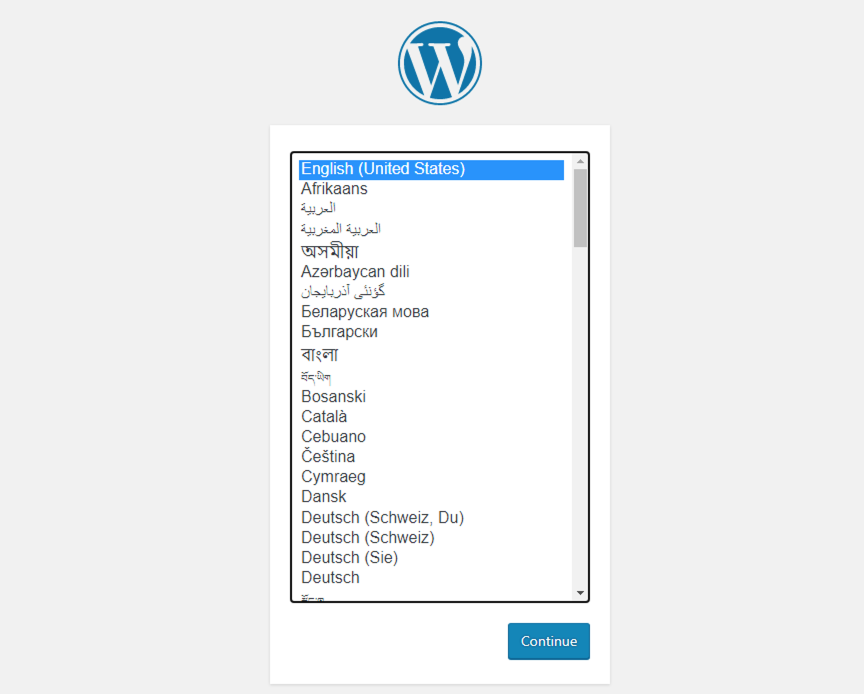
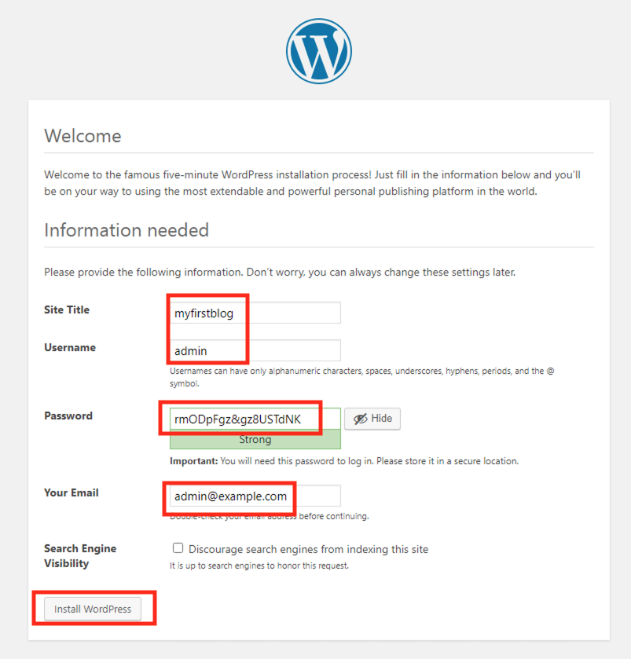
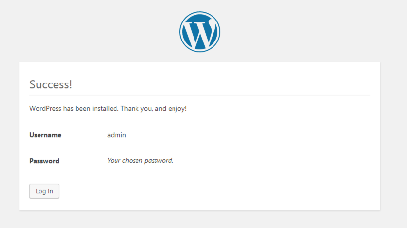
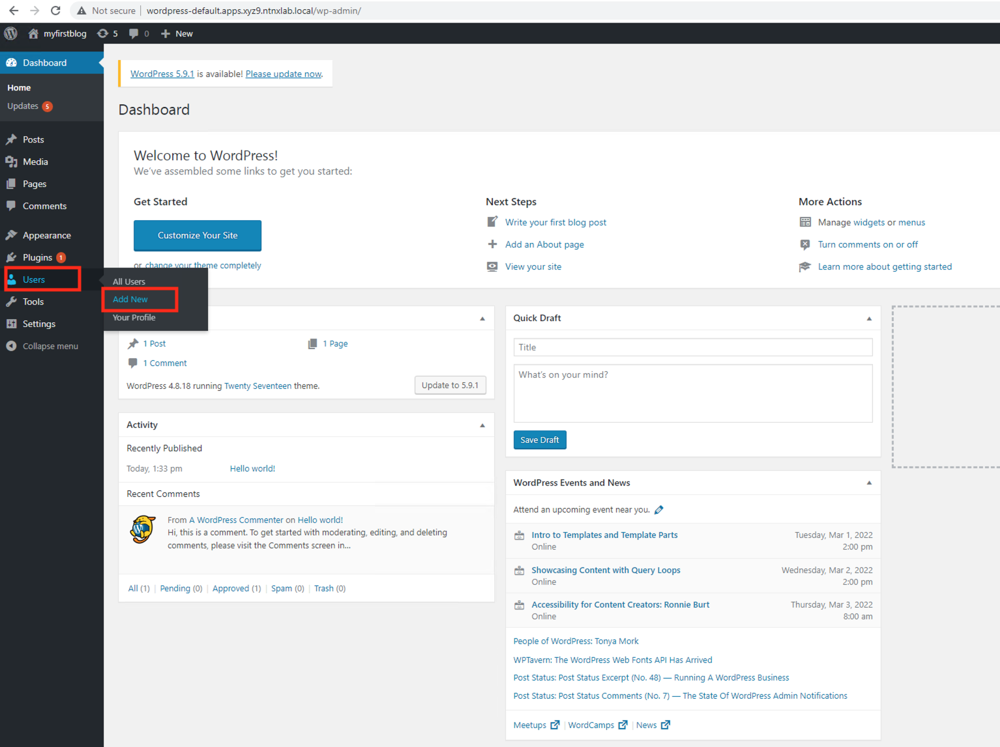
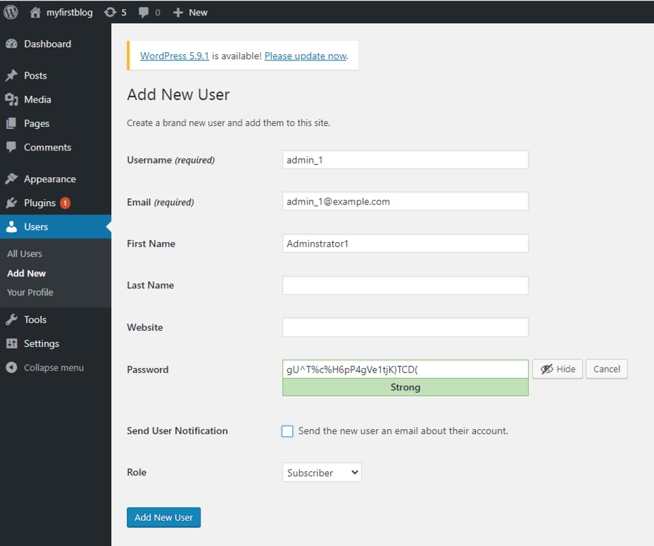
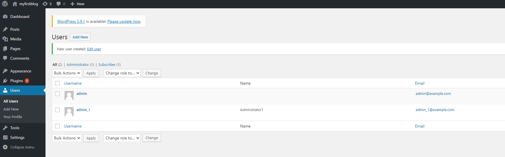

# Deploying Workload

In this section we will deploy a simple Wordpress application with MYSQL as the backend database store.

We will test backup and recovery of this application in next section.

## Deploying Wordpress App

1.  In Calm go to your **Applications** \> **Openshift xyz1**
    application

2.  Go to the **Services**

3.  Select your **LB_DNS** service

4.  Click on **Open Terminal**

    

    The terminal will open in a new browser tab

5.  Execute the following commands in sequence

    ``` bash
    export KUBECONFIG=~/openshift/auth/kubeconfig
    ```

6.  Create a new directory for your wordpress application and
    configuration files

    ``` bash
    mkdir wordpress 
    cd wordpress
    ```

7.  Make sure default is the current namespace

    ``` bash
    oc config set-context --current --namespace=default
    ```

8.  Download wordpress and mysql config yaml files

    ``` bash
    wget https://raw.githubusercontent.com/nutanix-japan/ocp-hci/main/ocp_wordpress_deploy/mysql_deployment.yaml
    wget https://raw.githubusercontent.com/nutanix-japan/ocp-hci/main/ocp_wordpress_deploy/wordpress_deployment.yaml 
    ```
9.  Testing has indicated that wordpress container expects to run as root in terms of security context. To enable the ``default`` service account in the ``wordpress`` namespace to run as root, we need to grant ``anyuid`` security context to the service account.
    
    ```bash
    oc adm policy add-scc-to-user anyuid -z default
    ```
    
9.  Make sure the nutanix-volume is the default storage class

    ``` bash
    oc patch storageclass nutanix-volumes -p '{"metadata": {"annotations":{"storageclass.kubernetes.io/is-default-class":"true"}}}'
    oc get sc
    ```

10. Create kustomization file to specify mysql password\]

    ``` bash {5}
    cat << EOF > kustomization.yaml
    secretGenerator:
    - name: mysql-pass
      literals:
      - password=XXXXXXX # change to your preferred MYSQL password
    resources:
      - mysql_deployment.yaml
      - wordpress_deployment.yaml
    EOF
    ```

11. Edit the kustomization.yaml to change your MYSQL password to a preferred password

    ``` bash
    vi kustomization.yaml
    ```

12. Apply all your configuration files

    ``` bash
    oc apply -k ./
    ```

13. Monitor pods until they are running

    ``` bash
    oc get po -w
    ```

    ``` bash
    # Sample output for the command above

    NAME                                   READY   STATUS    RESTARTS   AGE
    pod/wordpress-9c5b954c6-vdp4r          1/1     Running   0          3m11s
    pod/wordpress-mysql-77756785c8-vgtvb   1/1     Running   0          3m11s
    ```

## Exposing Wordpress to the World

1. Once both mysql and wordpress pods are running, we can expose the
    wordpress service to be able to access wordpress\' Web UI.

    ``` bash
    oc expose service/wordpress

    # Output here
    # route.route.openshift.io/wordpress exposed
    ```

    :::info
  
    OCP exposes internal services to the outside world using the concept of routes. This routes concept existed even before the popular
    kubernetes Ingress object was developed.

    As a result, when you create Ingress object in latest versions of OCP, this will automatically create routes in the background.

    For more information about OCP Routes see [here.](https://docs.openshift.com/container-platform/3.11/architecture/networking/routes.html)
    
    :::

2. Get the OCP route information by running the following command

    ``` bash
    oc get route

    # Output here

    NAME        HOST/PORT                                   PATH   SERVICES    PORT   TERMINATION   WILDCARD
    wordpress   wordpress-default.apps.xyz9.ntnxlab.local          wordpress   80                   None
    ```

3. Copy the value of **HOST/PORT** field and prepend a `http://` to it as we not using SSL (secure) termination

    Your route should look as follows:

    ``` url
    http://wordpress-default.apps.xyz9.ntnxlab.local
    ```

4. Copy the URL and paste in a browser in your **WindowsToolsVM**

5. You should see a configuration page

    

6. Select **English - United States** and click on **Continue**

7. Fill in the following fields as shown in the figure below

    

8. Note the auto-generated password and copy it somewhere safe. You are also free to use your own password.

9. You should see a installation confirmation page

    

    You will get re-directed to login page

10. Login to the wordpress site using admin and the password you used to install wordpress application

24. You will see the wordpress administration page

25. Lets populate some data by creating a new admin user

26. Click on **Users** > **Add New**

    

27. Fill in the following fields as shown in the figure below

    

28. Click on **Add New User**

29. You will be able to see the list of users

    

You have succesfully set up Wordpress application with mysql backend. In the next section we will backup and restore a deleted wordpress user using Kasten K10 software.
